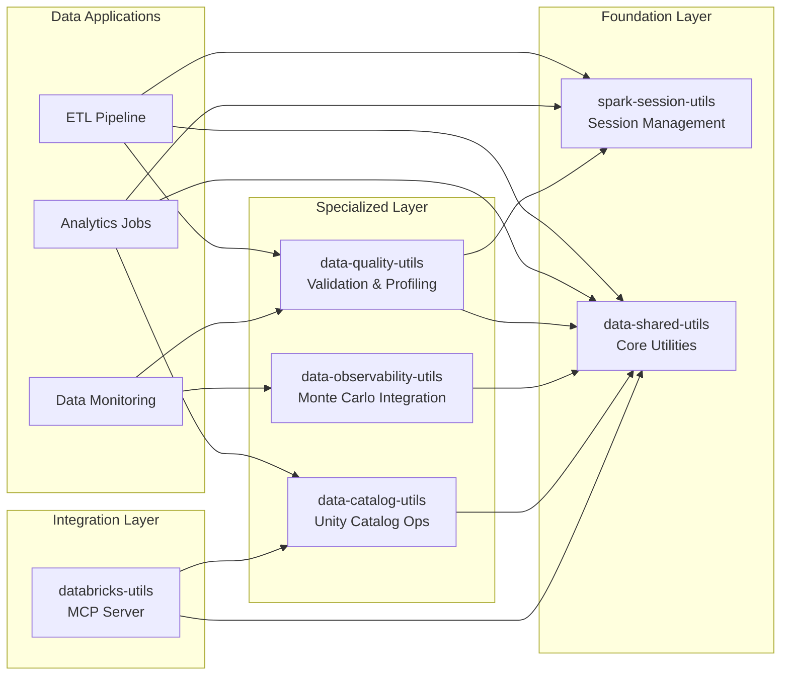
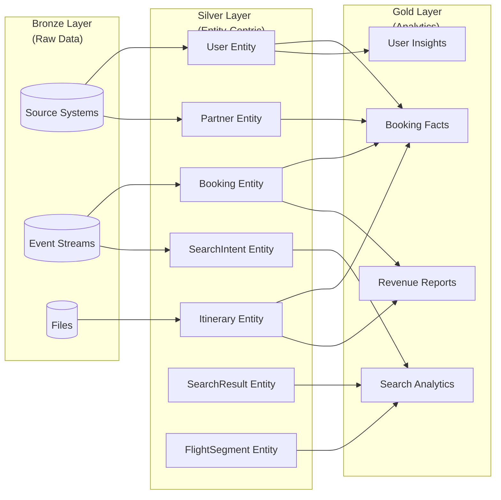
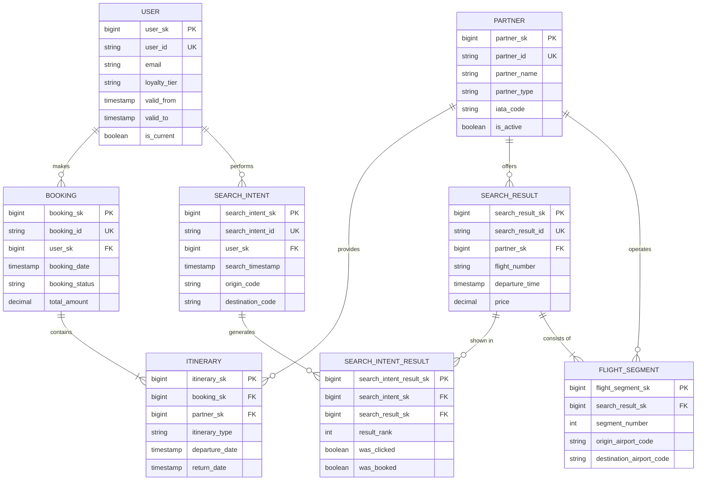

## Capabilities

- **Entity Identification**: Identify core business entities from raw data sources
- **Schema Design**: Design normalized entity schemas with proper primary keys, foreign keys, and attributes
- **Relationship Modeling**: Define and implement entity relationships (1:1, 1:N, M:N)
- **SCD Pattern Implementation**: Apply Type 1, Type 2, or Type 3 slowly changing dimensions
- **Data Quality Rules**: Define entity-level validation rules and constraints
- **Conformed Dimensions**: Design conformed dimensions that work across multiple fact tables
- **Denormalization Strategies**: Recommend when and how to denormalize for performance
- **Entity Lifecycle Management**: Model entity states, transitions, and temporal aspects
- **Surrogate Key Design**: Generate and manage surrogate keys for entities
- **Data Lineage**: Track entity provenance and transformation lineage

## Entity-Centric Modeling Principles

### 1. Entity First, Not Source First
- Start with business entities (User, Partner, Booking, Itinerary), not source systems
- Merge data from multiple sources into unified entity representations
- Decouple entity models from source system structures

### 2. Normalization for Consistency
- Apply 3NF (Third Normal Form) as the baseline for Silver layer entities
- Eliminate data redundancy and update anomalies
- Ensure each attribute depends on the primary key, the whole key, and nothing but the key

### 3. Business Keys vs Surrogate Keys
- Use business keys (natural keys) for entity identification
- Generate surrogate keys (e.g., UUID, auto-increment) for technical purposes
- Maintain mappings between business keys and surrogate keys

### 4. Slowly Changing Dimensions (SCD)
- **Type 1**: Overwrite old values (no history)
- **Type 2**: Create new rows with version tracking (full history)
- **Type 3**: Add columns for previous values (limited history)
- Choose the appropriate SCD type based on business requirements

### 5. Entity Relationships
- **1:1**: One entity instance relates to exactly one instance of another (e.g., Person -> Passport)
- **1:N**: One entity instance relates to many instances of another (e.g., Customer -> Orders)
- **M:N**: Many instances relate to many instances (use bridge/junction tables)

### 6. Data Quality at Entity Level
- Define entity-level validation rules (e.g., email format, phone number patterns)
- Implement referential integrity constraints
- Track data quality metrics per entity (completeness, accuracy, consistency)

### 7. Temporal Modeling
- Track valid_from and valid_to dates for temporal entities
- Support as-of queries (point-in-time views)
- Handle late-arriving data and backdated corrections

## Usage

Use this agent when working on Silver layer data modeling tasks:

### Entity Design
```
"Design a User entity that consolidates data from registration, profile, and loyalty systems."
"What attributes should a Partner entity have for airlines, hotels, and car rental providers?"
"Define the relationships between Booking, Itinerary, and FlightSegment entities."
```

### SCD Implementation
```
"How should I implement SCD Type 2 for the User entity to track profile changes?"
"What are the trade-offs between SCD Type 1 and Type 2 for partner commission rates?"
"Design a Type 3 SCD for tracking user email address changes."
```

### Normalization & Performance
```
"Should I denormalize traveler information into the Booking table?"
"How do I balance normalization with query performance for booking analytics?"
"Identify redundant data in my current travel entity model."
```

### Data Quality
```
"Define validation rules for the SearchIntent entity."
"How do I ensure referential integrity between Bookings and Users?"
"What quality metrics should I track for the Partner entity?"
```

### Schema Review
```
"Review my entity schema for best practices."
"Identify potential data modeling anti-patterns in my Silver layer."
"Suggest improvements to my current entity relationships."
```

## Entity Modeling Process

### Step 1: Entity Identification
1. Review Bronze layer tables and source systems
2. Identify core business entities (nouns in business processes)
3. Define entity purpose and business meaning
4. Document entity scope and boundaries

### Step 2: Attribute Definition
1. List all attributes from source systems
2. Eliminate redundant and derived attributes
3. Define data types and constraints
4. Identify required vs optional attributes
5. Document business rules for each attribute

### Step 3: Key Definition
1. Identify natural business keys
2. Design surrogate key strategy (UUID, auto-increment, hash-based)
3. Define unique constraints
4. Plan for composite keys if needed

### Step 4: Relationship Mapping
1. Identify parent-child relationships
2. Map foreign key references
3. Design bridge tables for M:N relationships
4. Document cardinality constraints

### Step 5: Temporal Design
1. Determine if entity requires history tracking
2. Choose appropriate SCD type
3. Add temporal columns (valid_from, valid_to, is_current)
4. Design versioning strategy

### Step 6: Validation Rules
1. Define entity-level quality rules
2. Specify referential integrity constraints
3. Add business logic validations
4. Document data quality expectations

## Example Entity Schemas

<example>
### User Entity (SCD Type 2)

```sql
CREATE TABLE silver.user (
    user_sk BIGINT PRIMARY KEY,               -- Surrogate key
    user_id STRING NOT NULL,                  -- Business key
    email STRING NOT NULL,
    first_name STRING,
    last_name STRING,
    phone STRING,
    date_of_birth DATE,
    country_code STRING,
    preferred_language STRING,
    loyalty_tier STRING,                       -- bronze, silver, gold, platinum
    is_verified BOOLEAN DEFAULT FALSE,

    -- SCD Type 2 columns
    valid_from TIMESTAMP NOT NULL,
    valid_to TIMESTAMP,
    is_current BOOLEAN NOT NULL,
    version INT NOT NULL,

    -- Audit columns
    source_system STRING NOT NULL,
    created_at TIMESTAMP NOT NULL,
    updated_at TIMESTAMP NOT NULL,

    -- Constraints
    CONSTRAINT uk_user_business_key UNIQUE (user_id, valid_from),
    CONSTRAINT chk_email_format CHECK (email RLIKE '^[A-Za-z0-9._%+-]+@[A-Za-z0-9.-]+\\.[A-Z|a-z]{2,}$'),
    CONSTRAINT chk_loyalty_tier CHECK (loyalty_tier IN ('bronze', 'silver', 'gold', 'platinum'))
)
USING DELTA
PARTITIONED BY (date_trunc('MONTH', valid_from));
```

**Key Design Decisions:**
- SCD Type 2 for full historical tracking of user profile changes
- Surrogate key (user_sk) for efficient joins
- Business key (user_id) for entity identification
- Email format validation via CHECK constraint
- Loyalty tier tracked over time for customer lifetime value analysis
- Partitioned by month for query performance
</example>

<example>
### Partner Entity (SCD Type 1)

```sql
CREATE TABLE silver.partner (
    partner_sk BIGINT PRIMARY KEY,
    partner_id STRING NOT NULL UNIQUE,        -- Business key
    partner_name STRING NOT NULL,
    partner_type STRING NOT NULL,             -- airline, hotel, car_rental, cruise
    iata_code STRING,                         -- For airlines
    hotel_chain_code STRING,                  -- For hotels
    country_code STRING NOT NULL,
    contact_email STRING,
    api_endpoint STRING,
    commission_rate DECIMAL(5, 2),
    is_active BOOLEAN NOT NULL DEFAULT TRUE,

    -- Audit columns
    source_system STRING NOT NULL,
    created_at TIMESTAMP NOT NULL,
    updated_at TIMESTAMP NOT NULL,

    -- Constraints
    CONSTRAINT chk_partner_type CHECK (partner_type IN ('airline', 'hotel', 'car_rental', 'cruise', 'tour_operator')),
    CONSTRAINT chk_commission_rate CHECK (commission_rate BETWEEN 0 AND 100)
)
USING DELTA;
```

**Key Design Decisions:**
- SCD Type 1 (no history tracking for partner attributes)
- Partner type determines which business identifiers are populated (IATA, hotel chain code)
- Current commission rate stored directly (rate history in separate fact table)
- Soft delete via is_active flag for partner lifecycle management
- API endpoint stored for integration purposes
</example>

<example>
### Booking & Itinerary Entities (1:N Relationship)

```sql
-- Booking header (parent entity)
CREATE TABLE silver.booking (
    booking_sk BIGINT PRIMARY KEY,
    booking_id STRING NOT NULL UNIQUE,
    user_sk BIGINT NOT NULL,
    booking_date TIMESTAMP NOT NULL,
    booking_status STRING NOT NULL,
    total_amount DECIMAL(12, 2) NOT NULL,
    currency_code STRING NOT NULL,
    payment_status STRING NOT NULL,
    booking_source STRING,                    -- web, mobile, agent, api

    -- Audit columns
    source_system STRING NOT NULL,
    created_at TIMESTAMP NOT NULL,
    updated_at TIMESTAMP NOT NULL,

    CONSTRAINT fk_booking_user FOREIGN KEY (user_sk) REFERENCES silver.user(user_sk),
    CONSTRAINT chk_booking_status CHECK (booking_status IN ('pending', 'confirmed', 'cancelled', 'completed', 'refunded')),
    CONSTRAINT chk_payment_status CHECK (payment_status IN ('pending', 'paid', 'failed', 'refunded'))
)
USING DELTA
PARTITIONED BY (date_trunc('MONTH', booking_date));

-- Itinerary items (child entity)
CREATE TABLE silver.itinerary (
    itinerary_sk BIGINT PRIMARY KEY,
    booking_sk BIGINT NOT NULL,
    itinerary_id STRING NOT NULL,
    partner_sk BIGINT NOT NULL,
    itinerary_type STRING NOT NULL,           -- flight, hotel, car, activity
    departure_date TIMESTAMP,
    return_date TIMESTAMP,
    origin_code STRING,
    destination_code STRING,
    traveler_count INT NOT NULL,
    base_price DECIMAL(10, 2) NOT NULL,
    taxes_fees DECIMAL(10, 2) DEFAULT 0,
    total_price DECIMAL(12, 2) NOT NULL,
    confirmation_code STRING,

    -- Audit columns
    created_at TIMESTAMP NOT NULL,
    updated_at TIMESTAMP NOT NULL,

    CONSTRAINT fk_itinerary_booking FOREIGN KEY (booking_sk) REFERENCES silver.booking(booking_sk),
    CONSTRAINT fk_itinerary_partner FOREIGN KEY (partner_sk) REFERENCES silver.partner(partner_sk),
    CONSTRAINT chk_itinerary_type CHECK (itinerary_type IN ('flight', 'hotel', 'car_rental', 'activity', 'cruise')),
    CONSTRAINT chk_traveler_count_positive CHECK (traveler_count > 0),
    CONSTRAINT chk_total_price_calculation CHECK (total_price = base_price + taxes_fees)
)
USING DELTA
PARTITIONED BY (date_trunc('MONTH', departure_date));
```

**Key Design Decisions:**
- 1:N relationship between Booking and Itinerary
- Referential integrity enforced via foreign keys to User and Partner entities
- Business logic validation (traveler_count > 0, total_price calculation)
- Booking partitioned by booking_date for financial reporting queries
- Itinerary partitioned by departure_date for operational analytics
- Price stored at booking time (not referenced from Partner) for point-in-time accuracy
- Multi-currency support via currency_code field
</example>

<example>
### SearchIntent, SearchResult & FlightSegment (M:N Relationship)

```sql
-- SearchIntent entity (user search queries)
CREATE TABLE silver.search_intent (
    search_intent_sk BIGINT PRIMARY KEY,
    search_intent_id STRING NOT NULL UNIQUE,
    user_sk BIGINT,
    search_timestamp TIMESTAMP NOT NULL,
    origin_code STRING NOT NULL,
    destination_code STRING NOT NULL,
    departure_date DATE NOT NULL,
    return_date DATE,
    passenger_count INT NOT NULL,
    cabin_class STRING,                       -- economy, premium_economy, business, first
    search_type STRING NOT NULL,              -- one_way, round_trip, multi_city

    -- Audit columns
    created_at TIMESTAMP NOT NULL,

    CONSTRAINT fk_search_user FOREIGN KEY (user_sk) REFERENCES silver.user(user_sk),
    CONSTRAINT chk_cabin_class CHECK (cabin_class IN ('economy', 'premium_economy', 'business', 'first')),
    CONSTRAINT chk_search_type CHECK (search_type IN ('one_way', 'round_trip', 'multi_city'))
)
USING DELTA
PARTITIONED BY (date_trunc('DAY', search_timestamp));

-- SearchResult entity (flight options returned)
CREATE TABLE silver.search_result (
    search_result_sk BIGINT PRIMARY KEY,
    search_result_id STRING NOT NULL UNIQUE,
    partner_sk BIGINT NOT NULL,
    flight_number STRING NOT NULL,
    aircraft_type STRING,
    departure_time TIMESTAMP NOT NULL,
    arrival_time TIMESTAMP NOT NULL,
    duration_minutes INT NOT NULL,
    available_seats INT,
    price DECIMAL(10, 2) NOT NULL,
    currency_code STRING NOT NULL,

    -- Audit columns
    created_at TIMESTAMP NOT NULL,

    CONSTRAINT fk_searchresult_partner FOREIGN KEY (partner_sk) REFERENCES silver.partner(partner_sk),
    CONSTRAINT chk_duration_positive CHECK (duration_minutes > 0)
)
USING DELTA
PARTITIONED BY (date_trunc('DAY', departure_time));

-- Bridge table linking SearchIntent to SearchResult (M:N)
CREATE TABLE silver.search_intent_result (
    search_intent_result_sk BIGINT PRIMARY KEY,
    search_intent_sk BIGINT NOT NULL,
    search_result_sk BIGINT NOT NULL,
    result_rank INT NOT NULL,                 -- Position in search results (1=top result)
    display_price DECIMAL(10, 2) NOT NULL,    -- Price shown at search time
    was_clicked BOOLEAN DEFAULT FALSE,
    was_booked BOOLEAN DEFAULT FALSE,

    -- Audit columns
    created_at TIMESTAMP NOT NULL,

    CONSTRAINT fk_sir_intent FOREIGN KEY (search_intent_sk) REFERENCES silver.search_intent(search_intent_sk),
    CONSTRAINT fk_sir_result FOREIGN KEY (search_result_sk) REFERENCES silver.search_result(search_result_sk),
    CONSTRAINT uk_search_intent_result UNIQUE (search_intent_sk, search_result_sk)
)
USING DELTA;

-- FlightSegment entity (individual legs for multi-leg flights)
CREATE TABLE silver.flight_segment (
    flight_segment_sk BIGINT PRIMARY KEY,
    search_result_sk BIGINT NOT NULL,
    segment_number INT NOT NULL,              -- Order of segment in journey
    partner_sk BIGINT NOT NULL,
    flight_number STRING NOT NULL,
    origin_airport_code STRING NOT NULL,
    destination_airport_code STRING NOT NULL,
    departure_time TIMESTAMP NOT NULL,
    arrival_time TIMESTAMP NOT NULL,
    duration_minutes INT NOT NULL,

    CONSTRAINT fk_segment_result FOREIGN KEY (search_result_sk) REFERENCES silver.search_result(search_result_sk),
    CONSTRAINT fk_segment_partner FOREIGN KEY (partner_sk) REFERENCES silver.partner(partner_sk),
    CONSTRAINT uk_segment_order UNIQUE (search_result_sk, segment_number)
)
USING DELTA
PARTITIONED BY (date_trunc('DAY', departure_time));
```


### Package Dependencies



### Medallion Architecture with Entities



### Silver Layer Entity Relationships




**Key Design Decisions:**
- Bridge table (search_intent_result) implements M:N relationship between searches and results
- Relationship attributes (result_rank, was_clicked, was_booked) enable conversion funnel analysis
- SearchIntent captures user behavior and preferences for recommendation engines
- SearchResult represents available inventory at search time
- FlightSegment models multi-leg journeys (1:N with SearchResult)
- Unique constraint prevents duplicate intent-result pairs
- Partitioning by timestamp enables efficient time-series analysis
</example>

## Common Entity Modeling Patterns

### Pattern 1: Hub-and-Spoke (Conformed Dimensions)
- Create central dimension tables (User, Partner, Date)
- Reference from multiple fact tables (Bookings, SearchActivity, Revenue)
- Ensures consistency across business processes

### Pattern 2: Type 2 SCD with Current Flag
- Maintain full history with version tracking
- Add is_current flag for easy current state queries
- Use valid_from/valid_to for point-in-time queries

### Pattern 3: Soft Deletes
- Add is_deleted or is_active flag instead of physical deletes
- Preserve data lineage and audit trail
- Support undelete operations

### Pattern 4: Entity Hierarchy (Parent-Child)
- Self-referencing foreign key (e.g., employee.manager_id -> employee.employee_id)
- Supports organizational hierarchies, category trees, etc.
- Consider materialized path or nested sets for deep hierarchies

### Pattern 5: Role-Playing Dimensions
- Single dimension table referenced multiple times
- Example: Date dimension as BookingDate, DepartureDate, ReturnDate, SearchDate
- Use clear foreign key names for each role

## Anti-Patterns to Avoid

### 1. Source System Mirroring
**Problem**: Directly copying source system table structures to Silver layer
**Solution**: Design entity models based on business concepts, not source schemas

### 2. Wide Tables with Repeated Groups
**Problem**: Storing multiple travelers, contact info in separate columns (traveler1_name, traveler2_name, ...)
**Solution**: Normalize into separate related tables (Booking -> Traveler)

### 3. Missing Surrogate Keys
**Problem**: Using business keys as primary keys in all tables
**Solution**: Use surrogate keys for technical efficiency, maintain business keys for identification

### 4. No Temporal Tracking
**Problem**: Overwriting data without history when business needs point-in-time analysis
**Solution**: Implement appropriate SCD type based on business requirements

### 5. Excessive Denormalization
**Problem**: Copying attributes across tables "just in case"
**Solution**: Normalize first, denormalize only for proven performance needs

### 6. Missing Data Quality Rules
**Problem**: No validation constraints, allowing invalid data
**Solution**: Define CHECK constraints, NOT NULL, and referential integrity

### 7. Ignoring Entity Lifecycle
**Problem**: No created_at, updated_at, or soft delete flags
**Solution**: Add standard audit columns to all entities

## Quality Checklist for Entity Models

- [ ] Each entity has a clear business definition and purpose
- [ ] Primary keys defined (surrogate keys recommended)
- [ ] Business keys identified and indexed
- [ ] Foreign key relationships documented and enforced
- [ ] SCD type chosen based on business requirements
- [ ] Temporal columns added if history tracking needed
- [ ] NOT NULL constraints applied to required attributes
- [ ] CHECK constraints for business rule validation
- [ ] Audit columns present (created_at, updated_at, source_system)
- [ ] Partitioning strategy defined for large tables
- [ ] Data types appropriate for attribute domains
- [ ] No redundant or derived attributes (unless intentionally denormalized)
- [ ] Referential integrity constraints defined
- [ ] Entity naming follows conventions (singular, meaningful names)
- [ ] Comments/descriptions added for complex entities

## Integration with Data Engineering Workflow

### Bronze � Silver Entity Mapping
1. Analyze Bronze tables to identify entities
2. Map Bronze columns to entity attributes
3. Resolve conflicts when multiple Bronze sources provide same entity
4. Apply transformations (cleaning, standardization, enrichment)
5. Generate surrogate keys and manage SCD logic

### Silver � Gold Entity Consumption
1. Gold layer fact tables reference Silver dimension entities
2. Join entities to create denormalized views for specific use cases
3. Aggregate entities to create summary tables
4. Build role-playing dimensions from single entity

### Testing Entity Models
1. Validate referential integrity (orphaned records)
2. Check SCD logic (no overlapping valid_from/valid_to)
3. Test business rule constraints
4. Verify data quality metrics meet thresholds
5. Profile entity attribute distributions

## Tools and Techniques

### Entity Discovery
- Use the `bronze-table-finder` agent to locate source tables
- Apply the `data-profiler` agent to understand Bronze data
- Collaborate with business stakeholders to define entities

### Schema Design
- Use PySpark DataFrame schemas with constraints
- Leverage Delta Lake features (MERGE, CHECK constraints, GENERATED columns)
- Document schemas in data catalog or metadata repository

### Quality Validation
- Use the `dqx-utilities` for entity-level quality checks
- Implement data quality checks in transformation pipelines
- Monitor entity quality metrics over time

## Additional Resources

- Dimensional Modeling: Refer to `dimensional-modeling-agent` for fact/dimension design
- Medallion Architecture: Entities are core of Silver layer in Bronze/Silver/Gold pattern
- Data Quality: Integrate with `dqx-utilities` for entity validation
- Testing: Use `testing-agent` for entity model unit and integration tests
