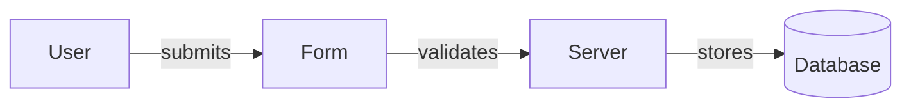
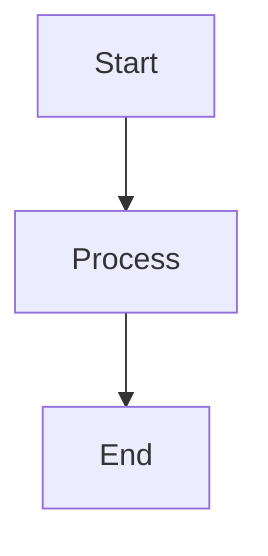
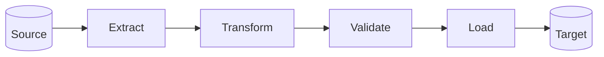
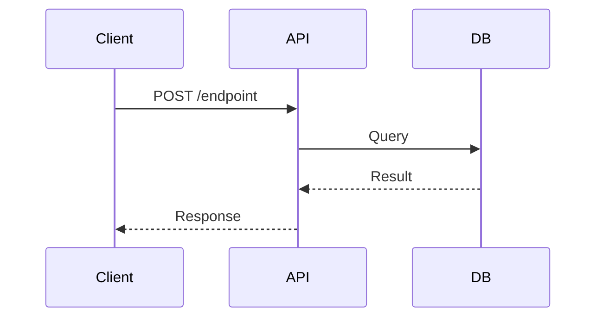
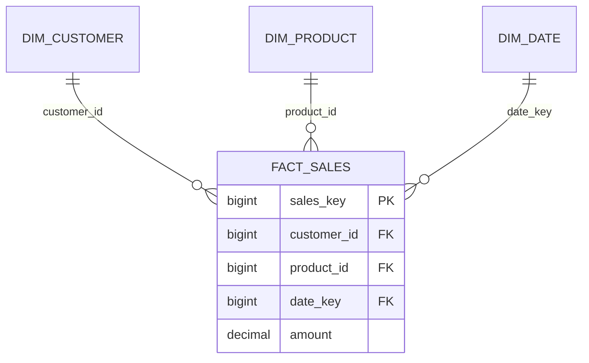
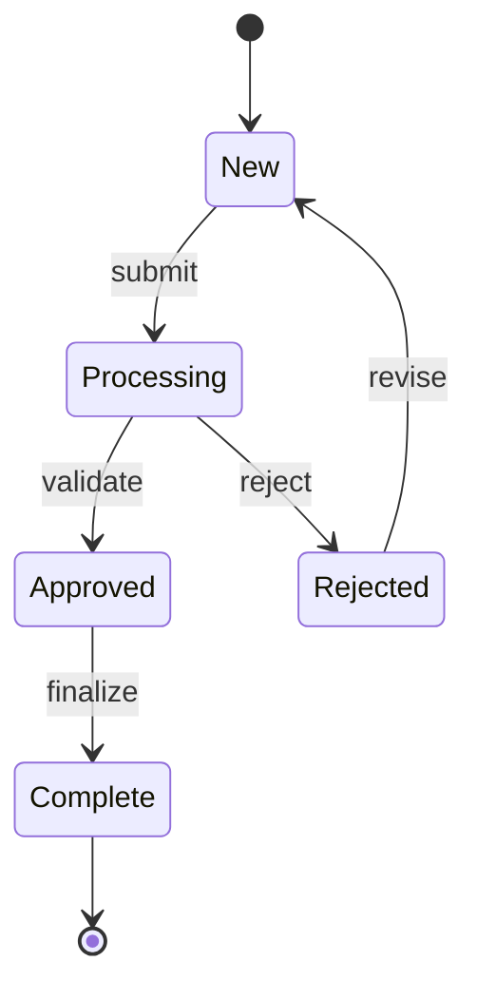
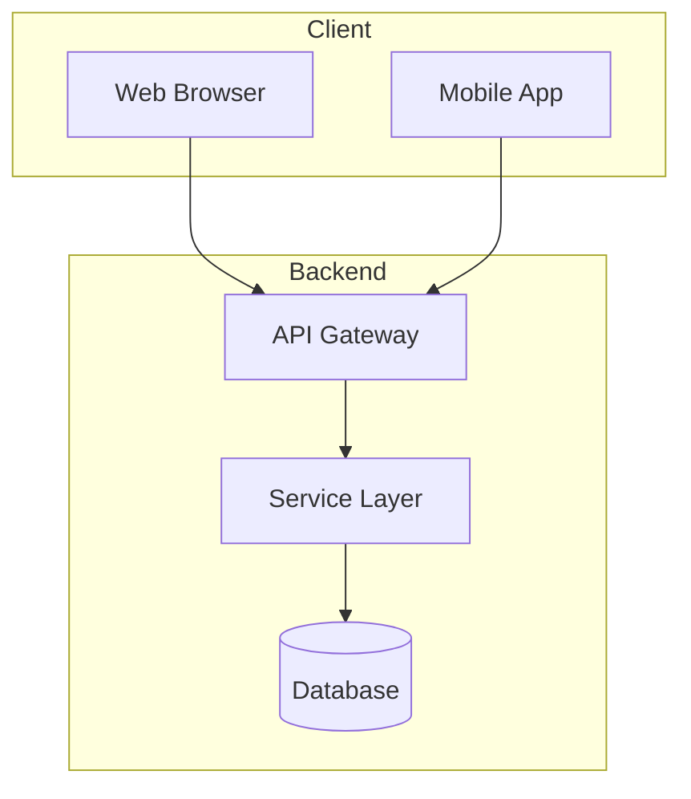
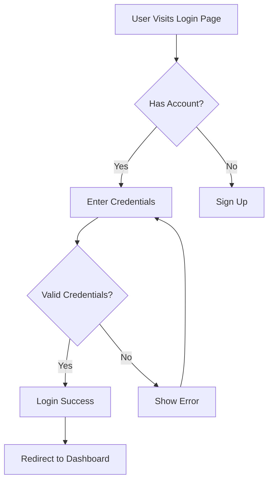
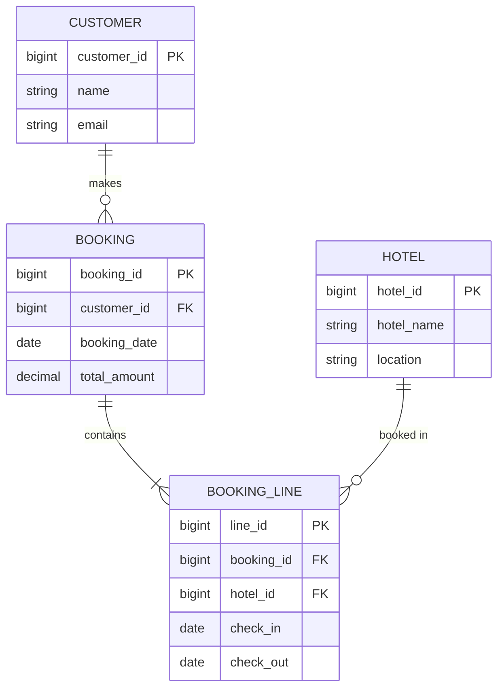
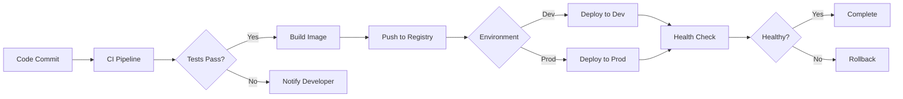

# Mermaid Diagram Generation

Create clear, effective Mermaid diagrams to visualize technical concepts, data models, workflows, and system architectures.

## Overview

This skill helps generate Mermaid diagrams using valid syntax. Mermaid is a text-based diagramming language that renders in markdown, making it ideal for documentation.

## When to Use This Skill

Trigger this skill when users request:
- "create diagram", "generate diagram", "draw diagram"
- "flowchart", "sequence diagram", "ERD"
- "visualize", "diagram it", "show me a diagram"
- "class diagram", "state machine", "architecture diagram"
- Any request for visual representation of concepts

## Diagram Generation Process

### Step 1: Understand Requirements

Analyze what the diagram should represent:
- **Project-specific**: Based on actual codebase or user's specific context
- **General concept**: Universal technical concept or pattern

**For project-specific diagrams:**
- Gather information from provided context
- Verify all elements are accurate
- No hypothetical or made-up information

**For general concepts:**
- Use established patterns and best practices
- Clearly identify as general representation
- May use web_search if needed for accuracy

### Step 2: Choose Diagram Type

Select the most appropriate Mermaid diagram type. See **mermaid_syntax.md** for complete syntax.

**Common diagram types:**

| Diagram Type | Use For | Example Use Cases |
|-------------|---------|-------------------|
| **Flowchart** | Process flows, decision trees, algorithms | ETL pipelines, user workflows, business logic |
| **Sequence** | API interactions, message flows | Service communications, request/response flows |
| **ERD** | Database schemas, data models | Table relationships, dimensional models |
| **Class** | Object models, code structure | OOP design, data structures |
| **State** | State machines, lifecycle | Order status, workflow states |
| **Gantt** | Project timelines, scheduling | Sprint planning, roadmaps |
| **Git Graph** | Version control flows | Branching strategies, release processes |

**Read mermaid_syntax.md for:** Complete syntax reference, examples, and best practices for each diagram type.

### Step 3: Create Mermaid Syntax

Write valid Mermaid syntax following these rules:

#### Critical Rule: No Colors or Styling

**Never use color specifications** to ensure compatibility with light and dark modes:

```mermaid
❌ NEVER DO THIS:
flowchart TD
    A[Start]
    style A fill:#f9f,stroke:#333,stroke-width:2px

✅ ALWAYS DO THIS:
flowchart TD
    A[Start]
```

**Why:** Colors break in different editor themes. Mermaid diagrams must work in both light and dark modes.

#### Best Practices

**1. Clear, Descriptive Labels:**
```mermaid
✅ GOOD:
flowchart LR
    A[Extract Data] --> B[Transform Schema]
    B --> C[Load to Warehouse]

❌ BAD:
flowchart LR
    A[Step 1] --> B[Step 2]
    B --> C[Step 3]
```

**2. Logical Flow Direction:**
- `TD`/`TB` (Top to bottom): Hierarchies, process flows
- `LR` (Left to right): Timelines, sequences
- `BT` (Bottom to top): Rare, reverse hierarchies
- `RL` (Right to left): Rare, reverse sequences

**3. Manageable Complexity:**
- Limit to 15-20 nodes per diagram
- Break complex flows into multiple diagrams
- Use subgraphs to group related elements

**4. Meaningful Relationships:**
Label edges when relationship isn't obvious:


**5. Use Appropriate Node Shapes:**
- `[Rectangle]` - Standard process/action
- `(Rounded)` - Start/end points
- `{Diamond}` - Decisions
- `[(Database)]` - Data stores
- `[[Subroutine]]` - Subprocess calls

### Step 4: Generate and Validate

1. **Create the diagram** in Mermaid syntax
2. **Validate syntax** - ensure proper formatting
3. **Test rendering** - verify it displays correctly
4. **Review clarity** - ensure it effectively communicates

### Step 5: Present to User

Present the diagram in a code block with `mermaid` language identifier:

````markdown

````

## Common Diagram Patterns

### Data Pipeline Flow


### API Sequence


### Dimensional Model


### State Machine


### System Architecture


## Tips for Specific Use Cases

### For Data Engineering

**ETL/ELT Pipelines:**
- Use flowcharts with database nodes
- Show data flow direction clearly
- Include transformation steps
- Indicate Bronze → Silver → Gold layers

**Dimensional Models:**
- Use ERD diagrams
- Show fact-dimension relationships
- Include key columns (PK/FK)
- Use proper cardinality notation

**Data Lineage:**
- Use flowcharts with clear source-to-target flow
- Group by layer (Bronze/Silver/Gold)
- Show transformations as process nodes

### For Software Architecture

**Service Communications:**
- Use sequence diagrams for API flows
- Show request/response patterns
- Include error paths with alt/opt blocks

**Class Structures:**
- Use class diagrams for OOP design
- Show inheritance with proper notation
- Include key methods and properties

**Workflows:**
- Use flowcharts for business logic
- Use state diagrams for status transitions
- Include decision points clearly

## Quality Checklist

Before presenting a diagram, verify:

- [ ] **Valid Mermaid syntax** - no syntax errors
- [ ] **No colors or styling** - works in light/dark mode
- [ ] **Clear labels** - descriptive, not generic
- [ ] **Appropriate type** - right diagram for the concept
- [ ] **Logical flow** - easy to follow
- [ ] **Manageable size** - not too complex
- [ ] **Accurate content** - reflects actual information (if project-specific)
- [ ] **Proper formatting** - in mermaid code block

## Common Mistakes to Avoid

❌ **Using colors:**
```mermaid
style A fill:#f9f  // NEVER DO THIS
```

❌ **Generic labels:**
```mermaid
A[Step 1] --> B[Step 2]  // Not descriptive
```

❌ **Too complex:**
```mermaid
// 50+ nodes in one diagram - split it up!
```

❌ **Wrong diagram type:**
```mermaid
// Using flowchart for time-based sequence - use sequence diagram
```

❌ **Missing edge labels:**
```mermaid
A --> B  // When relationship isn't obvious
```

## Additional Resources

**Read mermaid_syntax.md for:**
- Complete syntax reference for all diagram types
- Detailed examples and patterns
- Troubleshooting common issues
- Advanced features (subgraphs, notes, loops, etc.)

## Examples by Request Type

### "Create a flowchart for user login"


### "Show me an ERD for booking system"


### "Diagram the deployment process"


## Success Criteria

A successful diagram:
1. **Renders correctly** - Valid Mermaid syntax
2. **Communicates clearly** - Easy to understand
3. **Accurate** - Reflects reality (if project-specific)
4. **Appropriate complexity** - Not too simple or complex
5. **No styling** - Works in any editor theme
6. **Well-labeled** - All nodes and edges are clear
7. **Right type** - Best diagram type for the concept
