# Mermaid Diagram Syntax Reference

Quick reference for common Mermaid diagram types and syntax.

## Diagram Types

### Flowchart

**Use for:** Process flows, decision trees, workflows, algorithms

**Basic Syntax:**
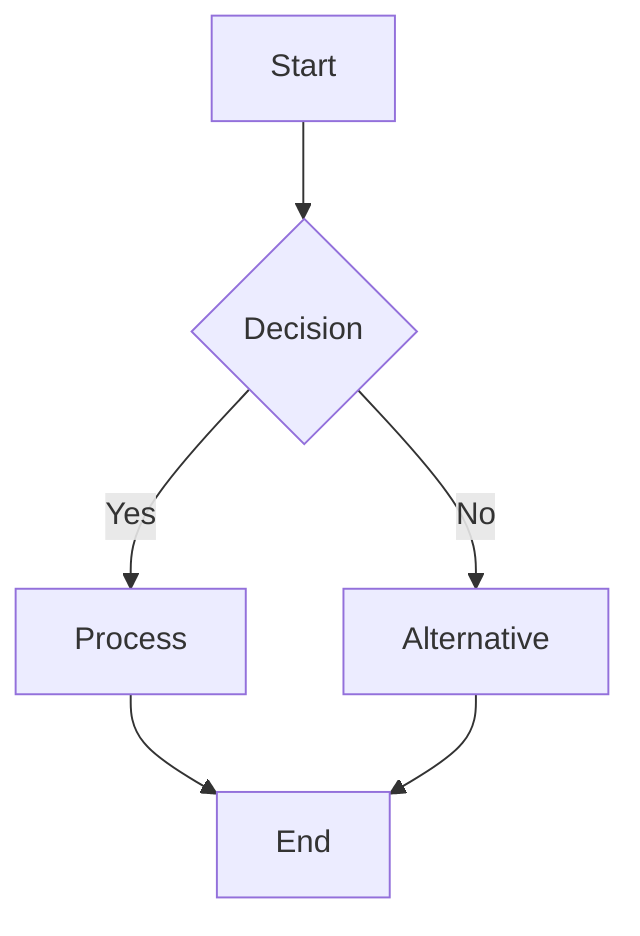

**Node Shapes:**
- `[Rectangle]` - Process/action
- `(Rounded)` - Start/end
- `{Diamond}` - Decision
- `([Stadium])` - Subprocess
- `[[Subroutine]]` - Subroutine
- `[(Database)]` - Database
- `((Circle))` - Connection point

**Directions:**
- `TD` or `TB` - Top to bottom
- `BT` - Bottom to top
- `LR` - Left to right
- `RL` - Right to left

**Example:**
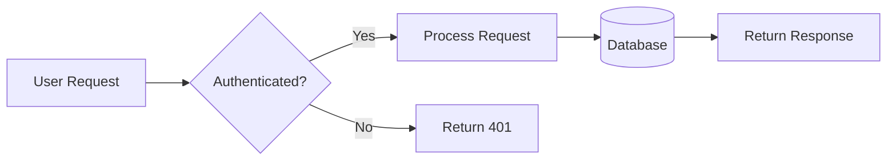

### Sequence Diagram

**Use for:** API interactions, system communications, message flows

**Basic Syntax:**
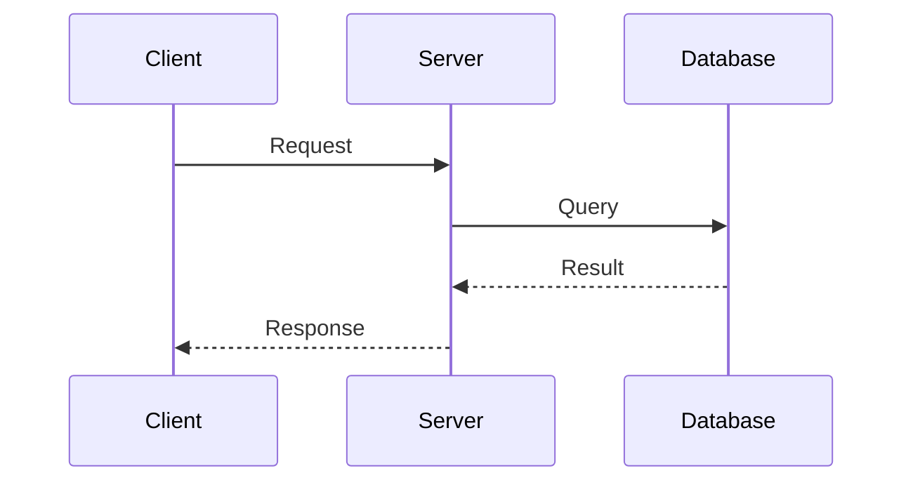

**Arrow Types:**
- `->` - Solid line
- `-->` - Dotted line
- `->>` - Solid arrow
- `-->>` - Dotted arrow
- `-x` - Cross at end
- `--x` - Dotted cross

**Special Features:**
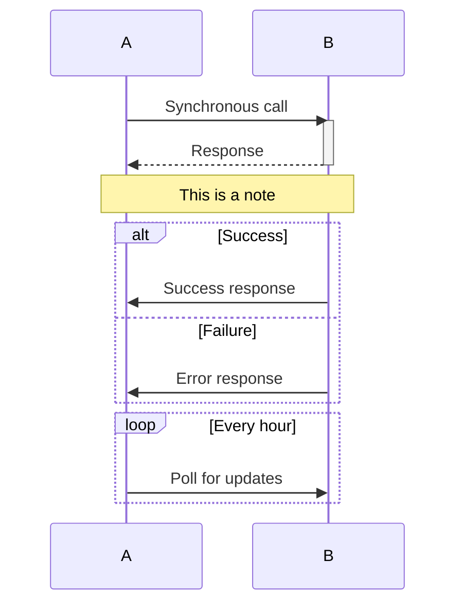

### Class Diagram

**Use for:** Object models, data structures, entity relationships

**Basic Syntax:**
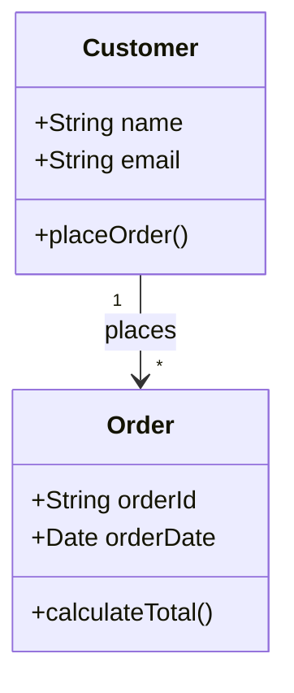

**Relationships:**
- `<|--` - Inheritance
- `*--` - Composition
- `o--` - Aggregation
- `-->` - Association
- `--` - Link (solid)
- `..>` - Dependency
- `..|>` - Realization

**Visibility:**
- `+` - Public
- `-` - Private
- `#` - Protected
- `~` - Package/Internal

**Example:**
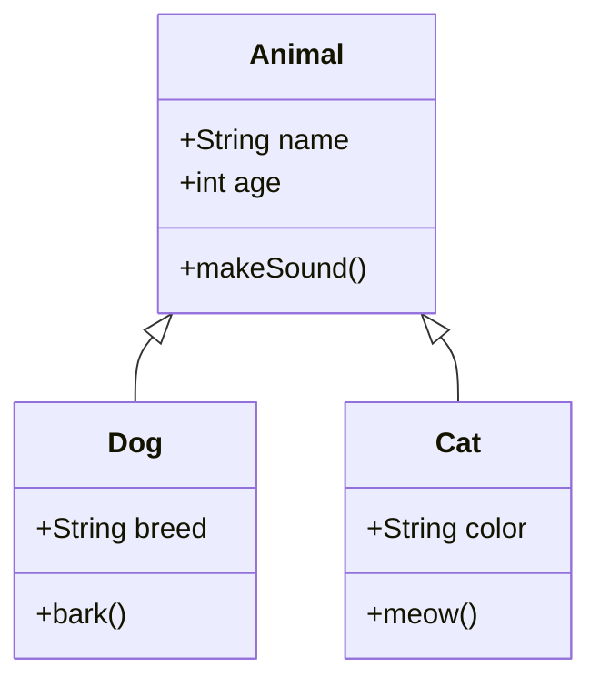

### Entity Relationship Diagram (ERD)

**Use for:** Database schemas, data models

**Basic Syntax:**
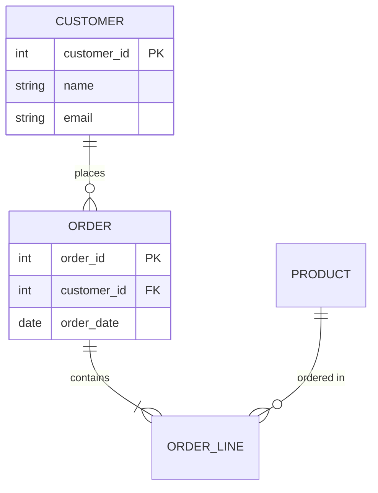

**Cardinality:**
- `||--||` - One to one
- `||--o{` - One to many
- `}o--o{` - Many to many
- `||--|{` - One to one or more
- `}o--||` - Many to one

**Example:**
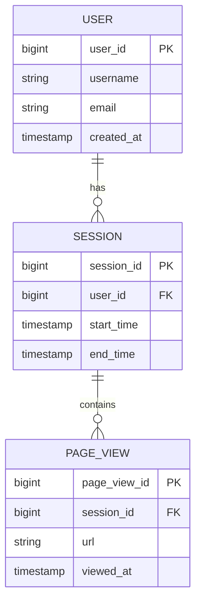

### State Diagram

**Use for:** State machines, status transitions, lifecycle

**Basic Syntax:**
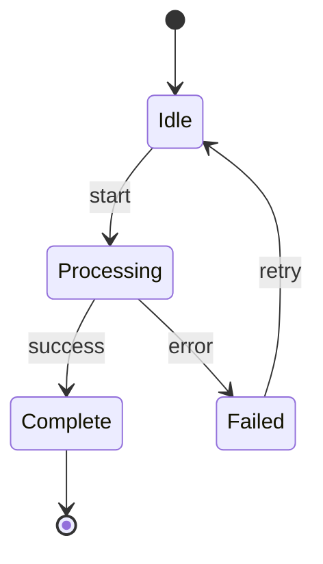

**Features:**
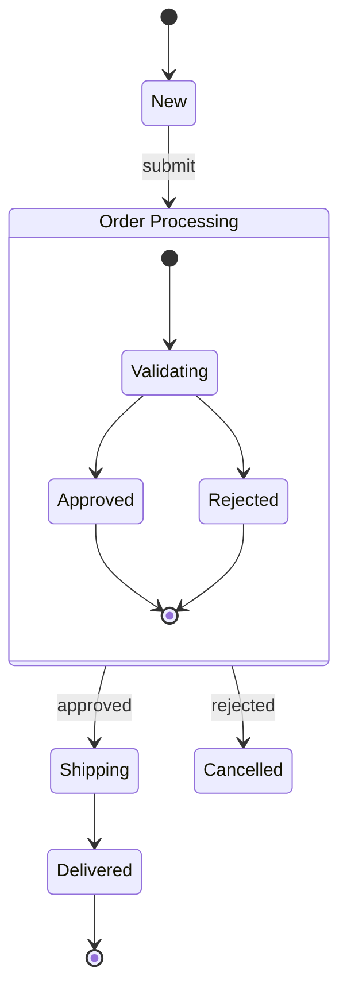

### Gantt Chart

**Use for:** Project timelines, task scheduling

**Basic Syntax:**
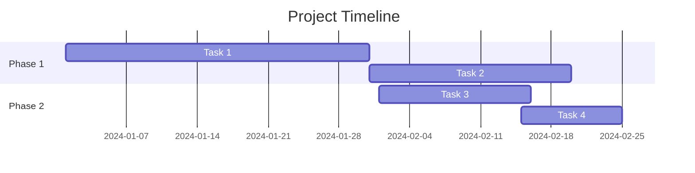

### Git Graph

**Use for:** Git branching strategies, version control flows

**Basic Syntax:**
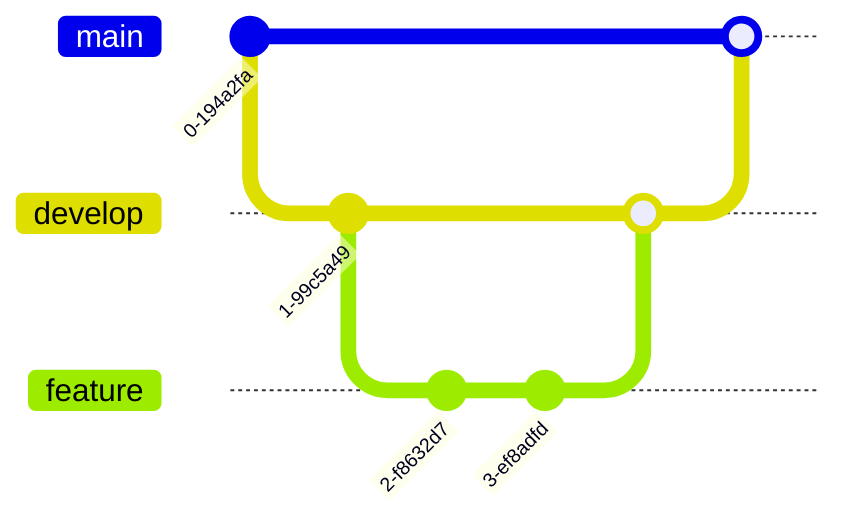

### Pie Chart

**Use for:** Distribution, percentages, composition

**Basic Syntax:**
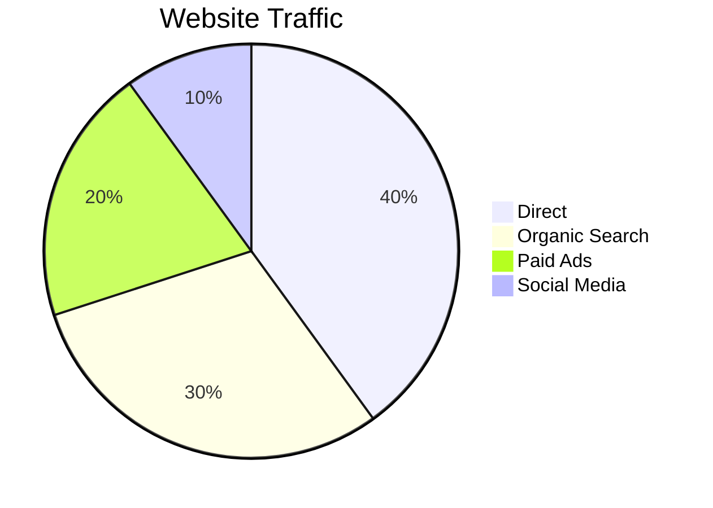

### Journey Map

**Use for:** User journeys, customer experience flows

**Basic Syntax:**
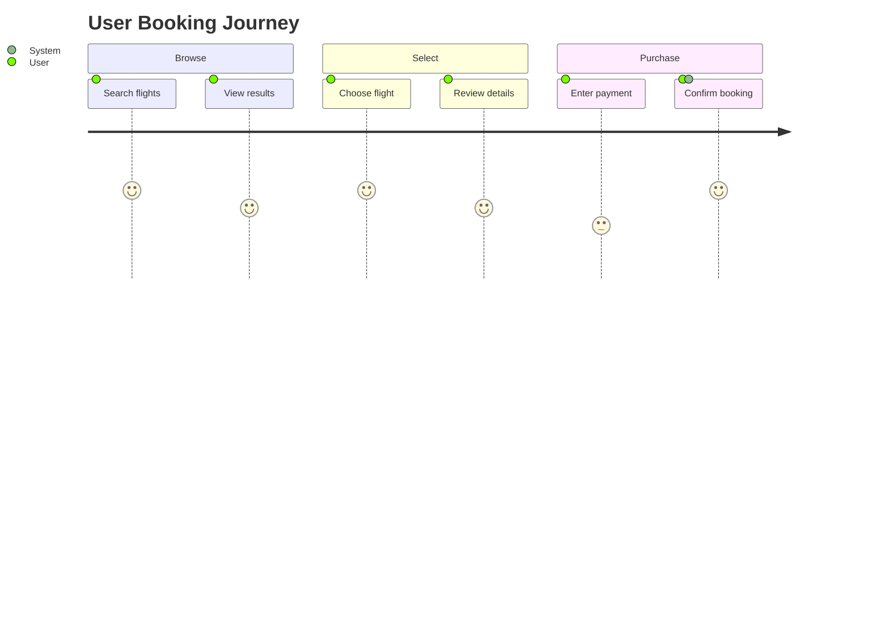

## Best Practices

### 1. No Colors or Styling
Never use color specifications to ensure compatibility:
```mermaid
❌ BAD:
flowchart TD
    A[Start]
    style A fill:#f9f,stroke:#333

✅ GOOD:
flowchart TD
    A[Start]
```

### 2. Clear Node Labels
Use descriptive, concise labels:
```mermaid
✅ GOOD:
flowchart LR
    A[Validate Input] --> B[Process Request]
    B --> C[Return Response]

❌ BAD:
flowchart LR
    A[Step 1] --> B[Step 2]
    B --> C[Step 3]
```

### 3. Logical Flow Direction
Choose direction based on content:
- Top-down (`TD`): Hierarchies, process flows
- Left-right (`LR`): Timelines, sequences
- Use consistent direction within diagram

### 4. Group Related Elements
Use subgraphs for organization:
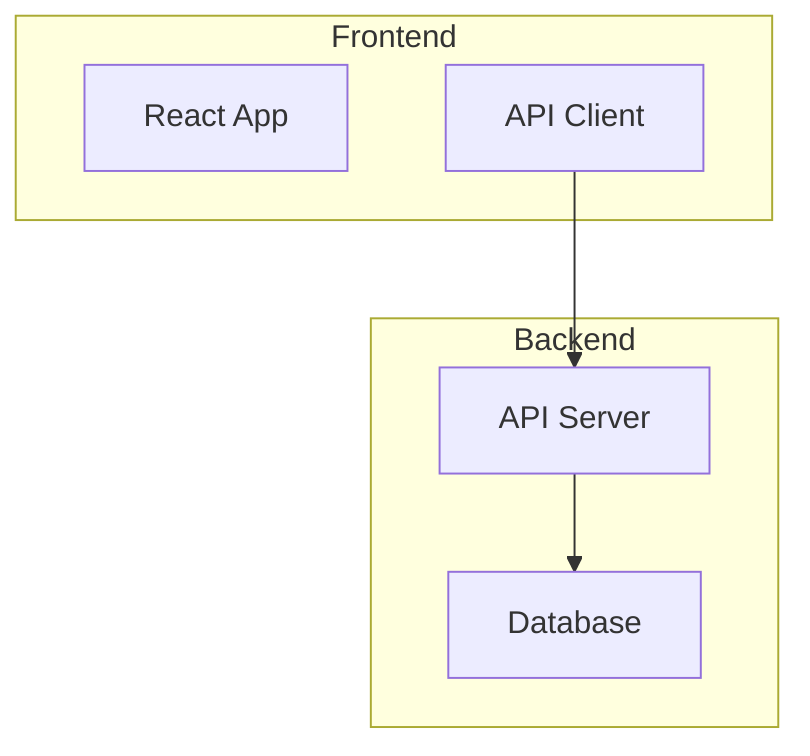

### 5. Keep It Simple
- One diagram per concept
- Limit nodes to 15-20 per diagram
- Break complex flows into multiple diagrams
- Use notes for additional context

### 6. Meaningful Relationships
Label edges when relationship isn't obvious:
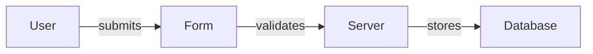

## Common Patterns

### API Request Flow
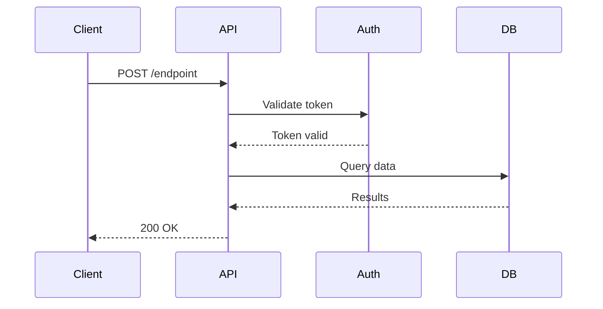

### Data Pipeline
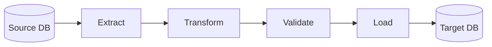

### Dimensional Model
```mermaid
erDiagram
    DIM_CUSTOMER ||--o{ FACT_SALES : "customer_id"
    DIM_PRODUCT ||--o{ FACT_SALES : "product_id"
    DIM_DATE ||--o{ FACT_SALES : "date_key"
    
    FACT_SALES {
        bigint sales_key PK
        bigint customer_id FK
        bigint product_id FK
        bigint date_key FK
        decimal amount
    }
```

### Class Hierarchy
```mermaid
classDiagram
    class BaseModel {
        <<abstract>>
        +id: int
        +created_at: timestamp
        +save()
        +delete()
    }
    
    class User {
        +username: string
        +email: string
        +authenticate()
    }
    
    class Product {
        +name: string
        +price: decimal
        +calculateTax()
    }
    
    BaseModel <|-- User
    BaseModel <|-- Product
```

### State Machine
```mermaid
stateDiagram-v2
    [*] --> Draft
    Draft --> Review : submit
    Review --> Approved : approve
    Review --> Rejected : reject
    Rejected --> Draft : revise
    Approved --> Published : publish
    Published --> Archived : archive
    Archived --> [*]
```

## Troubleshooting

### Common Errors

**Invalid syntax:**
- Check for missing quotes around labels with spaces
- Verify all arrows are properly formed
- Ensure proper use of brackets/parentheses for node shapes

**Diagram not rendering:**
- Verify Mermaid code block has correct language identifier
- Check for balanced brackets
- Ensure no special characters breaking syntax

**Complex diagrams:**
- Split into multiple smaller diagrams
- Use subgraphs to organize
- Consider different diagram type

## Resources

- [Mermaid Live Editor](https://mermaid.live/) - Test and export diagrams
- [Mermaid Documentation](https://mermaid.js.org/) - Official docs
- [Mermaid CLI](https://github.com/mermaid-js/mermaid-cli) - Command-line tool
