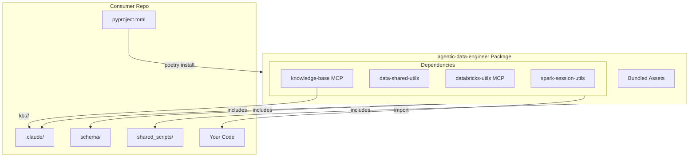

# Agentic Data Engineer

All-in-one data engineering platform with Claude AI integration.

## Overview

`agentic-data-engineer` is an all-in-one Python package that bundles:

- **20 Claude AI Agents** - Specialized agents for data engineering tasks
- **9 Speckit Commands** - AI-powered development workflow
- **5 Reusable Skills** - JSON, Mermaid diagrams, PDF generation, and more
- **Schema Definitions** - ODCS/ODPS data contract and product schemas
- **Shared Scripts** - Databricks authentication, environment setup utilities

## Quick Start

### For Consumer Repos (Recommended)

**Step 1: Add dependency**

```toml
# pyproject.toml
[tool.poetry.dependencies]
skyscanner-agentic-data-engineer = "1.0.0"
```

**Step 2: Install**

```bash
poetry install
```

**That's it!** All assets are automatically available:
- Utility packages ready to import in your code
- Claude agents, commands, and skills accessible in `.claude/`
- Schema definitions for data contracts/products in `schema/`
- Shared scripts available in `shared_scripts/`
- Agent documentation in `shared_agents_usage_docs/`
- Speckit constitution template in `.specify`

Everything is packaged and available immediately after installation.

### Using the Utilities

```python
# Core Skyscanner utilities available
from spark_session_utils import SparkSessionManager
from data_shared_utils.dataframe_utils import DataFrameUtils
```

## Package Contents

### Core Dependencies (via Poetry)

| Package | Version | Description |
|---------|---------|-------------|
| `skyscanner-spark-session-utils` | >=1.0.1 | Spark session lifecycle, configuration presets, logging |
| `skyscanner-data-shared-utils` | >=1.0.2 | Core Databricks utilities, Unity Catalog ops, testing |
| `skyscanner-databricks-utils` | >=0.2.2 | MCP server for Claude Code + Databricks integration |
| `skyscanner-data-knowledge-base-mcp` | >=1.0.5 | Data knowledge base MCP integration |

### Bundled Assets (Automatically Included)

```
your-project/
├── .claude/
│   ├── agents/shared/           # 20 specialized agents
│   │   ├── bronze-table-finder-agent.md
│   │   ├── claude-agent-template-generator.md
│   │   ├── coding-agent.md
│   │   ├── data-contract-agent.md
│   │   ├── data-naming-agent.md
│   │   ├── data-profiler-agent.md
│   │   ├── decision-documenter-agent.md
│   │   ├── dimensional-modeling-agent.md
│   │   ├── documentation-agent.md
│   │   ├── makefile-formatter-agent.md
│   │   ├── materialized-view-agent.md
│   │   ├── medallion-architecture-agent.md
│   │   ├── project-structure-agent.md
│   │   ├── pyproject-formatter-agent.md
│   │   ├── pyspark-standards-agent.md
│   │   ├── silver-data-modeling-agent.md
│   │   ├── streaming-tables-agent.md
│   │   ├── testing-agent.md
│   │   ├── transformation-validation-agent.md
│   │   └── unity-catalog-agent.md
│   ├── commands/                # 9 speckit workflow commands
│   │   ├── speckit.analyze.md
│   │   ├── speckit.checklist.md
│   │   ├── speckit.clarify.md
│   │   ├── speckit.constitution.md
│   │   ├── speckit.implement.md
│   │   ├── speckit.plan.md
│   │   ├── speckit.specify.md
│   │   ├── speckit.tasks.md
│   │   └── speckit.taskstoissues.md
│   └── skills/                  # 5 reusable skills
│       ├── dbdiagram-skill/
│       ├── json-formatter-skill/
│       ├── mermaid-diagrams-skill/
│       ├── pdf-creator-skill/
│       └── recommend_silver_data_model-skill/
├── schema/                      # Schema definitions
│   ├── data_contract/           # ODCS schemas
│   │   └── odcs/v3.1.0/
│   └── data_product/            # ODPS schemas
│       └── odps/v1.0.0/
├── shared_scripts/              # Utility scripts
│   ├── activate-pyenv.sh
│   ├── databricks-auth-setup.sh
│   ├── databricks-auth-setup-zsh.sh
│   └── fix-databricks-cache.sh
└── shared_agents_usage_docs/    # Agent documentation
    └── README-*.md              # Usage guides for each agent
```

## Updating to New Versions

Since this package is installed directly (not from a registry), update by pulling latest changes:

```bash
# In consumer repo - poetry will pick up the latest from source
poetry install
```

## Makefile Integration

Add these targets to your project's Makefile:

```makefile
# Check installed version
platform-info:
	poetry show skyscanner-agentic-data-engineer
```

## Included Agents

| Agent | Purpose |
|-------|---------|
| `bronze-table-finder` | Discover and analyze Bronze layer tables |
| `claude-agent-template-generator` | Create new agent templates |
| `coding-agent` | General code implementation |
| `data-contract-agent` | Generate and validate ODCS data contracts |
| `data-naming-agent` | Naming conventions and consistency |
| `data-profiler` | Data analysis and statistical profiling |
| `decision-documenter` | Document architectural decisions |
| `dimensional-modeling` | Design fact and dimension tables |
| `documentation-agent` | Generate technical documentation |
| `makefile-formatter-agent` | Format and validate Makefiles |
| `materialized-view-agent` | Design materialized views for Databricks |
| `medallion-architecture` | Design Bronze/Silver/Gold layers |
| `project-structure-agent` | Scaffold and organize project structure |
| `pyproject-formatter-agent` | Format and validate pyproject.toml files |
| `pyspark-standards-agent` | Enforce PySpark coding standards |
| `silver-data-modeling` | Entity-Centric Modeling for Silver layer |
| `streaming-tables-agent` | Design streaming table pipelines |
| `testing-agent` | Test development and QA |
| `transformation-validation-agent` | Validate data transformations |
| `unity-catalog-agent` | Unity Catalog management and operations |

## Knowledge Base

The knowledge base is accessible via the `skyscanner-data-knowledge-base-mcp` package. Agents and commands reference these documents for context via the MCP server.

### Access Pattern
```
kb://document/<domain>/<document>
```

This knowledge base is managed separately and installed as a dependency.

## Speckit Workflow

Speckit provides an AI-powered development workflow:

```bash
# Create feature specification
/speckit.specify "Add user authentication feature"

# Generate implementation plan
/speckit.plan

# Clarify requirements
/speckit.clarify

# Generate tasks
/speckit.tasks

# Create checklist
/speckit.checklist

# Execute implementation
/speckit.implement

# Analyze consistency
/speckit.analyze

# Convert to GitHub issues
/speckit.taskstoissues
```

## Development Setup (Contributors)

For developing on `agentic-data-engineer` itself:

### Prerequisites

- Python 3.10+ (via pyenv, 3.12 recommended)
- Poetry 2.2+
- Make 3.81+

### Setup

```bash
# Clone repository
git clone git@github.com:Skyscanner/agentic-data-engineer.git
cd agentic-data-engineer

# Setup environment
make setup

# Or manually:
pyenv install 3.12.12
pyenv local 3.12.12
poetry install
```

### MCP Server Setup

For Claude Code integration with Databricks:

```bash
# Install MCP dependencies
make setup-mcp

# Configure environment
export DATABRICKS_HOST="https://your-workspace.cloud.databricks.com"
export DATABRICKS_WAREHOUSE_ID="your-warehouse-id"

# Authenticate
databricks auth login --host $DATABRICKS_HOST
```

### Testing

```bash
make test          # Run tests
make test-cov      # Run with coverage
make lint          # Check code style
make lint-fix      # Fix code style
```

### Building & Packaging

```bash
make build         # Build distribution
make validate      # Validate package structure
```

## Repository Structure

```
agentic-data-engineer/
├── .claude/                     # Claude Code assets
│   ├── agents/shared/           # 20 AI agents
│   ├── commands/                # 9 Speckit commands
│   └── skills/                  # 5 reusable skills
├── .github/
│   └── workflows/
│       └── main.yaml            # CI/CD pipeline
├── .specify/                    # Speckit workflow templates
│   ├── templates/
│   ├── scripts/
│   └── memory/
├── docs/                        # Documentation
│   └── PACKAGING.md
├── schema/                      # Schema definitions
│   ├── data_contract/           # ODCS v3.1.0
│   └── data_product/            # ODPS v1.0.0
├── scripts/                     # Build scripts
│   └── verify-packaging.sh
├── shared_agents_usage_docs/    # Agent documentation (21 READMEs)
├── shared_scripts/              # Environment utilities (4 scripts)
├── specs/                       # Feature specifications
│   ├── 001-ai-native-data-eng-process/
│   ├── 001-makefile-build-tools/
│   └── .../
├── Makefile                     # Build automation
├── pyproject.toml               # Package configuration
├── MANIFEST.in                  # Package manifest
└── README.md                    # This file
```

## Architecture



## Version History

See [CHANGELOG.md](./CHANGELOG.md) for version history.

## License

MIT License - see LICENSE file for details.
