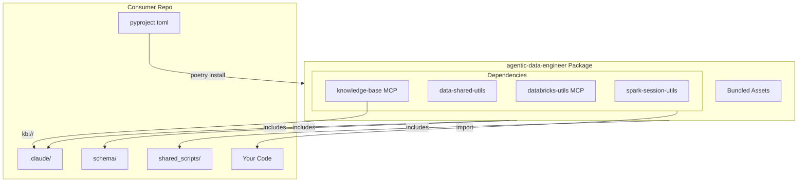

# Agentic Data Engineer

All-in-one data engineering platform with Claude AI integration.

## Overview

`skyscanner-agentic-data-engineer` is an all-in-one Python package that bundles:

- **21 Claude AI Agents** - Specialized agents for data engineering tasks
- **9 Speckit Commands** - AI-powered development workflow
- **5 Reusable Skills** - JSON, Mermaid diagrams, PDF generation, and more
- **Schema Definitions** - ODCS/ODPS data contract and product schemas
- **Shared Scripts** - Databricks authentication, environment setup utilities

## Setup Instructions

### Prerequisites

Before installing, ensure you have:

- **Python 3.10+** (3.12 recommended for best compatibility)
- **Poetry 2.2+** for dependency management
- **Claude Code CLI** (optional, for AI agents)
- **Databricks CLI** (optional, for MCP integration)

### Quick Start (Consumer Repos)

#### Step 1: Add Dependency

Add to your `pyproject.toml`:

```toml
[tool.poetry.dependencies]
skyscanner-agentic-data-engineer = "1.0.0"
```

#### Step 2: Install Package

```bash
# Install with Poetry
poetry install

# Or update existing installation
poetry update skyscanner-agentic-data-engineer
```

#### Step 3: Verify Installation

```bash
# Check installed version
poetry show skyscanner-agentic-data-engineer

# Expected output:
# name         : skyscanner-agentic-data-engineer
# version      : 1.0.0
# description  : All-in-one data engineering platform with Claude AI integration
```

#### What Gets Installed

After installation, all assets are automatically available:

✅ **Claude AI Assets** - 21 agents, 9 commands, 5 skills in `.claude/`
✅ **Schema Definitions** - ODCS/ODPS schemas in `shared_schema/`
✅ **Utility Scripts** - Databricks auth and environment setup in `shared_scripts/`
✅ **Documentation** - Agent usage guides in `shared_agents_usage_docs/`
✅ **Constitution Template** - Speckit workflow configuration in `.specify/`
✅ **Python Utilities** - Spark session, data utils, MCP servers

### Using the Package

#### 1. Import Python Utilities

```python
# Spark session management
from spark_session_utils import SparkSessionManager

# Core data utilities
from data_shared_utils.dataframe_utils import DataFrameUtils
```

#### 2. Use Claude AI Agents

Agents are automatically available in Claude Code:

```bash
# Example: Use the bronze-table-finder agent
# In Claude Code, reference the agent
"Use bronze-table-finder-agent to find source tables for my Silver user_session"
```

#### 3. Run Speckit Commands

```bash
# Create feature specification
/speckit.specify "Add user authentication"

# Generate implementation plan
/speckit.plan

# Generate tasks
/speckit.tasks

# Execute implementation
/speckit.implement
```

#### 4. Use Shared Scripts

```bash
# Setup Databricks authentication
source shared_scripts/databricks-auth-setup.sh

# Activate pyenv environment
source shared_scripts/activate-pyenv.sh

# Fix Databricks cache issues
./shared_scripts/fix-databricks-cache.sh
```

### MCP Server Setup (Optional)

For Claude Code + Databricks integration:

#### Step 1: Install MCP Dependencies

```bash
# In your consumer repo
poetry install --with mcp
```

#### Step 2: Configure Databricks

```bash
# Set environment variables
export DATABRICKS_HOST="https://skyscanner-dev.cloud.databricks.com"
export DATABRICKS_CONFIG_PROFILE="skyscanner-dev"
export DATABRICKS_WAREHOUSE_ID="your-warehouse-id"

# Authenticate with Databricks
databricks auth login --host $DATABRICKS_HOST
```

#### Step 3: Configure Claude Code MCP

Add to your `.claude/settings.local.json`:

```json
{
  "mcpServers": {
    "databricks": {
      "command": "poetry",
      "args": ["run", "python", "-m", "databricks_utils.mcp.server"],
      "env": {
        "DATABRICKS_HOST": "https://skyscanner-dev.cloud.databricks.com",
        "DATABRICKS_CONFIG_PROFILE": "skyscanner-dev",
        "DATABRICKS_WAREHOUSE_ID": "your-warehouse-id"
      }
    },
    "data-knowledge-base": {
      "command": "poetry",
      "args": ["run", "python", "-m", "data_knowledge_base_mcp.server"]
    }
  }
}
```

#### Step 4: Test MCP Connection

```bash
# In Claude Code, test MCP tools
# Use databricks__execute_query to run a simple query
```

### Troubleshooting

#### Issue: Package Not Found

```bash
# Clear Poetry cache and reinstall
poetry cache clear pypi --all
poetry install
```

#### Issue: MCP Server Not Starting

```bash
# Check Poetry environment
poetry env info

# Verify MCP dependencies installed
poetry show mcp httpx anyio

# Check logs
tail -f ~/.local/state/claude/logs/mcp*.log
```

#### Issue: Databricks Authentication Failing

```bash
# Re-authenticate
databricks auth login --host $DATABRICKS_HOST

# Verify credentials
databricks auth profiles

# Test connection
databricks warehouses list
```

#### Issue: Agents Not Available in Claude Code

1. Check `.claude/` directory exists in your project
2. Restart Claude Code
3. Verify package installed: `poetry show skyscanner-agentic-data-engineer`
4. Check Claude Code logs for errors

### Updating to New Versions

```bash
# Update to latest version
poetry update skyscanner-agentic-data-engineer

# Or specify version
poetry add skyscanner-agentic-data-engineer@1.1.0

# Verify update
poetry show skyscanner-agentic-data-engineer
```

## Package Contents

### Project Structure

This repository uses a specific structure to properly package resources while keeping them accessible during development:

```
agentic-data-engineer/
├── src/
│   └── agentic_data_engineer/           # Main Python package
│       ├── __init__.py                  # Package API for accessing resources
│       ├── .claude/                     # Claude AI assets (actual directory)
│       │   ├── agents/shared/           # 21 specialized agents
│       │   │   ├── bronze-table-finder-agent.md
│       │   │   ├── data-contract-agent.md
│       │   │   ├── dimensional-modeling-agent.md
│       │   │   ├── medallion-architecture-agent.md
│       │   │   ├── pyspark-standards-agent.md
│       │   │   └── ... (16 more agents)
│       │   ├── commands/                # 9 speckit workflow commands
│       │   │   ├── speckit.analyze.md
│       │   │   ├── speckit.plan.md
│       │   │   ├── speckit.specify.md
│       │   │   ├── speckit.tasks.md
│       │   │   └── ... (5 more commands)
│       │   └── skills/                  # 5 reusable skills
│       │       ├── dbdiagram-skill/
│       │       ├── json-formatter-skill/
│       │       ├── mermaid-diagrams-skill/
│       │       ├── pdf-creator-skill/
│       │       └── recommend_silver_data_model-skill/
│       ├── .specify/                    # Speckit templates (actual directory)
│       │   └── templates/
│       ├── shared_schema/               # Schema definitions (actual directory)
│       │   ├── data_contract/           # ODCS schemas
│       │   │   └── odcs/v3.1.0/
│       │   └── data_product/            # ODPS schemas
│       │       └── odps/v1.0.0/
│       ├── shared_scripts/              # Utility scripts (actual directory)
│       │   ├── activate-pyenv.sh
│       │   ├── databricks-auth-setup.sh
│       │   ├── databricks-auth-setup-zsh.sh
│       │   └── fix-databricks-cache.sh
│       └── shared_agents_usage_docs/    # Agent documentation (actual directory)
│           └── README-*.md              # Usage guides for 21 agents
├── .claude -> src/agentic_data_engineer/.claude  # Symlink for convenience
├── .specify -> src/agentic_data_engineer/.specify
├── shared_schema -> src/agentic_data_engineer/shared_schema
├── shared_scripts -> src/agentic_data_engineer/shared_scripts
├── shared_agents_usage_docs -> src/agentic_data_engineer/shared_agents_usage_docs
├── pyproject.toml                       # Package configuration
├── Makefile                             # Build automation
└── README.md
```

**Key Points:**
- **Actual resources** live in `src/agentic_data_engineer/` (properly packaged)
- **Symlinks at root** provide convenient access during development
- **Git tracks** both the actual directories and symlinks
- **Poetry packages** everything in `src/agentic_data_engineer/` automatically

### Accessing Resources

#### In Development (This Repo)

Use symlinks at the root for convenience:
```bash
# Edit agents
vim .claude/agents/shared/data-contract-agent.md

# Use scripts
source shared_scripts/activate-pyenv.sh

# View schemas
cat shared_schema/data_contract/odcs/v3.1.0/odcs-json-schema-v3.1.0.skyscanner.schema.json
```

Or access directly:
```bash
vim src/agentic_data_engineer/.claude/agents/shared/data-contract-agent.md
```

#### In Consumer Projects (via Package)

Use the Python API to access resources:
```python
from agentic_data_engineer import get_resource_path, list_resources

# Access schema files
schema_path = get_resource_path('shared_schema/data_contract/odcs/v3.1.0/odcs-json-schema-v3.1.0.skyscanner.schema.json')

# Access agent documentation
agent_doc = get_resource_path('shared_agents_usage_docs/README-data-contract-agent.md')

# Access scripts
script_path = get_resource_path('shared_scripts/activate-pyenv.sh')

# List available resources
all_schemas = list_resources('shared_schema')
all_agents = list_resources('.claude/agents/shared')
```

### Core Dependencies (via Poetry)

| Package | Version | Description |
|---------|---------|-------------|
| `skyscanner-spark-session-utils` | >=1.0.1 | Spark session lifecycle, configuration presets, logging |
| `skyscanner-data-shared-utils` | >=1.0.2 | Core Databricks utilities, Unity Catalog ops, testing |
| `skyscanner-databricks-utils` | >=0.2.2 | MCP server for Claude Code + Databricks integration |
| `skyscanner-data-knowledge-base-mcp` | >=1.0.5 | Data knowledge base MCP integration |

### For Contributors

If you're contributing to this repository:

1. **Clone the repo:**
   ```bash
   git clone https://github.com/Skyscanner/agentic-data-engineer.git
   cd agentic-data-engineer
   ```

2. **Setup development environment:**
   ```bash
   make setup
   ```
   This automatically:
   - Installs Python dependencies via Poetry
   - Sets up convenience symlinks at project root
   - Configures pre-commit hooks

3. **Verify symlinks:**
   ```bash
   ls -la | grep -E "(claude|specify|shared)"
   ```
   You should see symlinks pointing to `src/agentic_data_engineer/`

4. **Edit resources:**
   - Edit via symlinks at root OR directly in `src/agentic_data_engineer/`
   - Both point to the same files

For more details, see [docs/RESOURCES.md](docs/RESOURCES.md).

## Makefile Integration

Add these targets to your project's Makefile:

```makefile
# Check installed version
platform-info:
	poetry show skyscanner-agentic-data-engineer
```

## Included Agents (21 Total)

| Agent | Purpose |
|-------|---------|
| `bronze-table-finder` | Discover and analyze Bronze layer tables |
| `claude-agent-template-generator` | Create new agent templates |
| `coding-agent` | General code implementation |
| `data-contract-agent` | Generate and validate ODCS data contracts |
| `data-naming-agent` | Naming conventions and consistency |
| `data-profiler` | Data analysis and statistical profiling |
| `data-project-generator` | Scaffold new data engineering projects |
| `decision-documenter` | Document architectural decisions |
| `dimensional-modeling` | Design fact and dimension tables |
| `documentation-agent` | Generate technical documentation |
| `makefile-formatter-agent` | Format and validate Makefiles |
| `materialized-view-agent` | Design materialized views for Databricks |
| `medallion-architecture` | Design Bronze/Silver/Gold layers |
| `project-structure-agent` | Scaffold and organize project structure |
| `pyproject-formatter-agent` | Format and validate pyproject.toml files |
| `pyspark-standards-agent` | Enforce PySpark coding standards |
| `silver-data-modeling` | Entity-Centric Modeling for Silver layer |
| `streaming-tables-agent` | Design streaming table pipelines |
| `testing-agent` | Test development and QA |
| `transformation-validation-agent` | Validate data transformations |
| `unity-catalog-agent` | Unity Catalog management and operations |

## Knowledge Base

The knowledge base is accessible via the `skyscanner-data-knowledge-base-mcp` package. Agents and commands reference these documents for context via the MCP server.

### Access Pattern
```
kb://document/<domain>/<document>
```

This knowledge base is managed separately and installed as a dependency.

## Speckit Workflow

Speckit provides an AI-powered development workflow:

```bash
# Create feature specification
/speckit.specify "Add user authentication feature"

# Generate implementation plan
/speckit.plan

# Clarify requirements
/speckit.clarify

# Generate tasks
/speckit.tasks

# Create checklist
/speckit.checklist

# Execute implementation
/speckit.implement

# Analyze consistency
/speckit.analyze

# Convert to GitHub issues
/speckit.taskstoissues
```

## Development Setup (Contributors)

For developing on `agentic-data-engineer` itself:

### Prerequisites

- **Python 3.10+** (3.12 recommended, managed via pyenv)
- **Poetry 2.2+** for dependency management
- **Make 3.81+** for build automation
- **Databricks CLI** for Databricks integration
- **Git** with symlink support (required for resource access)

### Setup Steps

Follow these steps in order:

#### Step 1: Clone Repository

```bash
git clone git@github.com:Skyscanner/agentic-data-engineer.git
cd agentic-data-engineer
```

**Windows Users**: Ensure Git has symlink support enabled:
```bash
git config --global core.symlinks true
# Then re-clone the repository
```
```

#### Step 2: Install pyenv and Python

```bash
# Install pyenv and configure Python version
make project-pyenv-init
```

This will:
- Install Python version from `.python-version` file
- Configure pyenv for the project
- Set up local Python environment

#### Step 3: Activate pyenv

```bash
# Activate pyenv in your current shell
source shared_scripts/activate-pyenv.sh
```

**Important**: You need to run this in every new terminal session, or add it to your shell profile.

#### Step 4: Initialize Project

```bash
# Install all dependencies and set up project
make project-init
```

This command will:
- Install Databricks CLI
- Install Poetry
- Install all Python dependencies (including MCP servers)
- Set up pre-commit hooks
- **Create convenience symlinks** at project root (`.claude`, `.specify`, `shared_schema`, `shared_scripts`, `shared_agents_usage_docs`)

#### Step 5: Verify Symlinks

After initialization, verify that symlinks were created:

```bash
# Check symlinks
ls -la | grep -E "(claude|specify|shared)"

# Expected output:
# lrwxr-xr-x .claude -> src/agentic_data_engineer/.claude
# lrwxr-xr-x .specify -> src/agentic_data_engineer/.specify
# lrwxr-xr-x shared_schema -> src/agentic_data_engineer/shared_schema
# lrwxr-xr-x shared_scripts -> src/agentic_data_engineer/shared_scripts
# lrwxr-xr-x shared_agents_usage_docs -> src/agentic_data_engineer/shared_agents_usage_docs
```

If symlinks are missing or broken, run:

```bash
make setup-symlinks
```

#### Step 6: Configure Databricks Authentication

```bash
# Set up Databricks authentication
source shared_scripts/databricks-auth-setup.sh
```

This will:
- Prompt for your Databricks host and warehouse ID
- Configure authentication via OAuth or token
- Set up environment variables

### Validation

After setup, validate your installation:

#### Check `/agents` Command

```bash
# In Claude Code, run:
/agents

# Expected output: List of 21 available agents
# - bronze-table-finder-agent
# - claude-agent-template-generator
# - coding-agent
# - data-contract-agent
# ... (21 total)
```

#### Check `/mcp` Command

```bash
# In Claude Code, run:
/mcp

# Expected output: List of MCP servers
# - databricks (skyscanner-databricks-utils)
# - data-knowledge-base (skyscanner-data-knowledge-base-mcp)
```

#### Verify MCP Server Status

```bash
# Check MCP server health
poetry run python -m databricks_utils.mcp.server --help
poetry run python -m data_knowledge_base_mcp.server --help

# Both should show help output without errors
```

#### Test Databricks Connection

```bash
# List Databricks warehouses (should succeed if auth is correct)
databricks warehouses list

# Test query via MCP (in Claude Code)
# Use: databricks__execute_query("SELECT 1 as test")
```

### Common Issues

#### pyenv not activated
**Symptom**: Command not found, wrong Python version
**Fix**:
```bash
source shared_scripts/activate-pyenv.sh
```

#### MCP servers not starting
**Symptom**: `/mcp` shows errors or no servers
**Fix**:
```bash
# Reinstall MCP dependencies
poetry install --with mcp

# Check environment
poetry env info
```

#### Databricks auth failing
**Symptom**: Authentication errors when running queries
**Fix**:
```bash
# Re-run auth setup
source shared_scripts/databricks-auth-setup.sh

# Or manually authenticate
databricks auth login --host $DATABRICKS_HOST
```

### Testing & Validation

```bash
# Run all tests
make test

# Run tests with coverage
make test-cov

# Check code style
make lint

# Auto-fix code style issues
make lint-fix

# Validate package structure
make validate
```

### Building & Packaging

```bash
# Build distribution package
make build

# Build fat distribution (includes all dependencies)
make build-fat

# Build and verify contents
make build-verify

# Clean build artifacts
make clean
```

### CI/CD Pipeline

The project uses GitHub Actions for automated builds and deployments:

#### Build Jobs

On every push and pull request, the workflow runs:

1. **`build`** - Creates standard distribution package
   - Runs `make build`
   - Uploads artifacts as `dist-{run_number}`
   - Retention: 30 days

2. **`build-fat`** - Creates fat distribution with all dependencies bundled
   - Runs `make build-fat`
   - Uploads artifacts as `fatdist-{run_number}`
   - Retention: 30 days

#### Deployment Jobs

1. **`dabs-publish-dev`** - Deploys to Databricks dev workspace (on main branch)
2. **`create-deployment-version`** - Creates deployment version tracking files
3. **`publish`** - Publishes to Artifactory (on git tags only)

#### Workflow Configuration

Location: `.github/workflows/main.yaml`

Required permissions:
```yaml
permissions:
  actions: read          # Required for reusable workflows
  contents: write        # Required for creating releases
  pull-requests: write   # Required for PR operations
  id-token: write        # Required for OIDC authentication
```

#### Triggering Builds

```bash
# Trigger build on PR
git checkout -b feature/my-change
git push origin feature/my-change

# Trigger deployment to dev (main branch)
git checkout main
git push origin main

# Trigger publish to Artifactory (tag)
git tag v1.0.5
git push origin v1.0.5
```

### Daily Development Workflow

```bash
# 1. Activate pyenv (once per terminal session)
source shared_scripts/activate-pyenv.sh

# 2. Pull latest changes
git pull

# 3. Update dependencies if needed
poetry install

# 4. Make your changes
# ... edit files ...

# 5. Run tests
make test

# 6. Fix linting
make lint-fix

# 7. Commit changes
git add .
git commit -m "Your change description"

# 8. Push changes
git push
```

## Repository Structure

```
agentic-data-engineer/
├── .claude/                     # Claude Code assets
│   ├── agents/shared/           # 21 AI agents
│   ├── commands/                # 9 Speckit commands
│   └── skills/                  # 5 reusable skills
├── .github/
│   └── workflows/
│       └── main.yaml            # CI/CD pipeline
├── .specify/                    # Speckit workflow templates
│   ├── templates/
│   ├── scripts/
│   └── memory/
├── docs/                        # Documentation
│   └── PACKAGING.md
├── shared_schema/               # Schema definitions
│   ├── data_contract/           # ODCS v3.1.0
│   └── data_product/            # ODPS v1.0.0
├── scripts/                     # Build scripts
│   └── verify-packaging.sh
├── shared_agents_usage_docs/    # Agent documentation (21 READMEs)
├── shared_scripts/              # Environment utilities (4 scripts)
├── specs/                       # Feature specifications
│   ├── 001-ai-native-data-eng-process/
│   ├── 001-makefile-build-tools/
│   └── .../
├── Makefile                     # Build automation
├── pyproject.toml               # Package configuration
├── MANIFEST.in                  # Package manifest
└── README.md                    # This file
```

## Architecture



## Version History

See [CHANGELOG.md](./CHANGELOG.md) for version history.

## License

MIT License - see LICENSE file for details.
