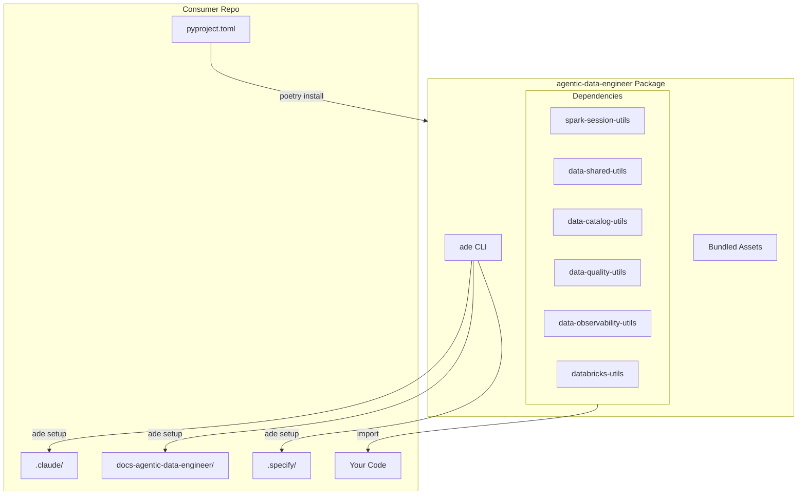

# Agentic Data Engineer

All-in-one data engineering platform with Claude AI integration.

## Overview

`agentic-data-engineer` is an installable Python package that bundles:

- **6 Utility Packages** - Spark, data quality, observability, catalog management
- **12 Claude AI Agents** - Specialized agents for data engineering tasks
- **9 Speckit Commands** - AI-powered development workflow
- **5 Reusable Skills** - JSON, Mermaid diagrams, PDF generation, and more
- **Knowledge Base** - Documentation for agent context

## Quick Start

### For Consumer Repos (Recommended)

**Step 1: Add dependency**

```toml
# pyproject.toml
[tool.poetry.dependencies]
agentic-data-engineer = { git = "git@github.com:Skyscanner/agentic-data-engineer.git", tag = "v1.0.0" }
```

**Step 2: Install**

```bash
poetry install
```

**Step 3: Setup Claude assets**

```bash
poetry run ade setup
```

**That's it!** You now have:
- All utility packages available for import
- Claude agents, commands, and skills in `.claude/`
- Knowledge base documentation in `docs-agentic-data-engineer/`
- Speckit workflow templates in `.specify/`

### Using the Utilities

```python
# All packages available via single install
from spark_session_utils import SparkSessionManager
from data_shared_utils.dataframe_utils import DataFrameUtils
from data_quality_utils import ValidationRule, ValidationRuleset
from data_catalog_utils import CatalogManager
from data_observability_utils import MonteCarloClient
```

## CLI Reference

The `ade` CLI manages Claude assets in your project:

```bash
# Install all Claude assets to current project
ade setup

# Force overwrite existing assets
ade setup --force

# Install only specific components
ade setup --claude-only      # Only .claude/ directory
ade setup --docs-only        # Only docs-agentic-data-engineer/
ade setup --specify-only     # Only .specify/ directory

# Install to a different directory
ade setup --target /path/to/project

# Update assets after upgrading package
ade update

# Show bundled assets info
ade info

# Check installation status
ade status

# Show version
ade --version
```

## What Gets Installed

### Utility Packages (via Poetry dependencies)

| Package | Version | Description |
|---------|---------|-------------|
| `skyscanner-spark-session-utils` | 0.2.0 | Spark session lifecycle, configuration presets, logging |
| `skyscanner-data-shared-utils` | 0.3.0 | Core Databricks utilities, Unity Catalog ops, testing |
| `data-catalog-utils` | 1.0.0 | Unity Catalog management, metadata operations |
| `data-quality-utils` | 1.0.0 | Validation rules, profiling, quality gates |
| `data-observability-utils` | 1.0.0 | Monte Carlo integration, monitoring |
| `skyscanner-databricks-utils` | 0.1.0 | MCP server for Claude Code |

### Claude Assets (via `ade setup`)

```
your-project/
├── .claude/
│   ├── agents/shared/           # 12 specialized agents
│   │   ├── bronze-table-finder-agent.md
│   │   ├── coding-agent.md
│   │   ├── data-naming-agent.md
│   │   ├── data-profiler-agent.md
│   │   ├── data-project-generator-agent.md
│   │   ├── decision-documenter-agent.md
│   │   ├── dimensional-modeling-agent.md
│   │   ├── documentation-agent.md
│   │   ├── medallion-architecture-agent.md
│   │   ├── silver-data-modeling-agent.md
│   │   ├── testing-agent.md
│   │   └── claude-agent-template-generator.md
│   ├── commands/                # 9 speckit workflow commands
│   │   ├── speckit.specify.md
│   │   ├── speckit.plan.md
│   │   ├── speckit.clarify.md
│   │   ├── speckit.tasks.md
│   │   ├── speckit.checklist.md
│   │   ├── speckit.implement.md
│   │   ├── speckit.analyze.md
│   │   ├── speckit.constitution.md
│   │   └── speckit.taskstoissues.md
│   └── skills/                  # 5 reusable skills
│       ├── json-formatter-skill/
│       ├── mermaid-diagrams-skill/
│       ├── dbdiagram-skill/
│       ├── pdf-creator-skill/
│       └── recommend_silver_data_model-skill/
├── docs-agentic-data-engineer/  # Knowledge base
│   └── knowledge_base/
│       ├── medallion-architecture/
│       ├── dimensional-modeling/
│       ├── data-platform/
│       ├── pipeline/
│       ├── pyspark-standards/
│       └── python-standards/
└── .specify/                    # Workflow templates
    ├── templates/
    ├── scripts/
    └── memory/
```

## Updating to New Versions

```bash
# Update the package
poetry update agentic-data-engineer

# Refresh Claude assets
poetry run ade update
```

## Makefile Integration

Add these targets to your project's Makefile:

```makefile
# Setup platform assets
setup-platform:
	poetry run ade setup

# Update to latest version
update-platform:
	poetry update agentic-data-engineer
	poetry run ade update

# Check platform status
platform-status:
	poetry run ade status
```

## Included Agents

| Agent | Purpose |
|-------|---------|
| `bronze-table-finder` | Discover and analyze Bronze layer tables |
| `coding-agent` | General code implementation |
| `data-naming-agent` | Naming conventions and consistency |
| `data-profiler` | Data analysis and statistical profiling |
| `data-project-generator` | Scaffold new data projects |
| `decision-documenter` | Document architectural decisions |
| `dimensional-modeling` | Design fact and dimension tables |
| `documentation-agent` | Generate technical documentation |
| `medallion-architecture` | Design Bronze/Silver/Gold layers |
| `silver-data-modeling` | Entity-Centric Modeling for Silver layer |
| `testing-agent` | Test development and QA |
| `claude-agent-template-generator` | Create new agent templates |

## Speckit Workflow

Speckit provides an AI-powered development workflow:

```bash
# Create feature specification
/speckit.specify "Add user authentication feature"

# Generate implementation plan
/speckit.plan

# Clarify requirements
/speckit.clarify

# Generate tasks
/speckit.tasks

# Create checklist
/speckit.checklist

# Execute implementation
/speckit.implement

# Analyze consistency
/speckit.analyze

# Convert to GitHub issues
/speckit.taskstoissues
```

## Development Setup (Contributors)

For developing on `agentic-data-engineer` itself:

### Prerequisites

- Python 3.10+ (via pyenv)
- Poetry 2.2+
- Git with submodule support

### Setup

```bash
# Clone with submodules
git clone --recurse-submodules git@github.com:Skyscanner/agentic-data-engineer.git
cd agentic-data-engineer

# Setup environment
make setup

# Or manually:
pyenv install 3.12.12
pyenv local 3.12.12
poetry install
```

### Working with Submodules

```bash
# Update all submodules
git submodule update --remote --merge

# Check submodule status
git submodule status
```

### Submodule Packages

| Submodule | Repository |
|-----------|------------|
| `spark-session-utils` | github.com/Skyscanner/spark-session-utils |
| `data-shared-utils` | github.com/Skyscanner/data-shared-utils |
| `data-catalog-utils` | github.com/Skyscanner/data-catalog-utils |
| `data-quality-utils` | github.com/Skyscanner/data-quality-utils |
| `data-observability-utils` | github.com/Skyscanner/data-observability-utils |
| `blue-data-nova-cookiecutter` | github.com/Skyscanner/blue-data-nova-cookiecutter |

### MCP Server Setup

For Claude Code integration with Databricks:

```bash
# Install MCP dependencies
make setup-mcp

# Configure environment
export DATABRICKS_HOST="https://your-workspace.cloud.databricks.com"
export DATABRICKS_WAREHOUSE_ID="your-warehouse-id"

# Authenticate
databricks auth login --host $DATABRICKS_HOST
```

### Testing

```bash
make test          # Run tests
make test-cov      # Run with coverage
make lint          # Check code style
make lint-fix      # Fix code style
```

### Building

```bash
make build         # Build distribution
```

## Repository Structure

```
agentic-data-engineer/
├── src/agentic_data_engineer/
│   ├── __init__.py              # Package version
│   ├── cli.py                   # CLI implementation
│   └── _assets/                 # Bundled assets
│       ├── claude/              # Agents, commands, skills
│       ├── docs/                # Knowledge base
│       └── specify/             # Workflow templates
├── spark-session-utils/         # Submodule
├── data-shared-utils/           # Submodule
├── data-catalog-utils/          # Submodule
├── data-quality-utils/          # Submodule
├── data-observability-utils/    # Submodule
├── data-project-templates/
│   └── blue-data-nova-cookiecutter/  # Submodule
├── .claude/                     # Dev copy (symlinks to _assets)
├── docs-agentic-data-engineer/  # Dev copy
├── .specify/                    # Dev copy
├── specs/                       # Feature specifications
├── pyproject.toml
├── Makefile
└── README.md
```

## Architecture



## Version History

See [CHANGELOG.md](./CHANGELOG.md) for version history.

## License

MIT License - see LICENSE file for details.
