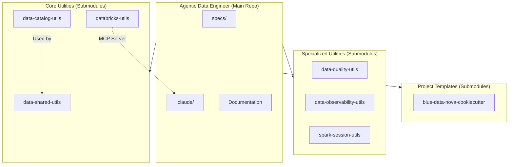
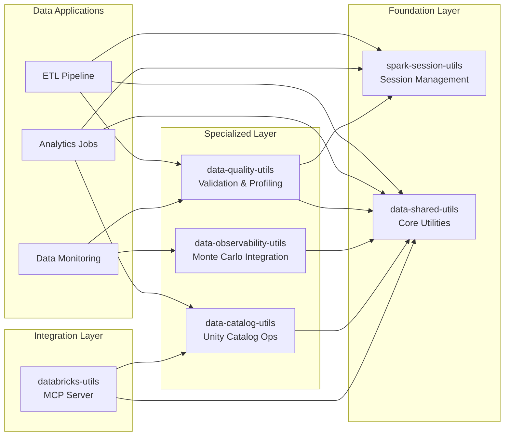
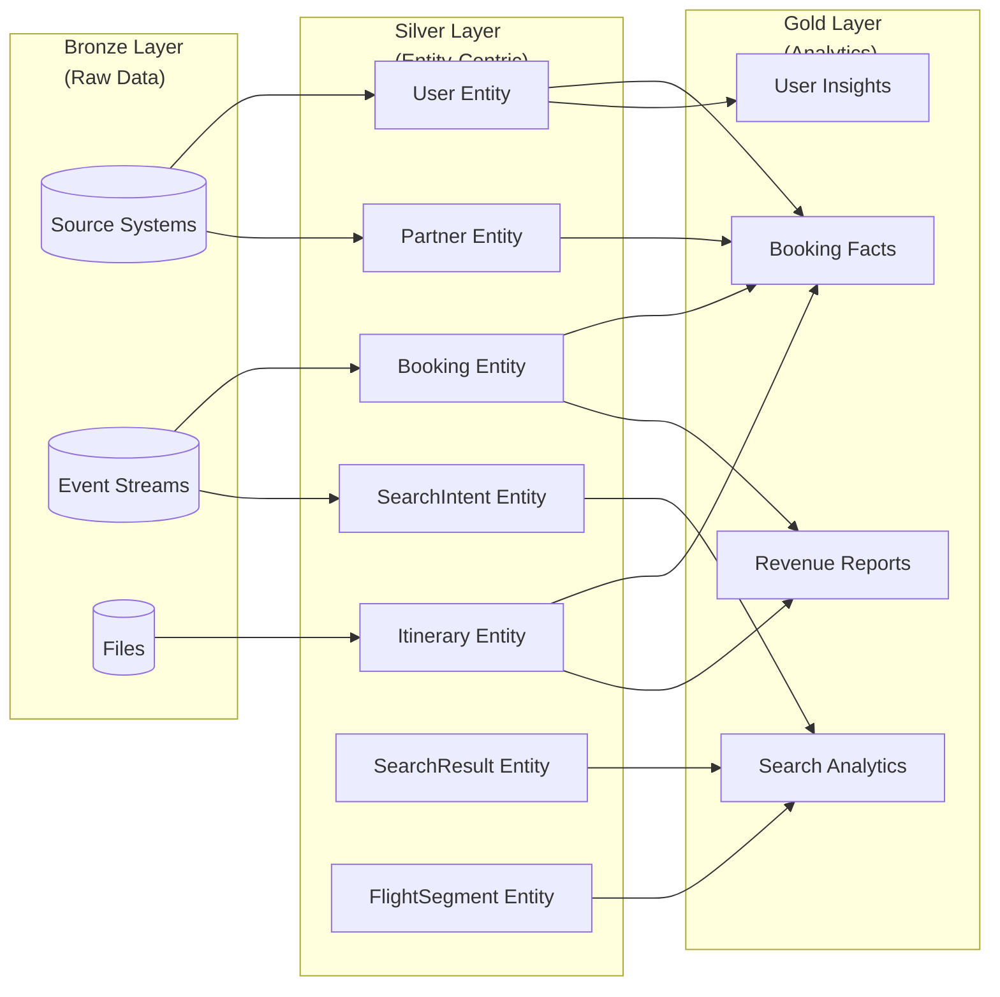
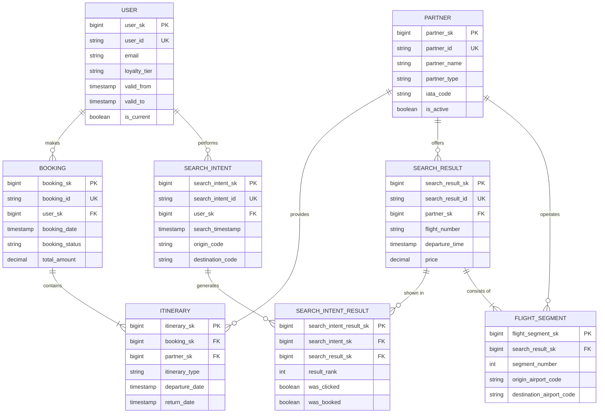
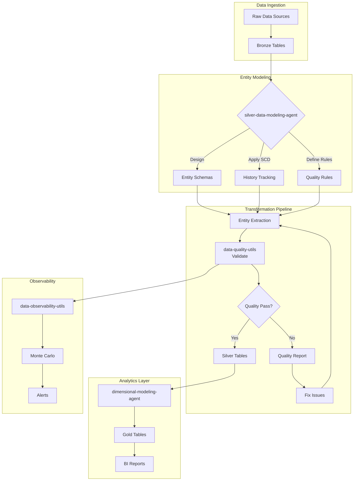
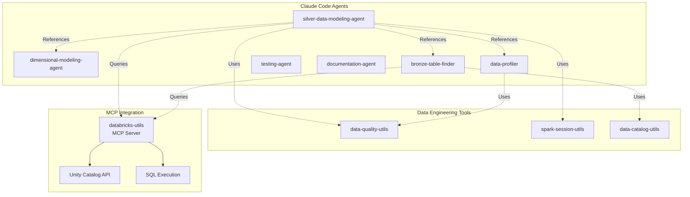
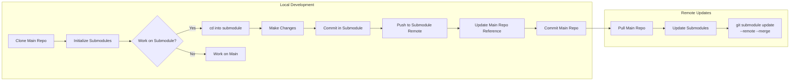

# Agentic Data Engineer

A multi-package monorepo for data engineering utilities with independent packages for data quality, observability, Spark session management, and Databricks integration.

## Submodule Initialization

This repository uses git submodules for package management. After cloning, initialize all submodules:

```bash
# Clone the repository with submodules
git clone --recurse-submodules https://github.com/your-org/agentic-data-engineer.git

# Or if already cloned, initialize submodules
git submodule update --init --recursive
```

## Packages

This repository contains 6 independent Python packages and 1 project template:

### 1. spark-session-utils (v1.0.0)
Spark session management, configuration, and logging utilities.

**Repository**: https://github.com/Skyscanner/spark-session-utils

**Features**:
- Spark session lifecycle management
- Configuration presets (Databricks, local, cluster)
- Structured logging with context support
- Delta Lake integration

**Installation**:
```bash
pip install spark-session-utils==1.0.0
```

[→ Documentation](./spark-session-utils/README.md)

### 2. data-shared-utils (v0.3.0)
Core utilities for Databricks with Unity Catalog integration and testing support.

**Repository**: https://github.com/Skyscanner/data-shared-utils

**Features**:
- Unity Catalog operations (via data-catalog-utils)
- Testing utilities and fixtures
- Error handling (retry logic, exponential backoff)

**Installation**:
```bash
pip install data-shared-utils==0.3.0
```

[→ Documentation](./data-shared-utils/README.md)

### 3. data-catalog-utils
Unity Catalog utilities for data catalog management and metadata operations.

**Repository**: https://github.com/Skyscanner/data-catalog-utils

**Features**:
- Unity Catalog table and schema operations
- Metadata management
- Catalog integration helpers

**Installation**:
```bash
pip install data-catalog-utils
```

[→ Documentation](./data-catalog-utils/README.md)

### 4. data-quality-utils (v1.0.0)
Standalone data quality validation and profiling for PySpark DataFrames.

**Repository**: https://github.com/Skyscanner/data-quality-utils

**Features**:
- Declarative validation rules (completeness, uniqueness, freshness, schema, pattern, range)
- Statistical data profiling with sampling support
- Quality gates and anomaly detection

**Installation**:
```bash
pip install data-quality-utils==1.0.0
```

[→ Documentation](./data-quality-utils/README.md)

### 5. data-observability-utils (v1.0.0)
Standalone Monte Carlo observability integration for data monitoring.

**Repository**: https://github.com/Skyscanner/data-observability-utils

**Features**:
- Monte Carlo SDK wrapper
- High-level integration helpers
- Configuration management with credential handling

**Installation**:
```bash
pip install data-observability-utils==1.0.0
```

[→ Documentation](./data-observability-utils/README.md)

### 6. databricks-utils
Databricks integration utilities with MCP server support for Claude Code integration.

**Repository**: https://github.com/Skyscanner/databricks-utils

**Features**:
- Model Context Protocol (MCP) server for Claude Code
- Unity Catalog SQL query execution
- Databricks workspace integration

**Installation**:
```bash
pip install databricks-utils
```

[→ Documentation](./databricks-utils/README.md)

## Project Templates

### blue-data-nova-cookiecutter
Cookiecutter template for creating new data projects following best practices.

**Repository**: https://github.com/Skyscanner/blue-data-nova-cookiecutter

**Features**:
- Pre-configured project structure
- Standard data engineering patterns
- Testing and CI/CD setup
- Configuration management templates

**Usage**:
```bash
# Generate a new project from template
cookiecutter data-project-templates/blue-data-nova-cookiecutter
```

[→ Documentation](./data-project-templates/blue-data-nova-cookiecutter/README.md)

## Quick Start

### Data Quality Validation
```python
from data_quality_utilities import ValidationRule, ValidationRuleset

ruleset = ValidationRuleset(name="user_validation")
ruleset.add_rule(ValidationRule.completeness("user_id", allow_null=False))
ruleset.add_rule(ValidationRule.uniqueness("email"))

result = ruleset.validate(df)
if result.overall_status == Status.FAILED:
    print(f"Validation failed: {result.failed_rules} failures")
```

### Data Profiling
```python
from data_quality_utilities import DataProfiler

profiler = DataProfiler(sample_size=100000)
profile = profiler.profile(df)

print(f"Rows: {profile.row_count:,}")
print(f"Null rate: {profile.get_column_profile('user_id').null_percentage}%")
```

### Spark Session Management
```python
from spark_session_utilities import SparkConfig

config = SparkConfig.for_databricks().enable_delta()
spark = config.create_session(app_name="ETL Pipeline")
```

## Migration from data-shared-utils 0.2.0

If you're migrating from the monolithic `data-shared-utils` 0.2.0:

**Only import paths change** - all class names, method signatures, and parameters remain identical.

See [MIGRATION_GUIDE.md](./MIGRATION_GUIDE.md) for step-by-step instructions.

## Documentation

- [Migration Guide](./MIGRATION_GUIDE.md) - Step-by-step migration from data-shared-utils 0.2.0
- [Changelog](./CHANGELOG.md) - Version history and breaking changes
- [Feature Specifications](./specs/) - Detailed feature specs and design documents

### API Contracts
- [data-quality-utils API](./specs/005-separate-utilities/contracts/data-quality-utils-api.md)
- [data-observability-utils API](./specs/005-separate-utilities/contracts/data-observability-utils-api.md)
- [spark-session-utils API](./specs/005-separate-utilities/contracts/spark-session-utils-api.md)

## Repository Structure

```
.
├── data-quality-utils/                           # Data quality validation package (submodule)
├── data-observability-utils/                     # Monte Carlo observability package (submodule)
├── spark-session-utils/                          # Spark session management package (submodule)
├── data-shared-utils/                            # Core Databricks utilities (submodule)
├── data-catalog-utils/                           # Unity Catalog utilities (submodule)
├── databricks-utils/                             # Databricks integration with MCP server (submodule)
├── data-project-templates/
│   └── blue-data-nova-cookiecutter/              # Cookiecutter project template (submodule)
├── .claude/                                      # Claude Code agents and configuration
├── specs/                                        # Feature specifications
├── MIGRATION_GUIDE.md                            # Migration instructions
├── CHANGELOG.md                                  # Version history
└── .gitmodules                                   # Submodule configuration
```

## Architecture & Diagrams

### Repository Structure Overview



### Package Dependencies



### Medallion Architecture with Entities



### Silver Layer Entity Relationships



### Data Engineering Workflow



### Claude Code Agent Ecosystem



### Submodule Development Workflow



## Development

### Working with Submodules

```bash
# Update all submodules to latest commits
git submodule update --remote --merge

# Update a specific submodule
git submodule update --remote --merge data-quality-utils

# Pull latest changes for all submodules
git pull --recurse-submodules

# Check submodule status
git submodule status
```

### Package Development

Each package is independently developed and versioned:

```bash
# Install package in development mode
cd data-quality-utils/
pip install -e ".[dev]"

# Run tests
pytest tests/

# Run linting
black src/ tests/
ruff src/ tests/
mypy src/
```

### MCP Server Setup (Claude Code Integration)

This repository includes a Model Context Protocol (MCP) server via the `databricks-utils` submodule for integration with Claude Code. The main project now includes MCP dependencies for enhanced AI integration capabilities.

**Setup:**

```bash
# Install main project dependencies (includes mcp and pydantic)
make setup

# Install MCP dependencies for databricks-utils submodule
make setup-mcp

# Or manually:
poetry install --no-root
poetry -C databricks-utils install --with mcp
```

**Configuration:**

The MCP server is configured in `.mcp.json`. Ensure the following environment variables are set:

```bash
export DATABRICKS_HOST="https://your-workspace.cloud.databricks.com"
export DATABRICKS_TOKEN="your-personal-access-token"
export DATABRICKS_WAREHOUSE_ID="your-warehouse-id"
```

Once configured, Claude Code will have access to Unity Catalog operations and SQL query execution capabilities through the MCP server.

## License

MIT License - see LICENSE file for details.
