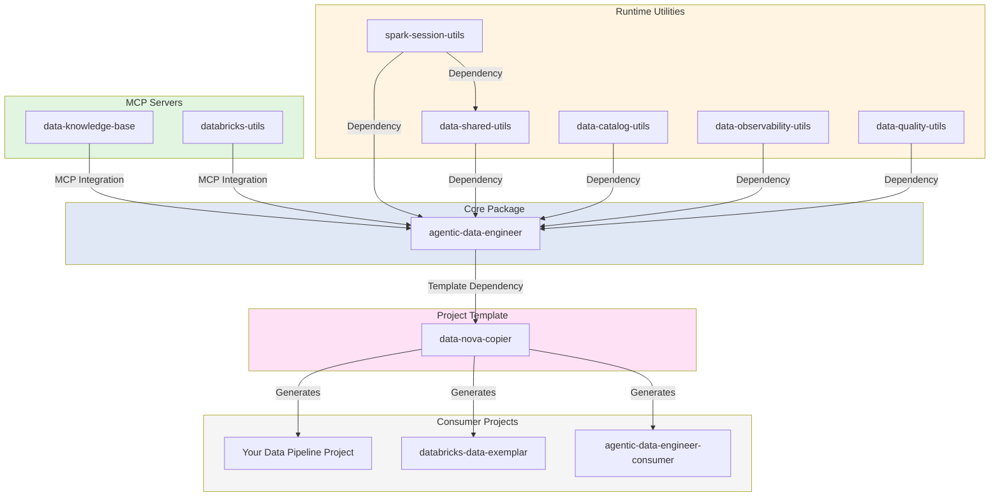
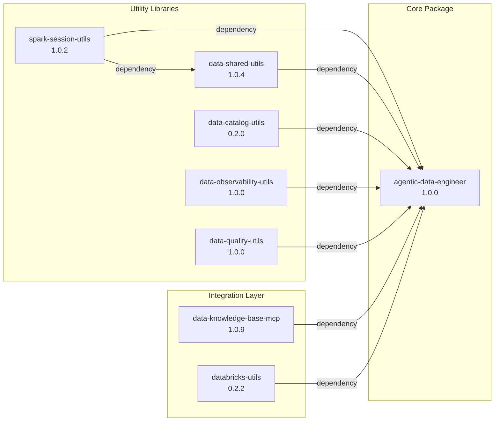
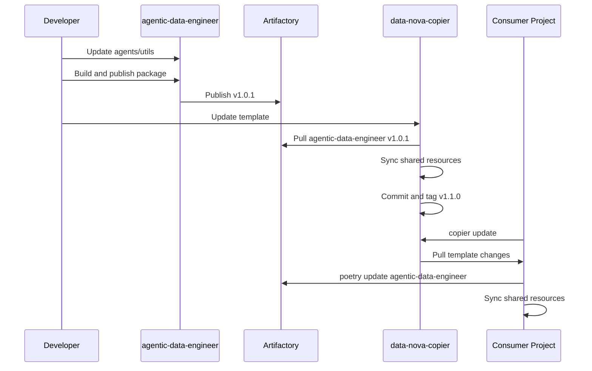

# Repository Relationships - Agentic Data Engineer Framework

## Architecture Overview



## Repository Details

### 1. MCP Servers (Local Context Protocol)

#### data-knowledge-base
- **Purpose**: Local MCP server providing data engineering knowledge base access
- **Artifactory**: [skyscanner-data-knowledge-base](https://artifactory.skyscannertools.net/ui/packages?name=skyscanner-data-knowledge-base&type=packages)
- **Used by**: `.claude/agents` and Speckit constitution in agentic-data-engineer
- **Integration**: MCP server accessible via Claude Code CLI

#### databricks-utils
- **Purpose**: Local MCP server for Databricks connectivity and operations
- **Artifactory**: [skyscanner-databricks-utils](https://artifactory.skyscannertools.net/ui/packages/pypi:%2F%2Fskyscanner-databricks-utils)
- **Used by**: agentic-data-engineer for Databricks SQL execution
- **Integration**: Enables Claude agents to query Databricks directly

### 2. Runtime Utilities

#### spark-session-utils
- **Purpose**: Minimal Spark session management with configuration and testing support
- **Artifactory**: [skyscanner-spark-session-utils](https://artifactory.skyscannertools.net/ui/packages/pypi:%2F%2Fskyscanner-spark-session-utils)
- **Version**: 1.0.2
- **Dependencies**: PySpark >=3.5.1, Pydantic ^2.0, PyYAML ^6.0
- **Key Features**:
  - SparkSessionFactory (thread-safe singleton)
  - ConfigLoader (environment-specific YAML configs)
  - Pytest fixtures for isolated testing
  - No Unity Catalog dependencies

#### data-shared-utils
- **Purpose**: Full platform utilities combining Spark and Unity Catalog operations
- **Artifactory**: [skyscanner-data-shared-utils](https://artifactory.skyscannertools.net/artifactory/api/pypi/pypi/simple/skyscanner-data-shared-utils/)
- **Version**: 1.0.4
- **Dependencies**:
  - skyscanner-spark-session-utils >=1.0.2
  - PySpark ^3.2
- **Key Features**:
  - Re-exports spark-session-utils functionality
  - Extended configuration with Unity Catalog support
  - Logging and error handling
  - DataFrameUtils and common transformations

#### data-catalog-utils
- **Purpose**: Unity Catalog operations independent of Spark
- **Artifactory**: Not yet deployed
- **Version**: 0.2.0
- **Dependencies**: Databricks SDK >=0.12.0, Pydantic ^2.0, NO PySpark
- **Key Features**:
  - Catalog/Schema/Table CRUD operations
  - Permission management
  - Metadata queries
  - Lightweight (no Spark dependency)

#### data-observability-utils
- **Purpose**: Monte Carlo observability integration for data monitoring
- **Artifactory**: Not yet deployed
- **Version**: 1.0.0
- **Dependencies**: pycarlo >=0.50.0, PySpark >=3.0.0
- **Key Features**:
  - MonteCarloClient SDK wrapper
  - Table health monitoring
  - Incident tracking

#### data-quality-utils
- **Purpose**: Data quality validation and profiling utilities
- **Artifactory**: [skyscanner-data-quality-utils](https://artifactory.skyscannertools.net/ui/packages/pypi:%2F%2Fskyscanner-data-quality-utils)
- **Version**: 1.0.0
- **Dependencies**: PySpark >=3.0.0, Pydantic >=2.0.0, scipy >=1.9.0
- **Key Features**:
  - ValidationRule and ValidationRuleset
  - DataProfiler with sampling support
  - Quality gates and anomaly detection

### 3. Core Package

#### agentic-data-engineer
- **Purpose**: All-in-one data engineering platform with Claude AI integration
- **Artifactory**: [skyscanner-agentic-data-engineer](https://artifactory.skyscannertools.net/ui/packages/pypi:%2F%2Fskyscanner-agentic-data-engineer)
- **Version**: 1.0.0
- **Dependencies**: All runtime utilities listed above
- **Contents**:
  - 21 Claude AI Agents (`.claude/agents/shared/`)
  - 9 Speckit Commands (`.claude/commands/`)
  - 5 Reusable Skills (`.claude/skills/`)
  - Schema Definitions (`shared_schema/`)
  - Utility Scripts (`shared_scripts/`)
  - Agent Documentation (`shared_agents_usage_docs/`)

**Package Structure:**
```
src/agentic_data_engineer/
├── .claude/                    # Actual directory (packaged)
│   ├── agents/shared/         # 21 specialized agents
│   ├── commands/              # 9 Speckit commands
│   └── skills/                # 5 reusable skills
├── .specify/                   # Speckit templates (packaged)
├── shared_schema/              # ODCS/ODPS schemas (packaged)
├── shared_scripts/             # Utility scripts (packaged)
└── shared_agents_usage_docs/   # Agent documentation (packaged)

# Root-level symlinks (development convenience)
.claude -> src/agentic_data_engineer/.claude
.specify -> src/agentic_data_engineer/.specify
shared_schema -> src/agentic_data_engineer/shared_schema
shared_scripts -> src/agentic_data_engineer/shared_scripts
shared_agents_usage_docs -> src/agentic_data_engineer/shared_agents_usage_docs
```

### 4. Project Template

#### data-nova-copier
- **Purpose**: Production-ready Copier template for Databricks data engineering projects
- **Versioning**: Git tags (e.g., v1.0.0)
- **Features**:
  - Medallion Architecture (Bronze/Silver/Gold/Silicon)
  - Claude AI integration
  - Databricks workflows
  - Testing and CI/CD
  - Pull-based update model

**Key Files:**
- `copier.yml`: Template configuration and questions
- `template/`: Actual template directory
- `scripts/sync_shared_resources.py`: Syncs from agentic-data-engineer package

### 5. Consumer Projects

#### databricks-data-exemplar
- **Purpose**: Best practices examples and testing ground
- **Features**:
  - Bronze/Silver/Gold layer examples
  - "What good looks like" reference implementations
  - New feature testing

#### agentic-data-engineer-consumer
- **Purpose**: Template upgrade testing repository
- **Use Case**: Validates template updates before release

## Dependency Flow

### Build Order (Bottom-Up)

```
1. data-knowledge-base (MCP Server)
   ↓
2. databricks-utils (MCP Server)
   ↓
3. spark-session-utils (Base Spark utilities)
   ↓
4. data-shared-utils (Extends spark-session-utils)
   ↓
5. data-catalog-utils (Unity Catalog operations)
   ↓
6. data-observability-utils (Monitoring)
   ↓
7. data-quality-utils (Validation)
   ↓
8. agentic-data-engineer (Bundles all above + AI assets)
   ↓
9. data-nova-copier (Project template using agentic-data-engineer)
   ↓
10. Consumer Projects (Generated from template)
```

### Package Dependencies



## Artifactory Publishing Status

| Repository | Version | Published | Artifactory Link |
|------------|---------|-----------|------------------|
| data-knowledge-base | 1.0.9 | ✅ | [Link](https://artifactory.skyscannertools.net/ui/packages?name=skyscanner-data-knowledge-base) |
| databricks-utils | 0.2.2 | ✅ | [Link](https://artifactory.skyscannertools.net/ui/packages/pypi:%2F%2Fskyscanner-databricks-utils) |
| spark-session-utils | 1.0.2 | ✅ | [Link](https://artifactory.skyscannertools.net/ui/packages/pypi:%2F%2Fskyscanner-spark-session-utils) |
| data-shared-utils | 1.0.4 | ✅ | [Link](https://artifactory.skyscannertools.net/artifactory/api/pypi/pypi/simple/skyscanner-data-shared-utils/) |
| data-quality-utils | 1.0.0 | ✅ | [Link](https://artifactory.skyscannertools.net/ui/packages/pypi:%2F%2Fskyscanner-data-quality-utils) |
| data-catalog-utils | 0.2.0 | ❌ | Not yet deployed |
| data-observability-utils | 1.0.0 | ❌ | Not yet deployed |
| agentic-data-engineer | 1.0.0 | ✅ | [Link](https://artifactory.skyscannertools.net/ui/packages/pypi:%2F%2Fskyscanner-agentic-data-engineer) |
| data-nova-copier | v1.0.0 | N/A | Git tags only |


## Key Integration Points

### 1. MCP Servers in Claude Code

Both MCP servers are configured in `.claude/settings.local.json`:

```json
{
  "mcpServers": {
    "databricks": {
      "command": "poetry",
      "args": ["run", "python", "-m", "databricks_utils.mcp.server"],
      "env": {
        "DATABRICKS_HOST": "https://skyscanner-dev.cloud.databricks.com",
        "DATABRICKS_CONFIG_PROFILE": "skyscanner-dev",
        "DATABRICKS_WAREHOUSE_ID": "c45e9cf2e10e61e5"
      }
    },
    "data-knowledge-base": {
      "command": "poetry",
      "args": ["run", "python", "-m", "data_knowledge_base_mcp.server"]
    }
  }
}
```

### 2. Shared Resources Sync

The `data-nova-copier` template syncs shared resources from `agentic-data-engineer` using:

```bash
poetry run python scripts/sync_shared_resources.py
```

This syncs:
- `.claude/` → Claude agents and configuration
- `.specify/` → Speckit framework files
- `shared_schema/` → Data contract and product schemas
- `shared_scripts/` → Utility scripts
- `shared_agents_usage_docs/` → Agent documentation

### 3. Template Update Workflow



## Related Documentation

- [CONTRIBUTING.md](./CONTRIBUTING.md) - Contributor setup guide
- [HOW_TO_ADD_UPDATE_AGENTS.md](./HOW_TO_ADD_UPDATE_AGENTS.md) - Agent development
- [HOW_TO_UPDATE_KNOWLEDGE_BASE.md](./HOW_TO_UPDATE_KNOWLEDGE_BASE.md) - Knowledge base updates
- [HOW_TO_EXTEND_TEMPLATE_CLAUDE_MD.md](./HOW_TO_EXTEND_TEMPLATE_CLAUDE_MD.md) - Template customization
- [HOW_TO_UPGRADE_AGENTIC_DATA_ENGINEER_IN_TEMPLATE.md](./HOW_TO_UPGRADE_AGENTIC_DATA_ENGINEER_IN_TEMPLATE.md) - Template upgrades

## Support

- Questions: #agentic-data-engineer
- Deployment Details: [Databricks Data Exemplar Wiki](https://github.com/Skyscanner/databricks-data-exemplar/wiki)
