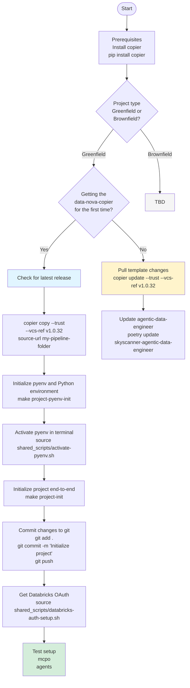

# Consumer Onboarding Guide

## Overview

This guide walks you through setting up and onboarding to the Agentic Data Engineer framework as a consumer. Whether you're starting a greenfield project or integrating with an existing brownfield project, this guide will help you get started.

## Prerequisites

Before you begin, ensure you have the following installed:

1. **Python 3.10 or 3.11**: Required for the framework
2. **pyenv**: For Python version management
3. **Copier**: Template management tool

### Install Copier

```bash
pip install copier
```

## Consumer Flow Overview



## Path 1: Greenfield Projects (New Projects)

Follow this path when starting a brand new data engineering project.

### Step 1: Check Latest Release

Before creating your project, check for the latest version of the template:

🔗 **Latest Release**: https://github.com/Skyscanner/data-nova-copier/releases

**Important**: Always use the latest version. For example, if `v1.0.32` is the latest version, use it in the commands below.

### Step 2: Copy the Template

Use Copier to generate your project from the template:

```bash
# Replace v1.0.32 with the latest version number
copier copy --trust --vcs-ref v1.0.32 \
  https://github.com/Skyscanner/data-nova-copier.git \
  my-pipeline-folder
```

**Parameters**:
- `--trust`: Trust the template to execute hooks
- `--vcs-ref v1.0.32`: Specify the template version
- Source URL: The template repository
- `my-pipeline-folder`: Your target project directory name

You'll be prompted to answer several questions about your project:
- Project name
- Description
- Team/squad name
- AWS configurations
- Databricks workspace details
- etc.

### Step 3: Initialize Python Environment

Navigate to your project directory and initialize pyenv:

```bash
cd my-pipeline-folder
make project-pyenv-init
```

This command:
- Installs the required Python version via pyenv
- Creates a virtual environment for the project
- Sets up the local Python environment

### Step 4: Activate Python Environment

Activate the pyenv environment in your terminal:

```bash
source shared_scripts/activate-pyenv.sh
```

**Note**: You'll need to run this command in each new terminal session when working on this project.

### Step 5: Initialize Project

Run the end-to-end project initialization:

```bash
make project-init
```

This command:
- Installs all project dependencies via Poetry
- Sets up the project structure
- Configures development tools (linters, formatters, etc.)
- Initializes any required configurations

### Step 6: Commit Changes to Git

Initialize git (if not already done) and commit your initial project setup:

```bash
git add .
git commit -m "Initialize project"
git push
```

**Best Practice**: Create your remote repository first, then:

```bash
git remote add origin <your-repo-url>
git branch -M main
git push -u origin main
```

### Step 7: Configure Databricks OAuth

Set up authentication with Databricks:

```bash
# If using OAuth
source shared_scripts/databricks-auth-setup.sh

# If using bash
bash: source shared_scripts/databricks-auth-setup.sh
```

This script will guide you through:
1. Databricks workspace authentication
2. OAuth token configuration
3. Profile setup for CLI access

### Step 8: Test Your Setup

Verify your installation by testing the framework components:

#### Test 1: MCPO (Multi-Cloud Pipeline Orchestrator)

```bash
mcpo
```

Expected output: MCPO command-line interface should display available commands and options.

#### Test 2: Agents

```bash
agents
```

Expected output: The agents CLI should display available agents and their configurations.

**Successful Setup Indicators**:
- Both commands run without errors
- You can see available tools and configurations
- No authentication errors from Databricks

## Path 2: Brownfield Projects (Existing Projects)

**Status**: 🚧 To Be Determined (TBD)

If you're integrating the Agentic Data Engineer framework into an existing project, the detailed steps are currently being developed.

**Recommended Approach** (Interim):
1. Review your existing project structure
2. Consider starting with a greenfield template and gradually migrating components
3. Contact the framework team for guidance on brownfield migration

## Updating the Template (Existing Projects)

If you already have a project generated from the template and want to pull in the latest changes:

### When to Update

**Recommended Frequency**: Weekly or bi-weekly

**Update when**:
- New features are released
- Bug fixes are available
- Security patches are published
- Breaking changes are announced (review changelog carefully)

### Update Process

#### Step 1: Pull Template Changes

Update your project with the latest template version:

```bash
# Replace v1.0.32 with the latest version
copier update --trust --vcs-ref v1.0.32
```

This command:
- Compares your project with the new template version
- Shows you the differences
- Allows you to accept or reject changes
- Preserves your customizations where possible

**Important**: Review all changes before accepting them. Some changes may conflict with your customizations.

#### Step 2: Update Framework Dependencies

Update the Agentic Data Engineer framework to the latest version:

```bash
poetry update skyscanner-agentic-data-engineer
```

This updates:
- Core framework libraries
- Agent implementations
- Utility functions
- Bug fixes and improvements

#### Step 3: Test After Updates

After updating, always run your test suite:

```bash
make test
```

And verify your agents still work correctly:

```bash
agents --list
mcpo --help
```

## Common Tasks After Onboarding

### Daily Development Workflow

```bash
# 1. Activate environment
source shared_scripts/activate-pyenv.sh

# 2. Work on your code
# ... make changes ...

# 3. Run linting
make lint

# 4. Run tests
make test

# 5. Commit changes
git add .
git commit -m "Your commit message"
git push
```

### Running Agents

```bash
# List available agents
agents --list

# Run a specific agent
agents run <agent-name>

# View agent documentation
agents info <agent-name>
```

### Managing Dependencies

```bash
# Add a new dependency
poetry add <package-name>

# Add a development dependency
poetry add --group dev <package-name>

# Update all dependencies
poetry update

# Install dependencies from lock file
poetry install
```

## Troubleshooting

### Issue: `copier: command not found`

**Solution**: Install Copier:
```bash
pip install copier
```

### Issue: Python version not found

**Solution**: Install the required Python version via pyenv:
```bash
pyenv install 3.11
```

### Issue: `make: command not found` (Windows)

**Solution**:
- Install Make for Windows via Chocolatey: `choco install make`
- Or use WSL2 (Windows Subsystem for Linux)
- Or use Git Bash

### Issue: Databricks authentication fails

**Solution**:
1. Verify your Databricks workspace URL
2. Check your OAuth token or credentials
3. Re-run the authentication setup:
   ```bash
   source shared_scripts/databricks-auth-setup.sh
   ```
4. Verify your `~/.databrickscfg` file has the correct profile

### Issue: Poetry installation fails

**Solution**:
```bash
# Clear poetry cache
poetry cache clear . --all

# Reinstall
poetry install
```

### Issue: Template version conflicts

**Solution**:
```bash
# Force update to specific version
copier update --trust --vcs-ref v1.0.32 --force

# Review and resolve conflicts manually
```

## Best Practices

### Version Management

1. **Always use tagged versions**: Never use `main` or `master` branch directly
2. **Check release notes**: Review what changed before updating
3. **Test after updates**: Run full test suite after template updates

### Project Organization

1. **Use feature branches**: Never commit directly to `main`
2. **Keep customizations separate**: Document any deviations from template
3. **Regular updates**: Pull template updates regularly to avoid large conflicts

### Development Environment

1. **Use virtual environments**: Always activate pyenv before working
2. **Pin dependencies**: Use Poetry lock files for reproducibility
3. **Document setup**: Keep a team README for project-specific setup steps

### Collaboration

1. **Shared conventions**: Follow the template's coding standards
2. **Document changes**: Update project docs when customizing template
3. **Team alignment**: Ensure all team members follow same onboarding process

## Validation Checklist

After completing onboarding, verify the following:

- [ ] Copier is installed and accessible
- [ ] Python 3.10 or 3.11 is installed via pyenv
- [ ] Project generated successfully from template
- [ ] Virtual environment activated
- [ ] All dependencies installed via Poetry
- [ ] Git repository initialized and connected to remote
- [ ] Databricks authentication configured
- [ ] `mcpo` command works
- [ ] `agents` command works
- [ ] `make test` passes
- [ ] `make lint` passes
- [ ] Can run agents successfully
- [ ] Team members can replicate setup

## Next Steps

After successful onboarding:

1. **Review Documentation**:
   - Read the framework architecture docs
   - Explore available agents and their capabilities
   - Review coding standards and patterns

2. **Explore Examples**:
   - Check the `examples/` directory in your project
   - Review sample pipelines and transformations
   - Study agent usage patterns

3. **Start Building**:
   - Create your first data pipeline
   - Implement transformations
   - Configure agents for your use case

4. **Join the Community**:
   - Join team Slack channels
   - Attend framework office hours
   - Share feedback and suggestions

## Support and Resources

### Documentation

- **Framework Docs**: `/docs/` in your project
- **API Reference**: Available after running `make docs`
- **How-To Guides**: `/docs/how_to_guides/`

### Getting Help

- **Slack**: #data-platform-support (or your team's channel)
- **GitHub Issues**: https://github.com/Skyscanner/agentic-data-engineer/issues
- **Team Wiki**: [Link to your team's wiki]

### Template Repository

- **Source**: https://github.com/Skyscanner/data-nova-copier
- **Releases**: https://github.com/Skyscanner/data-nova-copier/releases
- **Changelog**: Review release notes for updates

## Appendix

### Environment Variables

Common environment variables you may need:

```bash
# Databricks configuration
export DATABRICKS_HOST="https://your-workspace.cloud.databricks.com"
export DATABRICKS_TOKEN="your-token"

# AWS configuration (if applicable)
export AWS_PROFILE="your-profile"
export AWS_REGION="eu-west-1"

# Project-specific
export PROJECT_ENV="dev"  # or "prod", "staging"
```

### Makefile Targets

Common `make` targets available in generated projects:

| Target | Description |
|--------|-------------|
| `make help` | Display all available targets |
| `make project-pyenv-init` | Initialize Python environment |
| `make project-init` | Initialize project dependencies |
| `make test` | Run test suite |
| `make lint` | Run linters (ruff) |
| `make format` | Format code |
| `make clean` | Clean build artifacts |
| `make docs` | Generate documentation |

### File Structure

Typical generated project structure:

```
my-pipeline-folder/
├── .python-version           # Python version specification
├── pyproject.toml           # Poetry configuration
├── poetry.lock              # Dependency lock file
├── Makefile                 # Build automation
├── shared_scripts/          # Shared utility scripts
│   ├── activate-pyenv.sh
│   └── databricks-auth-setup.sh
├── src/                     # Source code
│   └── pipelines/          # Pipeline definitions
├── tests/                   # Test suite
├── .agents/                 # Agent configurations
├── docs/                    # Documentation
└── README.md               # Project README
```

---

**Document Version**: 1.0
**Last Updated**: 2026-01-23
**Maintained By**: Data Platform Team
