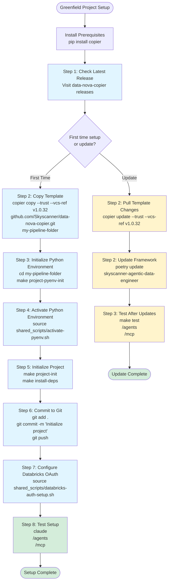

# Consumer Onboarding Guide - Greenfield Project


## Consumer Flow Overview



## 1. First time setup
### Step 1: Check Latest Release

Before creating your project, check for the latest version of the template:

🔗 **Latest Release**: https://github.com/Skyscanner/data-nova-copier/releases

**Important**: Always use the latest version. For example, if `v1.0.32` is the latest version, use it in the commands below.

### Step 2: Copy the Template

Use Copier to generate your project from the template:

```bash
# Replace v1.0.32 with the latest version number
copier copy --trust --vcs-ref v1.0.32 \
  https://github.com/Skyscanner/data-nova-copier.git \
  my-pipeline-folder
```

**Parameters**:
- `--trust`: Trust the template to execute hooks
- `--vcs-ref v1.0.32`: Specify the template version
- Source URL: The template repository
- `my-pipeline-folder`: Your target project directory name

You'll be prompted to answer several questions about your project:
- Project name
- Description
- Team/squad name
- AWS configurations
- Databricks workspace details
- etc.

### Step 3: Initialize Python Environment

Navigate to your project directory and initialize pyenv:

```bash
cd my-pipeline-folder
make project-pyenv-init
```

This command:
- Installs the required Python version via pyenv
- Creates a virtual environment for the project
- Sets up the local Python environment

### Step 4: Activate Python Environment

Activate the pyenv environment in your terminal:

```bash
source shared_scripts/activate-pyenv.sh
```

**Note**: You'll need to run this command in each new terminal session when working on this project.

### Step 5: Initialize Project

Run the end-to-end project initialization:

```bash
make project-init
make install-deps
```

This command:
- Installs all project dependencies via Poetry
- Sets up the project structure
- Configures development tools (linters, formatters, etc.)
- Initializes any required configurations

### Step 6: Commit Changes to Git

Initialize git (if not already done) and commit your initial project setup:

```bash
git add .
git commit -m "Initialize project"
git push
```

**Best Practice**: Create your remote repository first, then:

```bash
git remote add origin <your-repo-url>
git branch -M main
git push -u origin main
```

### Step 7: Configure Databricks OAuth

Set up authentication with Databricks:

```bash
# If using OAuth
source shared_scripts/databricks-auth-setup.sh

# If using bash
bash: source shared_scripts/databricks-auth-setup.sh
```

This script will guide you through:
1. Databricks workspace authentication
2. OAuth token configuration
3. Profile setup for CLI access

### Step 8: Test Your Setup

#### Start Claude Code

Navigate to the project directory in your terminal and start Claude:

```bash
cd my-pipeline-folder
claude
```

You should see:
```
┌────────────────────────────────────────┐
│   Claude Code CLI                      │
│   Connected to agentic-data-engineer   │
│                                        │
│   Type /help for commands              │
└────────────────────────────────────────┘
```

#### Verify Agents

Check that all agents are available:

```bash
/agents
```

**Expected output** (18 agents):
```
Available agents:
- bronze-table-finder-agent
- claude-agent-template-generator
- data-contract-agent
- data-contract-formatter-agent
- data-naming-agent
- data-profiler-agent
- decision-documenter-agent
- dimensional-modeling-agent
- documentation-agent
- materialized-view-agent
- medallion-architecture-agent
- project-structure-agent
- pyspark-standards-agent
- silver-data-modeling-agent
- streaming-tables-agent
- transformation-validation-agent
- unity-catalog-agent
- claude-code-guide-agent
```

#### Verify MCP Servers

Check that MCP servers are running:

```bash
/mcp
```

**Expected output**:
```
MCP Servers:
✓ databricks (skyscanner-databricks-utils)
  - Status: Connected
  - Tools: execute_query, list_catalogs, describe_table, etc.

✓ data-knowledge-base (skyscanner-data-knowledge-base-mcp)
  - Status: Connected
  - Tools: get_document, list_domains, search_knowledge_base
```

> ⚠️ **Important**: The `databricks` MCP server requires (Databricks OAuth Step) to be completed successfully.


**Successful Setup Indicators**:
- Both commands run without errors
- You can see available tools and configurations
- No authentication errors from Databricks


---

## 2. Update Process

#### Step 1: Pull Template Changes

Update your project with the latest template version:

```bash
# Replace v1.0.32 with the latest version
copier update --trust --vcs-ref v1.0.32
```

This command:
- Compares your project with the new template version
- Shows you the differences
- Allows you to accept or reject changes
- Preserves your customizations where possible

**Important**: Review all changes before accepting them. Some changes may conflict with your customizations.

#### Step 2: Update Framework Dependencies

Update the Agentic Data Engineer framework to the latest version:

```bash
poetry update skyscanner-agentic-data-engineer
```

This updates:
- Core framework libraries
- Agent implementations
- Utility functions
- Bug fixes and improvements

#### Step 3: Test After Updates

After updating, always run your test suite:

```bash
make test
```

And verify your agents still work correctly:

```bash
/agents
/mcp
```

---

### [Best Practices, Validation Checklist, ](consumer_onboarding.md)


---

**Document Version**: 1.0
**Last Updated**: 2026-01-23
**Maintained By**: Agentic Data Engineer Team
