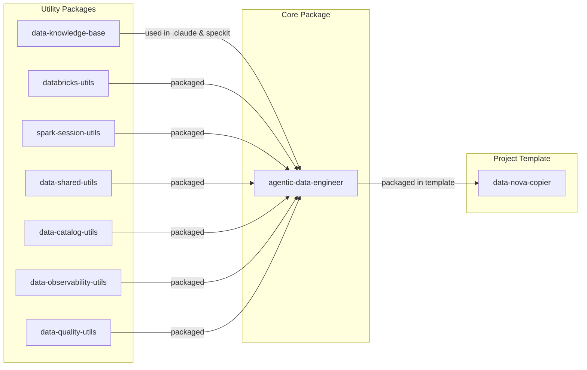

# Contributor Onboarding Guide

> **Important**: This guide is for **contributors** who want to develop and contribute to the agentic-data-engineer project.
>
> If you are a **consumer** (just using the package in your project), please use the [Consumer Onboarding Guide](./consumer_onboarding.md) instead.

## Table of Contents

- [Overview](#overview)
- [Main Repositories](#main-repositories)
- [Usage Repositories](#usage-repositories)
- [Setup](#setup)
  - [Step 0: Prerequisites](#step-0---prerequisites)
  - [Step 1: Clone Repository](#step-1---clone-repository)
  - [Step 2: Project Init](#step-2---project-init)
  - [Step 3: Databricks OAuth](#step-3---databricks-oauth)
  - [Step 4: Verify Setup within Claude](#step-4---verify-setup-within-claude)
- [Getting Help](#getting-help)

---

## ⚠️ Important Notes

**Only use this setup if you are a contributor.**

- If you'd like to try this setup and contribute, please reach out to [#agentic-data-engineer](https://skyscanner.slack.com/archives/agentic-data-engineer) while we formalize the process.
- We're currently trialing this with a small group.
- As this is a proof of concept, **breaking changes are expected**.

---

## Overview

The Agentic Data Engineer framework provides an AI-powered data engineering toolkit with Claude integration:

```
┌─────────────────────────────────────────────────────────────┐
│                  Agentic Data Engineer                      │
│  ┌────────────────┐  ┌──────────────┐  ┌─────────────────┐  │
│  │ Claude Agents  │  │    Skills    │  │   Utilities     │  │
│  └────────────────┘  └──────────────┘  └─────────────────┘  │
│                                                             │
│  ┌─────────────────────────────────────────────────────────┐│
│  │           MCP Servers (Databricks + Knowledge)          ││
│  └─────────────────────────────────────────────────────────┘│
└─────────────────────────────────────────────────────────────┘
```

---

## Main Repositories

> **Note**: You don't need to clone all repositories upfront. Only clone when you need to contribute to that specific repository. This section provides an overview of all repositories.

**Deployment Details**: See [databricks-data-exemplar wiki](https://github.com/Skyscanner/databricks-data-exemplar/wiki)

| # | Repository | Description | Artifactory |
|---|------------|-------------|-------------|
| 1 | [data-nova-copier](https://github.com/Skyscanner/data-nova-copier) | Project template | N/A (versioned via git tags) |
| 2 | [agentic-data-engineer](https://github.com/Skyscanner/agentic-data-engineer) | Claude Agents, skills, packages all utils repos below | [PyPI](https://artifactory.skyscannertools.net/ui/packages/pypi:%2F%2Fskyscanner-agentic-data-engineer) |
| 3 | [data-knowledge-base](https://github.com/Skyscanner/data-knowledge-base) | Local MCP server for data knowledge base | [PyPI](https://artifactory.skyscannertools.net/ui/packages?name=skyscanner-data-knowledge-base&type=packages) |
| 4 | [databricks-utils](https://github.com/Skyscanner/databricks-utils) | Local MCP server to connect to Databricks | [PyPI](https://artifactory.skyscannertools.net/ui/packages/pypi:%2F%2Fskyscanner-databricks-utils) |
| 5 | [spark-session-utils](https://github.com/Skyscanner/spark-session-utils) | Spark session management | [PyPI](https://artifactory.skyscannertools.net/ui/packages/pypi:%2F%2Fskyscanner-spark-session-utils) |
| 6 | [data-shared-utils](https://github.com/Skyscanner/data-shared-utils) | Shared utilities reusable across projects | [PyPI](https://artifactory.skyscannertools.net/artifactory/api/pypi/pypi/simple/skyscanner-data-shared-utils/) |
| 7 | [data-quality-utils](https://github.com/Skyscanner/data-quality-utils) | Data quality utilities | [PyPI](https://artifactory.skyscannertools.net/ui/packages/pypi:%2F%2Fskyscanner-data-quality-utils) |
| 8 | [data-catalog-utils](https://github.com/Skyscanner/data-catalog-utils) | Data catalog utilities | Not yet deployed |
| 9 | [data-observability-utils](https://github.com/Skyscanner/data-observability-utils) | Data observability utilities | Not yet deployed |

### Package Dependency Order

Understanding the dependency chain:



---

## Usage Repositories

| # | Repository | Description | Artifactory |
|---|------------|-------------|-------------|
| 1 | [databricks-data-exemplar](https://github.com/Skyscanner/databricks-data-exemplar) | Best practices examples for Bronze/Silver/Gold layers, examples of what good looks like, try/test new features/ideas | - |

---

## Setup

Instructions are also available in the project [README.md](../../README.md).

### Step 0 - Prerequisites

> ⚠️ **Don't skip this step!**

#### 1. Complete Mac Environment Setup

Follow the guide: [HOW-TO Environment setup - Mac - Data Engineering](https://skyscanner.atlassian.net/wiki/spaces/ADE/pages/1971322970)

#### 2. Authenticate with Artifactory

**This is critical for setup success!**

```bash
# 1. Add Skyscanner homebrew tap
brew tap skyscanner/mshell git@github.com:Skyscanner/homebrew-mshell.git

# 2. Install Artifactory CLI login tool
brew install artifactory-cli-login

# 3. Login to Artifactory (overwrites ~/.pip/pip.conf)
mshell artifactory login -f
```

You will be prompted for:
- **Skyscanner email**: `firstname.lastname@skyscanner.net`
- **Okta password**: Your Skyscanner password

**Note**: Username can be either:
- `firstname.lastname` OR
- `firstname.lastname@skyscanner.net`

**More info**: [Onboard Artifactory to Okta Authentication](https://skyscanner.atlassian.net/wiki/spaces/DAT/pages/onboard-artifactory)

---

### Step 1 - Clone Repository

Clone the `agentic-data-engineer` repository:

```bash
git clone git@github.com:Skyscanner/agentic-data-engineer.git
cd agentic-data-engineer
```

---

### Step 2 - Project Init

> **Note**: Run these commands in the project root directory

#### Install pyenv

```bash
# Install pyenv and configure Python version
make project-pyenv-init

# Activate pyenv in your current shell
source shared_scripts/activate-pyenv.sh
```

**Important**: Run `source shared_scripts/activate-pyenv.sh` in every new terminal session, or add it to your shell profile (`.zshrc` or `.bashrc`).

#### Initialize Project

```bash
# Runs all setup commands: Poetry install, dependencies, symlinks, pre-commit hooks
make project-init
```

This command will:
- Install Poetry
- Install all Python dependencies
- Install MCP servers
- Create convenience symlinks (`.claude`, `.specify`, `openspec`, `shared_schema`, etc.)
- Set up pre-commit hooks

#### Install dependencies
##### Note: aAlthough this is already called within `make project-init`, the large number of dependencies means some may be skipped. Running this step explicitly ensures that all dependencies are installed.
```bash
make install-deps
```
---

### Step 3 - Databricks OAuth

Configure Databricks authentication using OAuth.

#### For Zsh users:

```bash
source shared_scripts/databricks-auth-setup-zsh.sh
```

#### For Bash users:

```bash
source shared_scripts/databricks-auth-setup.sh
```

#### Expected Browser View

You should see an OAuth consent screen in your browser:

```
┌─────────────────────────────────────────┐
│   Databricks OAuth Authorization       │
│                                         │
│   Allow access to:                      │
│   - Read data from clusters             │
│   - Execute SQL queries                 │
│                                         │
│   [Authorize]  [Cancel]                 │
└─────────────────────────────────────────┘
```

#### Verify Environment Variables

```bash
echo $DATABRICKS_HOST
echo $DATABRICKS_CONFIG_PROFILE
echo $DATABRICKS_WAREHOUSE_ID
```

**Expected output**:
```
DATABRICKS_HOST=https://skyscanner-dev.cloud.databricks.com
DATABRICKS_CONFIG_PROFILE=skyscanner-dev
DATABRICKS_WAREHOUSE_ID=c45e9cf2e10e61e5
```

**Note**: We use the SQL Warehouse: `default_warehouse` (ID: `c45e9cf2e10e61e5`)

---

### Step 4 - Verify Setup within Claude

#### Start Claude Code

Navigate to the project directory in your terminal and start Claude:

```bash
cd /path/to/agentic-data-engineer
claude
```

You should see:
```
┌────────────────────────────────────────┐
│   Claude Code CLI                      │
│   Connected to agentic-data-engineer   │
│                                        │
│   Type /help for commands              │
└────────────────────────────────────────┘
```

#### Verify Agents

Check that all agents are available:

```bash
/agents
```

**Expected output** (18 agents):
```
Available agents:
- bronze-table-finder-agent
- claude-agent-template-generator
- data-contract-agent
- data-contract-formatter-agent
- data-naming-agent
- data-profiler-agent
- decision-documenter-agent
- dimensional-modeling-agent
- documentation-agent
- materialized-view-agent
- medallion-architecture-agent
- project-structure-agent
- pyspark-standards-agent
- silver-data-modeling-agent
- streaming-tables-agent
- transformation-validation-agent
- unity-catalog-agent
- claude-code-guide-agent
```

#### Verify MCP Servers

Check that MCP servers are running:

```bash
/mcp
```

**Expected output**:
```
MCP Servers:
✓ databricks (skyscanner-databricks-utils)
  - Status: Connected
  - Tools: execute_query, list_catalogs, describe_table, etc.

✓ data-knowledge-base (skyscanner-data-knowledge-base-mcp)
  - Status: Connected
  - Tools: get_document, list_domains, search_knowledge_base
```

> ⚠️ **Important**: The `databricks` MCP server requires Step 3 (Databricks OAuth) to be completed successfully.

If MCP servers are not working, see [Troubleshooting](#troubleshooting-mcp-servers) below.


---

## Troubleshooting

### Troubleshooting MCP Servers

If MCP servers are not starting:

```bash
# Check Poetry environment
poetry env info

# Verify MCP dependencies installed
poetry show mcp httpx anyio

# Reinstall MCP dependencies
poetry install --with mcp

# Check MCP server logs
tail -f ~/.local/state/claude/logs/mcp*.log

# Test MCP servers manually
poetry run python -m databricks_utils.mcp.server --help
poetry run python -m data_knowledge_base --help
```

### Troubleshooting Databricks Authentication

```bash
# Re-run authentication setup
source shared_scripts/databricks-auth-setup-zsh.sh

# Or manually authenticate
databricks auth login --host $DATABRICKS_HOST

# Verify authentication
databricks auth profiles

# Test connection
databricks warehouses list
```

### Troubleshooting pyenv

```bash
# Check Python version
python --version

# Should show version from .python-version file
# If not, reactivate pyenv:
source shared_scripts/activate-pyenv.sh
```

### Troubleshooting Symlinks

```bash
# Verify symlinks exist
ls -la | grep -E "(claude|specify|shared)"

# Recreate symlinks if missing
make setup-symlinks
```

---

## Getting Help

### Support Channels

- **Slack**: [#agentic-data-engineer](https://skyscanner.slack.com/archives/agentic-data-engineer)
- **Jira**: [ADE Project - Contributors Board](https://skyscanner.atlassian.net/jira/software/c/projects/ADE/boards/7118)
- **GitHub**: [agentic-data-engineer](https://github.com/Skyscanner/agentic-data-engineer)

### Documentation

- [README.md](../../README.md) - Project overview and setup
- [CONTRIBUTING.md](../../CONTRIBUTING.md) - Contribution guidelines
- [CLAUDE.md](../../CLAUDE.md) - AI assistant instructions
- [Agent Usage Docs](../../shared_agents_usage_docs/) - Detailed agent documentation

### Common Questions

**Q: I get "Permission denied" when cloning repos**
A: Ensure your SSH key is added to GitHub. See [GitHub SSH setup](https://docs.github.com/en/authentication/connecting-to-github-with-ssh).

**Q: Artifactory authentication fails**
A: Run `mshell artifactory login -f` again and ensure you use your Skyscanner email (not username).

**Q: Claude doesn't show any agents**
A:
1. Verify symlinks exist: `ls -la | grep claude`
2. Recreate symlinks: `make setup-symlinks`
3. Restart Claude Code

**Q: MCP servers not connecting**
A:
1. Check Databricks OAuth is configured
2. Reinstall MCP dependencies: `poetry install --with mcp`
3. Check logs: `tail -f ~/.local/state/claude/logs/mcp*.log`

---

## Next Steps

Now that you're set up:

1. ✅ Read [CONTRIBUTING.md](../../CONTRIBUTING.md) for contribution guidelines
2. ✅ Explore [Agent Usage Docs](../../shared_agents_usage_docs/)
3. ✅ Check [Jira Board](https://skyscanner.atlassian.net/jira/software/c/projects/ADE/boards/7118) for tasks
4. ✅ Try the usage examples above
5. ✅ Join [#agentic-data-engineer](https://skyscanner.slack.com/archives/agentic-data-engineer) discussions

---

**Welcome to the Agentic Data Engineer contributor community!** 🎉
