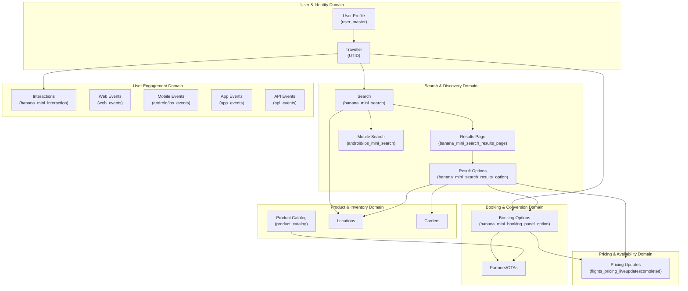
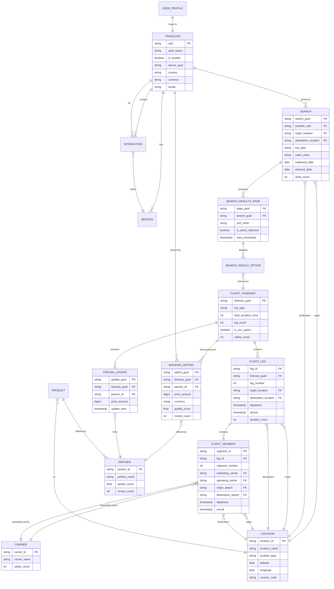
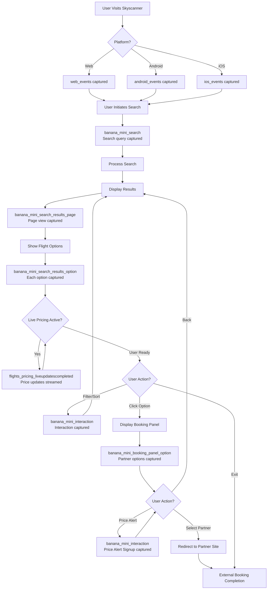
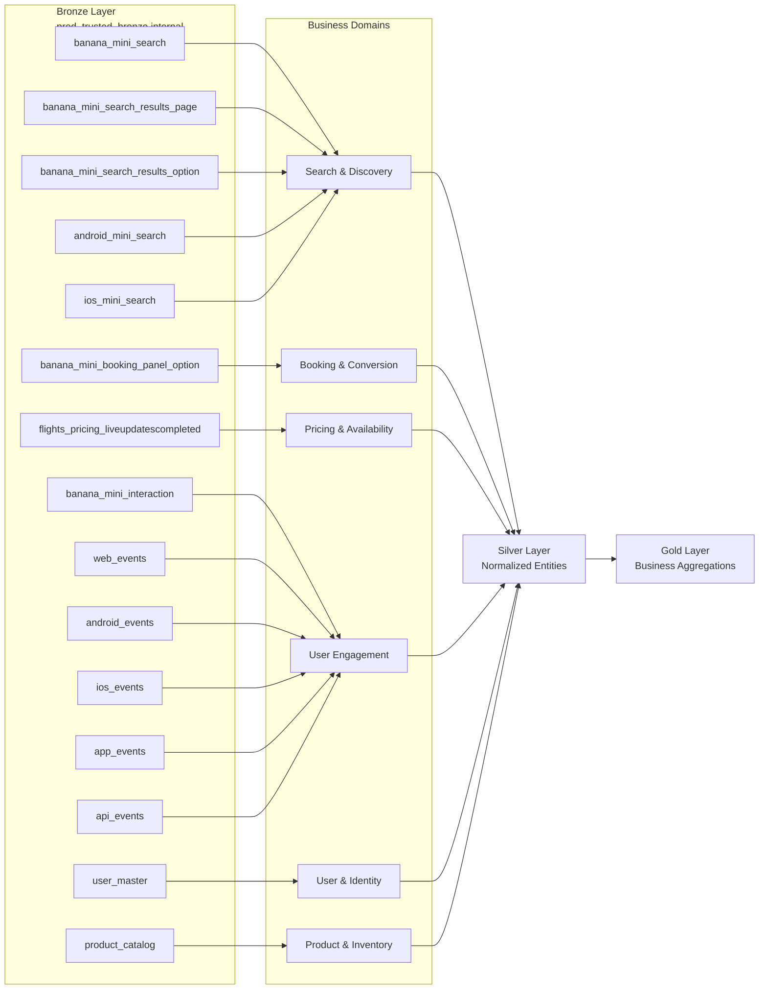
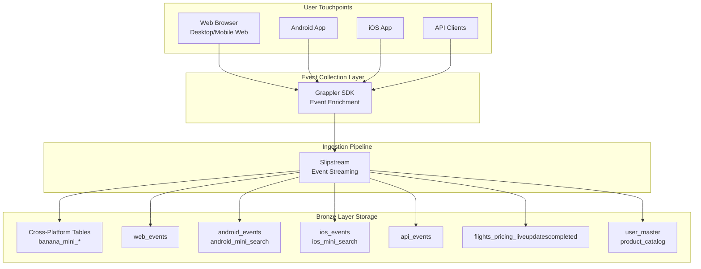
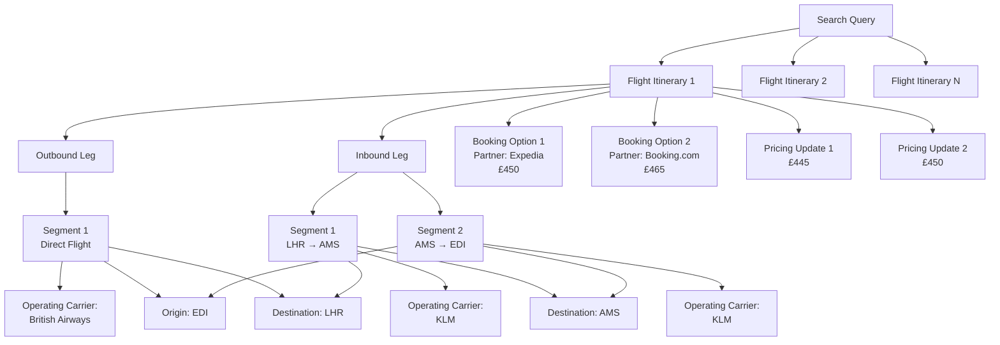
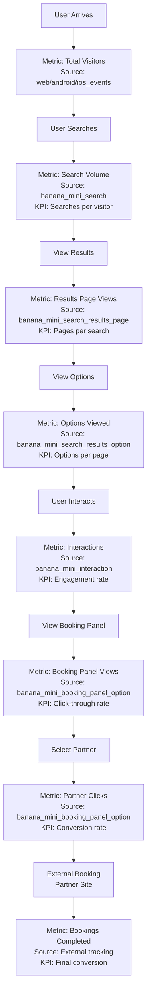
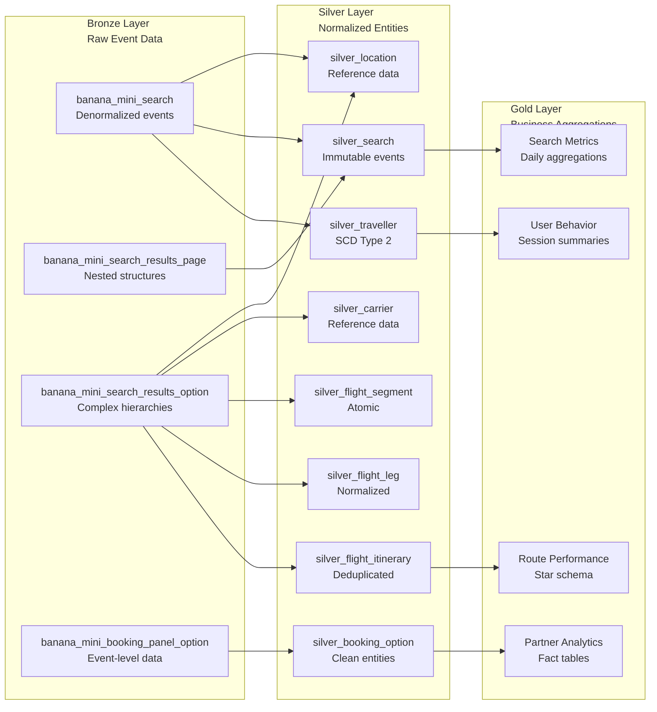

# Skyscanner High-Level Conceptual Data Model

**Generated:** 2025-11-25
**Analyst:** Claude (Data Architecture Analyst)
**Scope:** prod_trusted_bronze.internal - Complete Bronze Layer Inventory
**Approach:** Entity-Centric, Domain-Driven Design

---

## Executive Summary

This document provides a **high-level conceptual data model** for Skyscanner's travel platform based on comprehensive analysis of all tables in the `prod_trusted_bronze.internal` catalog. The model identifies core business domains, entities, and their relationships across the Skyscanner ecosystem.

**Catalog Analyzed:** `prod_trusted_bronze.internal`
**Total Tables Identified:** 16 tables
**Business Domains:** 6 major domains
**Platform Coverage:** Web, Mobile (Android/iOS), API

---

## Bronze Layer Table Inventory

### Complete Table List

| # | Table Name | Domain | Platform | Data Type | Description |
|---|------------|--------|----------|-----------|-------------|
| 1 | banana_mini_search | Search | Cross-platform | Event | Flight search queries and parameters |
| 2 | banana_mini_search_results_page | Search | Cross-platform | Event | Search results page views with filters |
| 3 | banana_mini_search_results_option | Search | Cross-platform | Event | Individual flight itinerary options |
| 4 | banana_mini_booking_panel_option | Booking | Cross-platform | Event | Booking partner options and pricing |
| 5 | banana_mini_interaction | Interaction | Cross-platform | Event | General user interaction events |
| 6 | banana_config_page_landing | Configuration | Cross-platform | Event | Configuration page events (no data) |
| 7 | flights_pricing_liveupdatescompleted | Pricing | Cross-platform | Event | Real-time flight pricing updates |
| 8 | android_mini_search | Search | Android | Event | Android-specific mini search events |
| 9 | ios_mini_search | Search | iOS | Event | iOS-specific mini search events |
| 10 | android_events | Analytics | Android | Streaming | Android platform event stream |
| 11 | ios_events | Analytics | iOS | Streaming | iOS platform event stream |
| 12 | web_events | Analytics | Web | Event | Web/desktop platform events |
| 13 | app_events | Analytics | Mobile | Event | Mobile app events (cross-platform) |
| 14 | api_events | Analytics | API | Event | API-based interaction events |
| 15 | user_master | User | Cross-platform | Reference | User master data and profiles |
| 16 | product_catalog | Product | Cross-platform | Reference | Product catalog reference data |

---

## Business Domain Model

Skyscanner's data architecture is organized into **6 major business domains**, each representing a distinct area of the travel platform business:

### Domain 1: **Search & Discovery**
**Purpose:** Capture and analyze user search behavior, search results, and discovery patterns
**Key Entities:** Search Query, Search Results Page, Search Result Option, Location, Itinerary

**Tables:**
- `banana_mini_search` (cross-platform search)
- `banana_mini_search_results_page` (results presentation)
- `banana_mini_search_results_option` (individual options)
- `android_mini_search` (Android-specific)
- `ios_mini_search` (iOS-specific)

**Business Questions Answered:**
- What are users searching for?
- Which routes are most popular?
- What filters do users apply?
- How do search results influence booking behavior?

---

### Domain 2: **Booking & Conversion**
**Purpose:** Track booking funnel, partner selection, and conversion paths
**Key Entities:** Booking Panel, Booking Option, Partner, Price Quote, Fare Attributes

**Tables:**
- `banana_mini_booking_panel_option` (booking partner options)

**Business Questions Answered:**
- Which partners get the most bookings?
- What is the conversion rate from search to booking?
- How do price and quality scores affect partner selection?
- What fare attributes drive conversion?

---

### Domain 3: **Pricing & Availability**
**Purpose:** Monitor real-time pricing changes, availability, and price competitiveness
**Key Entities:** Price Update, Pricing Session, Fare Type, Price Quote

**Tables:**
- `flights_pricing_liveupdatescompleted` (live pricing updates)

**Business Questions Answered:**
- How frequently do prices change?
- Which routes have the most price volatility?
- Are our pricing updates competitive?
- What is the price update latency?

---

### Domain 4: **User Engagement & Interaction**
**Purpose:** Understand user behavior, engagement patterns, and platform interactions
**Key Entities:** Interaction Event, User Action, Session, Engagement Metric

**Tables:**
- `banana_mini_interaction` (specific interactions like price alerts)
- `web_events` (web platform events)
- `app_events` (mobile app events)
- `api_events` (API-based interactions)
- `android_events` (Android streaming events)
- `ios_events` (iOS streaming events)

**Business Questions Answered:**
- What features do users engage with most?
- What is the user journey across the platform?
- Where do users drop off in the funnel?
- How do interactions differ by platform?

---

### Domain 5: **User & Identity**
**Purpose:** Manage user profiles, authentication, preferences, and traveler identity
**Key Entities:** User, Traveler Profile, Authentication Status, User Preferences

**Tables:**
- `user_master` (user master data and profiles)

**Business Questions Answered:**
- Who are our users?
- What are user preferences and behaviors?
- How does authentication status affect engagement?
- What is user lifetime value?

---

### Domain 6: **Product & Inventory**
**Purpose:** Catalog travel products, partners, and inventory metadata
**Key Entities:** Product, Partner, Carrier, Location, Hotel, Car Rental

**Tables:**
- `product_catalog` (product catalog reference data)

**Business Questions Answered:**
- What products are available?
- Which partners offer which products?
- What is the product coverage by market?
- How does inventory change over time?

---

## Core Conceptual Entities

Based on analysis of all Bronze tables, the following **core business entities** emerge:

### 1. **Traveller** (User/Customer)
**Definition:** Individual using the Skyscanner platform to search and book travel
**Key Attributes:**
- Unique Traveller ID (UTID)
- Authentication status
- Device information
- Location/market
- Preferences

**Source Tables:** All tables (via `utid` or `user_id`)

**Relationships:**
- Performs → Searches
- Views → Search Results
- Creates → Interactions
- Selects → Booking Options

---

### 2. **Search**
**Definition:** A travel search query initiated by a traveller
**Key Attributes:**
- Search ID (GUID)
- Origin/Destination locations
- Travel dates
- Passenger details
- Trip type (one-way, return, multi-city)
- Cabin class
- Filters (direct, baggage, stops)

**Source Tables:** `banana_mini_search`, `android_mini_search`, `ios_mini_search`

**Relationships:**
- Initiated by → Traveller
- Produces → Search Results Pages
- Involves → Locations
- Leads to → Booking Options

---

### 3. **Search Results Page**
**Definition:** A page displaying flight options matching search criteria
**Key Attributes:**
- Page ID (GUID)
- Sort order (best, price, duration)
- Applied filters
- Number of results
- Timestamp

**Source Tables:** `banana_mini_search_results_page`

**Relationships:**
- Belongs to → Search
- Displays → Search Result Options
- Viewed by → Traveller

---

### 4. **Flight Itinerary**
**Definition:** A specific flight route with one or more legs
**Key Attributes:**
- Itinerary ID
- Legs (outbound, inbound)
- Segments per leg
- Total duration
- Carriers
- Eco-friendly flag
- Safety score

**Source Tables:** `banana_mini_search_results_option`

**Relationships:**
- Contains → Flight Legs
- Contains → Flight Segments
- Shown in → Search Result Options
- Has → Pricing Updates
- Offered by → Partners (in Booking Options)

---

### 5. **Flight Leg**
**Definition:** One directional segment of a journey (e.g., outbound or inbound)
**Key Attributes:**
- Leg number
- Origin/Destination locations
- Departure/Arrival times
- Duration
- Number of stops/segments

**Source Tables:** `banana_mini_search_results_option` (nested)

**Relationships:**
- Belongs to → Itinerary
- Contains → Flight Segments
- Connects → Locations

---

### 6. **Flight Segment**
**Definition:** A single flight operated by one carrier
**Key Attributes:**
- Segment number
- Marketing carrier
- Operating carrier
- Origin/Destination airports
- Departure/Arrival times
- Flight duration

**Source Tables:** `banana_mini_search_results_option` (nested)

**Relationships:**
- Belongs to → Flight Leg
- Operated by → Carrier
- Connects → Locations

---

### 7. **Booking Option**
**Definition:** A bookable offer from a travel partner
**Key Attributes:**
- Option ID
- Partner ID
- Price (amount, currency)
- Quality score
- Number of reviews
- Fare attributes (baggage, change/cancel policies)
- Transfer protection

**Source Tables:** `banana_mini_booking_panel_option`

**Relationships:**
- Offered for → Itinerary
- Provided by → Partner
- Viewed by → Traveller
- Follows from → Search Result Option

---

### 8. **Pricing Update**
**Definition:** Real-time price change for a flight itinerary
**Key Attributes:**
- Update ID
- Itinerary reference
- New price
- Partner ID
- Update timestamp
- Session ID

**Source Tables:** `flights_pricing_liveupdatescompleted`

**Relationships:**
- Updates → Itinerary
- From → Partner
- Within → Pricing Session

---

### 9. **Interaction Event**
**Definition:** User action or engagement with platform features
**Key Attributes:**
- Event ID
- Event name (e.g., Price_Alert_Signup_Clicked)
- Platform (Desktop, Mobile, App)
- Source component
- Vertical (flight, hotel, car)
- Consent flags
- Custom attributes (bools, numbers, strings)

**Source Tables:** `banana_mini_interaction`, `web_events`, `app_events`, `api_events`, `android_events`, `ios_events`

**Relationships:**
- Performed by → Traveller
- On → Platform
- In → Session

---

### 10. **Location**
**Definition:** Geographic location (airport, city, country)
**Key Attributes:**
- Location ID (IATA code)
- Location name
- Location type (airport, city, country)
- Coordinates (latitude, longitude)
- Country code

**Source Tables:** All search and flight tables (origin/destination fields)

**Relationships:**
- Origin of → Searches, Legs, Segments
- Destination of → Searches, Legs, Segments

---

### 11. **Carrier** (Airline)
**Definition:** Airline company operating flights
**Key Attributes:**
- Carrier ID (airline code)
- Carrier name
- Safety score
- COVID safety measures

**Source Tables:** `banana_mini_search_results_option` (in segment data)

**Relationships:**
- Operates → Flight Segments
- Marketing for → Flight Segments

---

### 12. **Partner**
**Definition:** Travel booking partner/OTA offering bookings
**Key Attributes:**
- Partner ID
- Partner name
- Quality score
- Number of reviews

**Source Tables:** `banana_mini_booking_panel_option`, `flights_pricing_liveupdatescompleted`

**Relationships:**
- Offers → Booking Options
- Provides → Pricing Updates

---

### 13. **Session**
**Definition:** User session on the platform
**Key Attributes:**
- Session ID
- Device ID
- Platform
- Start/End timestamps
- User agent

**Source Tables:** All event tables (session tracking fields)

**Relationships:**
- Belongs to → Traveller
- Contains → Searches
- Contains → Interactions

---

### 14. **User Profile**
**Definition:** Master data about registered users
**Key Attributes:**
- User ID
- Email
- Name
- Preferences
- Account status
- Registration date

**Source Tables:** `user_master`

**Relationships:**
- Maps to → Traveller (UTID)
- Has → Preferences
- Creates → Searches

---

### 15. **Product**
**Definition:** Travel product in the catalog
**Key Attributes:**
- Product ID
- Product type (flight, hotel, car)
- Product metadata
- Availability

**Source Tables:** `product_catalog`

**Relationships:**
- Offered by → Partners
- Searched for → Travellers
- Available at → Locations

---

## Platform Architecture View

Skyscanner operates across multiple platforms with unified data capture:

```
┌─────────────────────────────────────────────────────────┐
│                    SKYSCANNER PLATFORM                   │
├─────────────────────────────────────────────────────────┤
│                                                           │
│  ┌───────────┐  ┌───────────┐  ┌───────────┐           │
│  │    WEB    │  │  ANDROID  │  │    iOS    │           │
│  │  Desktop  │  │   Mobile  │  │  Mobile   │           │
│  └─────┬─────┘  └─────┬─────┘  └─────┬─────┘           │
│        │              │              │                   │
│        └──────────────┴──────────────┘                   │
│                       │                                   │
│              ┌────────▼────────┐                         │
│              │   API GATEWAY   │                         │
│              └────────┬────────┘                         │
│                       │                                   │
│              ┌────────▼────────┐                         │
│              │  EVENT PIPELINE │                         │
│              │   (Slipstream)  │                         │
│              └────────┬────────┘                         │
│                       │                                   │
└───────────────────────┼─────────────────────────────────┘
                        │
              ┌─────────▼─────────┐
              │  BRONZE LAYER     │
              │  prod_trusted_    │
              │  bronze.internal  │
              └───────────────────┘
```

### Platform-Specific Tables

| Platform | Tables | Purpose |
|----------|--------|---------|
| **Web** | web_events | Desktop/web browser events |
| **Android** | android_events, android_mini_search | Android app-specific events |
| **iOS** | ios_events, ios_mini_search | iOS app-specific events |
| **Cross-platform** | banana_mini_* tables | Unified events across all platforms |
| **API** | api_events | Direct API consumption events |

---

## Data Flow: User Journey

The following illustrates how data flows through Skyscanner's platform during a typical user journey:

```
1. USER SEARCH
   ↓
   banana_mini_search (search query captured)
   ↓
2. RESULTS DISPLAYED
   ↓
   banana_mini_search_results_page (page view captured)
   ↓
   banana_mini_search_results_option (each itinerary option captured)
   ↓
3. PRICING UPDATES (live)
   ↓
   flights_pricing_liveupdatescompleted (real-time price changes)
   ↓
4. USER INTERACTIONS
   ↓
   banana_mini_interaction (clicks, filters, alerts)
   web_events / android_events / ios_events (platform-specific)
   ↓
5. BOOKING PANEL
   ↓
   banana_mini_booking_panel_option (partner options displayed)
   ↓
6. CONVERSION
   ↓
   [External booking completion tracking]
```

---

## Entity Relationship Overview

### High-Level Relationships

```
TRAVELLER
  ├─ performs → SEARCH
  │    ├─ produces → SEARCH RESULTS PAGE
  │    │    └─ displays → SEARCH RESULT OPTIONS
  │    │         └─ references → FLIGHT ITINERARY
  │    │              ├─ contains → FLIGHT LEG
  │    │              │    └─ contains → FLIGHT SEGMENT
  │    │              │         ├─ operated by → CARRIER
  │    │              │         └─ connects → LOCATION
  │    │              └─ receives → PRICING UPDATE
  │    │                   └─ from → PARTNER
  │    └─ leads to → BOOKING OPTION
  │         ├─ for → FLIGHT ITINERARY
  │         └─ offered by → PARTNER
  │
  ├─ creates → INTERACTION EVENT
  │    └─ in → SESSION
  │
  └─ maps to → USER PROFILE
       └─ stored in → user_master

PRODUCT CATALOG
  └─ offered by → PARTNER
       └─ at → LOCATION
```

---

## Business Domain Groupings

### Group 1: Search & Discovery Domain
- **Core Function:** Enable travelers to discover flight options
- **Tables:** banana_mini_search, banana_mini_search_results_page, banana_mini_search_results_option, android_mini_search, ios_mini_search
- **Key Metrics:** Search volume, popular routes, filter usage, result quality

### Group 2: Conversion & Booking Domain
- **Core Function:** Facilitate booking through partners
- **Tables:** banana_mini_booking_panel_option
- **Key Metrics:** Conversion rate, partner performance, price competitiveness

### Group 3: Real-Time Pricing Domain
- **Core Function:** Provide live pricing updates
- **Tables:** flights_pricing_liveupdatescompleted
- **Key Metrics:** Price volatility, update frequency, pricing accuracy

### Group 4: User Engagement Domain
- **Core Function:** Track and analyze user behavior
- **Tables:** banana_mini_interaction, web_events, app_events, api_events, android_events, ios_events
- **Key Metrics:** Engagement rate, feature adoption, user journey paths

### Group 5: Master Data Domain
- **Core Function:** Maintain reference and master data
- **Tables:** user_master, product_catalog
- **Key Metrics:** Data completeness, data freshness, data quality

---

## Key Business Metrics by Domain

### Search Metrics
- **Search Volume:** Total number of searches per time period
- **Popular Routes:** Top origin-destination pairs
- **Search-to-Click Rate:** % of searches leading to option clicks
- **Average Search Duration:** Time spent on search results
- **Filter Usage:** Most commonly applied filters

### Booking Metrics
- **Conversion Rate:** % of searches leading to bookings
- **Partner Click-Through Rate:** % of partner options clicked
- **Average Booking Value:** Mean price of bookings
- **Partner Performance:** Quality scores, review counts
- **Fare Attribute Impact:** Effect of baggage, flexibility on conversion

### Pricing Metrics
- **Price Volatility:** Frequency and magnitude of price changes
- **Average Price by Route:** Route-level pricing trends
- **Update Latency:** Time between source update and Skyscanner update
- **Price Competitiveness:** Skyscanner vs market pricing

### Engagement Metrics
- **Active Users:** DAU, WAU, MAU
- **Session Duration:** Average time per session
- **Feature Adoption:** Usage of price alerts, filters, etc.
- **Platform Distribution:** Web vs Android vs iOS usage
- **User Retention:** Repeat visit rate

### User Metrics
- **Registered Users:** Total user base
- **Authentication Rate:** % of sessions authenticated
- **User Preferences:** Cabin class, airline preferences
- **User Lifetime Value:** Total bookings per user

---

## Data Lineage Summary

### Bronze → Silver Transformation Paths

**Path 1: Search Funnel**
```
banana_mini_search → silver_search
banana_mini_search_results_page → silver_search_results_page
banana_mini_search_results_option → silver_flight_itinerary
                                  → silver_flight_leg
                                  → silver_flight_segment
                                  → silver_search_results_option (bridge)
```

**Path 2: Booking Funnel**
```
banana_mini_booking_panel_option → silver_booking_option
                                 → silver_partner
                                 → silver_fare_attributes
```

**Path 3: Pricing Stream**
```
flights_pricing_liveupdatescompleted → silver_pricing_update
                                     → silver_pricing_session
```

**Path 4: User Engagement**
```
banana_mini_interaction → silver_interaction
web_events → silver_web_event
android_events → silver_android_event
ios_events → silver_ios_event
app_events → silver_app_event
api_events → silver_api_event
```

**Path 5: Master Data**
```
user_master → silver_user → silver_traveller (with SCD Type 2)
product_catalog → silver_product
```

**Path 6: Reference Data**
```
All tables (locations) → silver_location
All tables (carriers) → silver_carrier
All tables (partners) → silver_partner
```

---

## Vertical Coverage

Skyscanner's data model supports multiple travel verticals:

| Vertical | Tables | Status | Coverage |
|----------|--------|--------|----------|
| **Flights** | banana_mini_*, flights_pricing_* | ✅ Full | Complete search, booking, pricing |
| **Hotels** | (Inferred from interaction events) | ⚠️ Partial | Interaction tracking only |
| **Car Hire** | (Inferred from interaction events) | ⚠️ Partial | Interaction tracking only |

**Note:** Current Bronze inventory focuses heavily on **flights vertical**. Hotel and car hire verticals may have separate catalogs or schemas not analyzed in this document.

---

## Data Quality Considerations

### Completeness
- ✅ **Full search funnel captured:** Search → Results → Options
- ✅ **Platform coverage:** Web, Android, iOS events
- ✅ **Real-time pricing:** Live updates captured
- ⚠️ **Booking completion:** External (partner-side), not in Bronze
- ⚠️ **Hotel/Car data:** Limited visibility

### Consistency
- ✅ **Unified identifiers:** UTID across all tables
- ✅ **Standardized timestamps:** unix_time_millis format
- ✅ **Consistent partitioning:** All tables partitioned by `dt`

### Freshness
- ✅ **Real-time streams:** android_events, ios_events
- ✅ **Near real-time:** flights_pricing_liveupdatescompleted
- ✅ **Event-driven:** All banana_mini_* tables

### Accuracy
- ⚠️ **Client-side events:** Dependent on client timestamp accuracy
- ⚠️ **Network delays:** grappler_receive_timestamp tracks server arrival
- ✅ **Source of truth:** Bronze preserves raw data for audit

---

## Recommended Next Steps

### 1. **Silver Layer Entity Design**
- Normalize denormalized Bronze events into entity-centric Silver tables
- Implement SCD Type 2 for `silver_traveller`
- Create reference entities: `silver_location`, `silver_carrier`, `silver_partner`
- Build fact tables: `silver_search_fact`, `silver_booking_fact`

### 2. **Cross-Platform Unification**
- Merge android_events, ios_events, web_events into unified `silver_platform_event`
- Consolidate android_mini_search, ios_mini_search with banana_mini_search

### 3. **Extend to Other Verticals**
- Identify hotel and car hire Bronze tables (if in separate schemas)
- Create vertical-specific conceptual models
- Unify cross-vertical user behavior

### 4. **Gold Layer Aggregations**
- Create star schemas for BI/analytics
- Build daily/weekly/monthly aggregations
- Design KPI dashboards per business domain

### 5. **Data Quality Framework**
- Implement data quality checks at Bronze ingestion
- Add SLA monitoring for critical tables
- Create data contracts for downstream consumers

---

## Glossary

| Term | Definition |
|------|------------|
| **UTID** | Unique Traveller Identifier - unique ID for each user |
| **GUID** | Globally Unique Identifier - unique event ID |
| **Banana** | Skyscanner's internal code name for search/booking funnel events |
| **Grappler** | Event SDK that adds headers to client events |
| **Slipstream** | Event ingestion pipeline |
| **Mini Search** | Mobile-optimized search experience |
| **Booking Panel** | UI component showing partner booking options |
| **OTA** | Online Travel Agency (partner) |
| **Itinerary** | Complete flight journey (can have multiple legs) |
| **Leg** | One-way portion of journey (outbound or inbound) |
| **Segment** | Single flight operated by one carrier |
| **Bronze Layer** | Raw, unprocessed data from sources |
| **Silver Layer** | Cleaned, normalized, entity-centric data |
| **Gold Layer** | Aggregated, business-oriented data |

---

## Appendix: Table Details

### Tables with Full Schema Documentation
1. banana_mini_search - 23 columns, 71 KB schema
2. banana_mini_search_results_page - 16 columns, 44 KB schema
3. banana_mini_search_results_option - 19 columns, 88 KB schema
4. banana_mini_booking_panel_option - 32 columns, 47 KB schema
5. banana_mini_interaction - 18 columns, 34 KB schema
6. flights_pricing_liveupdatescompleted - 15 columns, 1,698 lines

### Tables Referenced in Code Examples
7. android_mini_search - Mobile mini search (Android)
8. ios_mini_search - Mobile mini search (iOS)
9. android_events - Streaming events (Android)
10. ios_events - Streaming events (iOS)
11. web_events - Web platform events
12. app_events - Mobile app events
13. api_events - API interaction events
14. user_master - User master data
15. product_catalog - Product reference data

### Table Not Found
16. banana_config_page_landing - Documented as non-existent

---

**Document Version:** 1.0
**Generated:** 2025-11-25
**Maintained By:** Data Architecture Team
**Next Review:** Q1 2026


---

## Conceptual Data Model Diagrams

### 1. High-Level Business Domain Model

This diagram shows the six major business domains in Skyscanner and their relationships.



### 2. Core Entity Relationship Diagram

This diagram shows the key conceptual entities and their relationships.



### 3. User Journey Flow

This flowchart shows how data flows through the system during a typical user journey.



### 4. Data Flow: Bronze Layer to Business Domains

This diagram shows how Bronze tables feed into different business domains.



### 5. Platform Architecture & Event Capture

This diagram illustrates the multi-platform architecture and event collection.



### 6. Flight Itinerary Hierarchy

This diagram shows the hierarchical decomposition of flight itineraries.



### 7. Booking Funnel Metrics

This diagram shows key metrics tracked at each stage of the booking funnel.



### 8. Medallion Architecture: Bronze → Silver → Gold

This diagram shows the transformation from Bronze through Silver to Gold layers.



---

## Diagram Legend

### Entity Relationship Diagrams
- **||--o{** : One-to-Many relationship (mandatory parent, optional children)
- **}o--||** : Many-to-One relationship (optional parent, mandatory child)
- **||--||** : One-to-One relationship (mandatory both sides)
- **PK** : Primary Key
- **FK** : Foreign Key

### Flowcharts
- **Rectangle** : Process or action
- **Diamond** : Decision point
- **Rounded Rectangle** : Start/end point
- **Cylinder/Database** : Data storage
- **Subgraph** : Logical grouping

### Graph Diagrams
- **Solid Arrow** : Direct relationship or data flow
- **Dashed Arrow** : Indirect or optional relationship

---

