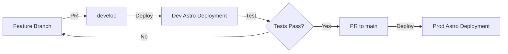
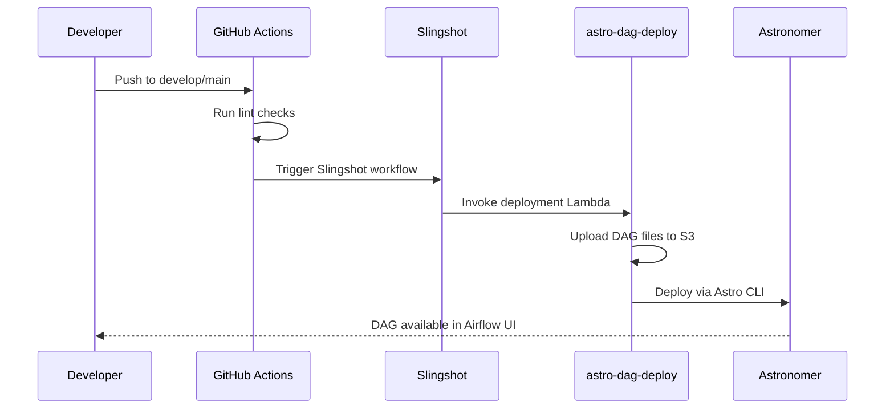

# astro-dag-cookiecutter

## Purpose
Cookiecutter template for generating opinionated Airflow DAG projects that deploy to Astronomer (Astro) platform at Skyscanner, providing standardized project structure, development workflows, and CI/CD integration.

## Repository Location
https://github.com/skyscanner/astro-dag-cookiecutter

## Overview

astro-dag-cookiecutter is a project template that accelerates creation of Airflow DAG projects using [cookiecutter](https://cookiecutter.readthedocs.io/) and Skyscanner's MShell tooling. It provides a complete, opinionated structure for developing, testing, and deploying DAGs to Astronomer workspaces.

### Key Features

- **Rapid Project Scaffolding**: Generate complete DAG projects via MShell in minutes
- **Environment Separation**: Built-in prod/staging DAG configurations
- **Local Development**: Astro CLI integration for local Airflow testing
- **Automated Deployment**: GitHub Actions + Slingshot integration for DAG deployment
- **SkySpark Integration**: Pre-configured examples using SkySparkOperator
- **Testing Framework**: Pytest setup with Astro test harness
- **Standardized Structure**: Consistent project layout across teams

## Template Configuration

### cookiecutter.json Parameters

The template requires these parameters during project generation:

| Parameter | Description | Validation |
|-----------|-------------|------------|
| `gitlab_group_name` | GitHub organization name | - |
| `repo_name` | Repository name | Must be valid GitHub repo name |
| `repo_description` | Short description of the DAG project | - |
| `pipeline_name` | Name of the DAG pipeline | - |
| `astro_workspace_name` | Target Astro workspace for deployment | - |
| `squad_name` | Team/squad owning the DAGs | - |
| `contact_email` | Contact email for alerts | Must end in `@skyscanner.net` |
| `alert_slack_channel` | Slack channel for alerts | Must start with @ or # |
| `aws_project_name` | AWS project name for cost allocation | - |

### Example Configuration

```json
{
  "gitlab_group_name": "data-platform",
  "repo_name": "user-metrics-pipeline",
  "repo_description": "ETL pipeline for user metrics aggregation",
  "pipeline_name": "user-metrics",
  "astro_workspace_name": "data-analytics",
  "squad_name": "analytics-platform",
  "contact_email": "analytics@skyscanner.net",
  "alert_slack_channel": "#analytics-alerts",
  "aws_project_name": "analytics-etl"
}
```

## Generated Project Structure

```
{{ cookiecutter.repo_name }}/
├── dags/
│   └── {{ pipeline_name }}_dag.py           # Main DAG definition
├── tests/
│   └── dags/                                # DAG tests
├── .github/
│   └── workflows/
│       └── main.yml                         # CI/CD pipeline
├── .astro/
│   └── config.yaml                          # Astro CLI config
├── Dockerfile                               # Astro Runtime image
├── Makefile                                 # Development commands
├── airflow_settings.yaml                    # Local Airflow config
├── requirements.txt                         # Runtime dependencies
├── setup.py                                 # Dev dependencies
├── .slingshot.yml                           # Slingshot deployment config
├── .python-version                          # Python version (pyenv)
└── README.md                                # Project documentation
```

## Usage via MShell

### 1. Generate Project

```bash
$ mshell-cut
✨ mshell-cut
==> Please select an option for template
    [0] - java-dropwizard
    [1] - java-module
    [2] - python-module
    [3] - node-library
    [4] - AWS-Lambda
    [5] - AWS-Batch
    [6] - probot
    [7] - bosun
    [8] - airflow-dag
    [9] - skyspark
✅  [10] - astro-dag
```

### 2. Follow Prompts

MShell will prompt for all cookiecutter parameters and generate the project structure.

### 3. Local Testing (Optional)

For testing changes to the cookiecutter template itself:

```bash
# Clone the template repo
mkdir ~/cookiecut-projects
cd ~/cookiecut-projects
git clone git@github.com:skyscanner/astro-dag-cookiecutter.git

# Configure cookiecutter-override.json with parameters
# Then cut locally:
mshell-cut --debug --local \
  --local-template-path ~/cookiecut-projects/astro-dag-cookiecutter \
  -c ~/cookiecut-projects/astro-dag-cookiecutter/cookiecutter-override.json
```

## Generated DAG Structure

### Environment-Based Configuration

Generated projects include a single DAG file that creates **two different DAGs** based on deployment environment:

```python
IS_PROD = Variable.get("ENVIRONMENT_NAME", "dev") == "prod"

PROD_CONFIG = Config(
    env="prod",
    dag_id="pipeline_name_dag_v1",
    schedule="0 0 * * *",
    docker_image="databricks-alchemy/org/pipeline:latest",
    catchup=False,
    tags=["production", "squad_name"]
)

STAGING_CONFIG = Config(
    env="staging",
    dag_id="pipeline_name_staging_dag_v1",
    schedule=None,  # Manual trigger only
    docker_image="databricks-alchemy/org/pipeline/staging:latest",
    catchup=False,
    tags=["staging", "squad_name"]
)

CONFIG = PROD_CONFIG if IS_PROD else STAGING_CONFIG
```

### Example DAG Components

Generated DAGs include example tasks using:

1. **DatabricksSqlSensor**: Wait for upstream data availability
   ```python
   sample_sensor = DatabricksSqlSensor(
       task_id="some_sensor",
       databricks_conn_id="databricks_skyscanner",
       sql="SELECT * FROM trusted_silver.some_upstream_table WHERE dt={{ ds }} LIMIT 1",
       http_path=CONFIG.sensor_http_path,
       catalog="hive_to_uc_intermediate"
   )
   ```

2. **SkySparkOperator**: Execute PySpark jobs on Databricks
   ```python
   sample_app_task = SkySparkOperator(
       spark_app="sample_app_builder",
       docker_image=CONFIG.docker_image,
       databricks_runtime="15.4.x-scala2.12",
       py_files=[ZIP_PATH, f"{APPS_PATH}/sample_app_builder.py"],
       project=PROJECT,
       cmd_params=["--dt", "{{ ds }}", "--env", CONFIG.env]
   )
   ```

3. **DatabricksPartitionSensor**: Wait for specific partitions
   ```python
   partition_sensor = DatabricksPartitionSensor(
       task_id="partition_sensor",
       table_name="some_domain.some_upstream_table",
       partitions={"dt": "{{ ds }}"},
       catalog="prod_trusted_bronze"
   )
   ```

## Development Workflow

### 1. Initial Setup

```bash
# Set up local development environment
make setup-dev
```

This command:
- Installs Astro CLI via Homebrew
- Creates and pushes `develop` branch to GitHub
- Installs Python version via pyenv
- Creates virtual environment in `.pyenv`
- Installs all dependencies

### 2. Configure Artifactory

```bash
artifactory-cli-login pip -f
cp ~/.pip/pip.conf .
```

### 3. Local Development

```bash
# Start local Airflow
make run-airflow  # or: astro dev start

# Access Airflow UI at http://localhost:8080
# Username: admin, Password: admin

# Run tests
make test  # Runs lint + pytest

# Format code
make format

# Lint code
make lint
```

### 4. Branch Protection Setup

**Critical**: Configure branch protection in GitHub:
1. Go to Settings → Branches
2. Add protection rules for `main` and `develop`
3. Set `develop` as default branch
4. Require pull requests before merging

## Deployment Process

### Development Lifecycle



1. **Feature Development**: Create feature branch from `develop`, test locally
2. **Dev Deployment**: PR to `develop` → deploys staging DAG to dev Astro deployment
3. **Production Deployment**: PR to `main` → deploys prod DAG to prod Astro deployment

### Enabling Deployments

Edit `.github/workflows/main.yml`:

```yaml
astro-dag:
  name: Astro DAG
  uses: skyscanner/reusable-workflows/.github/workflows/astro-dag.yaml@main
  secrets: inherit
  with:
    service_name: repo_name
    astro_workspace: "workspace_name"
    deploy: true  # Change from false to true
```

- `deploy: true` + push to `develop` → Deploys to dev
- `deploy: true` + push to `main` → Deploys to prod

### CI/CD Pipeline



### Slingshot Configuration

The `.slingshot.yml` defines deployment workflow:

```yaml
supportFiles:
  pipeline_name_dag:
    filename: dags/pipeline_name_dag.py

genericWorkflow:
  - name: trigger_astro_dag_deploy_lambda
    kind: webhook
    request:
      url: {{ astro_dag_deploy_lambda_endpoint }}
      method: POST
      params:
        astroWorkspace: {{ astro_workspace }}
        astroDeployment: {{ astro_deployment }}
        repo: {{ repo }}
      json:
        dags:
          - service_name: {{ service_name }}
            squad_name: squad_name
            pipeline_name: pipeline_name_dag
            file: $$FILES.pipeline_name_dag
```

### Managing DAGs

**Add new DAGs**: Update `.slingshot.yml` with new DAG entries:

```yaml
supportFiles:
  second_dag:
    filename: dags/second_dag.py

# In genericWorkflow json.dags:
  - service_name: {{ service_name }}
    squad_name: squad_name
    pipeline_name: second_dag
    file: $$FILES.second_dag
```

## Makefile Targets

| Target | Description |
|--------|-------------|
| `help` | Show all available targets |
| `install-astro-cli` | Install Astro CLI via Homebrew |
| `install-venv` | Setup Python version + virtualenv |
| `install-dev` | Install dev dependencies |
| `format` | Reformat code with Ruff |
| `lint` | Lint code with Ruff |
| `test` | Run linting and tests |
| `run-airflow` | Start local Airflow with Astro CLI |
| `setup-dev` | Complete local dev environment setup |
| `setup-dev-branch` | Create and push develop branch |

## Testing Framework

### Running Tests

```bash
# Run all tests (lint + pytest)
make test

# Run only pytest
astro dev pytest

# Run with coverage
astro dev pytest --cov
```

### Test Structure

```
tests/
└── dags/
    └── test_pipeline_name_dag.py
```

Example test:

```python
from airflow.models import DagBag

def test_dag_loads():
    dagbag = DagBag(dag_folder="dags/", include_examples=False)
    assert len(dagbag.import_errors) == 0
    assert "pipeline_name_dag_v1" in dagbag.dags
```

## Dependencies Management

### Runtime Dependencies

**Important**: Runtime dependencies are **NOT** managed in `requirements.txt`. They are managed in the workspace-specific Astro Runtime Docker image referenced in the Dockerfile.

To update runtime dependencies:
1. Request changes in [#data-platform-support](https://skyscanner.slack.com/archives/C043JRRJJ)
2. Platform team updates custom Astro Runtime image

### Development Dependencies

Development dependencies are managed in `setup.py`:

```python
setup(
    name="pipeline-name",
    version="0.1.0",
    install_requires=[],
    extras_require={
        "dev": [
            "pytest>=7.0.0",
            "ruff>=0.1.0",
            # Add dev dependencies here
        ]
    }
)
```

## Integration Points

### With astro-dag-deploy

- Generated projects trigger [astro-dag-deploy](ASTRO_DAG_DEPLOY.md) Lambda via Slingshot
- Lambda uploads DAG files to S3 and deploys to Astronomer
- S3 prefix: `dags/{workspace}/{deployment}/{repo}`

### With alchemy-airflow-operators

- Generated DAGs import `SkySparkOperator` from `skyscanner_airflow_provider`
- Uses [alchemy-airflow-operators](ALCHEMY_AIRFLOW_OPERATORS.md) for Databricks integration
- Pre-configured with Databricks sensors and operators

### With SkySpark Projects

- Generated DAGs are designed to orchestrate SkySpark jobs
- References Docker images containing SkySpark applications
- Example tasks show SkySparkOperator configuration

### With Astronomer

- Local development uses Astro CLI
- Deploys to Astronomer workspaces via Astro CLI
- Uses workspace-specific custom Astro Runtime images

## Astro-Specific Features

### Dockerfile

```dockerfile
FROM quay.io/astronomer/astro-runtime:11.0.0-python-3.11-base
# Inherits from workspace-specific custom image
# Contains all necessary runtime dependencies
```

### airflow_settings.yaml

Local-only configuration for development:

```yaml
airflow:
  connections:
    - conn_id: databricks_skyscanner
      conn_type: databricks
      # ... connection details
  variables:
    - variable_name: ENVIRONMENT_NAME
      variable_value: dev
  pools:
    - pool_name: default_pool
      pool_slot: 128
```

### .astro/config.yaml

Astro CLI configuration:

```yaml
project:
  name: pipeline-name
```

## Best Practices

### DAG Configuration

1. **Carefully set `start_date`**:
   - Choose an appropriate start date for your use case
   - Never change after deployment (causes scheduling issues)
   - Read [DAG scheduling documentation](https://skyscanner.atlassian.net/wiki/spaces/alchemy/pages/202677037)

2. **Configure `catchup` appropriately**:
   - `catchup=False`: No backfill (common for incremental loads)
   - `catchup=True`: Backfill from start_date (for historical processing)

3. **Set up alerting**:
   ```python
   "on_failure_callback": (
       FailureManager.get_failure_callback(
           channel="<slack_channel>",
           incident_io_escalation_path="<path>",
           incident_io_alert_priority="critical"  # or "non-critical"
       )
   )
   ```

### Deployment Strategy

1. **Always test in dev first**: Merge to `develop` before `main`
2. **Use staging DAGs**: Test with real data in dev environment
3. **Enable deployments gradually**: Start with dev, then prod
4. **Monitor deployments**: Check Airflow UI after deployment

### Code Quality

1. **Run tests locally**: `make test` before committing
2. **Format code**: `make format` to ensure consistency
3. **Follow linting rules**: `make lint` to catch issues early

### Security

1. **Never commit secrets**: Use Airflow Connections and Variables
2. **Use branch protection**: Prevent direct pushes to main/develop
3. **Review changes carefully**: Especially catchup and start_date

## Troubleshooting

### MShell Issues

**Error**: Docker mounting issues when cutting locally
- **Solution**: Clone repo outside home directory (`~`)

**Error**: mshell-cut out of date
- **Solution**: Update mshell-cut following [documentation](https://skyscanner.atlassian.net/wiki/spaces/DEVEX/pages/144658043/mshell-cut)

### Local Airflow Issues

**Error**: Port 8080 or 5432 already in use
- **Solution**: Stop existing containers or [change ports](https://www.astronomer.io/docs/astro/cli/troubleshoot-locally#ports-are-not-available-for-my-local-airflow-webserver)

**Error**: pip.conf issues during install
- **Solution**: Run `artifactory-cli-login pip -f` and copy pip.conf

### Deployment Issues

**Error**: Deploy step not triggering
- **Solution**: Check `deploy: true` in `.github/workflows/main.yml`

**Error**: Lambda deployment failure
- **Solution**: Check CloudWatch logs for astro-dag-deploy Lambda

## Hooks and Post-Generation

The template includes post-generation hooks (`hooks/post_gen_project.py`):

- Creates `.python-version` file
- Runs `git init` if needed
- Creates initial commit
- Sets up remote origin

## Comparison with skyspark-cookiecutter

| Feature | astro-dag-cookiecutter | skyspark-cookiecutter |
|---------|----------------------|---------------------|
| **Purpose** | Generate Airflow DAG projects | Generate SkySpark application projects |
| **Output** | Airflow DAG files | PySpark application code |
| **Runtime** | Astronomer/Airflow | Databricks |
| **Testing** | Pytest with Astro test harness | Pytest with PySpark fixtures |
| **Deployment** | GitHub Actions + Slingshot + Lambda | Docker (ECR) or DABs (Databricks) |
| **Primary User** | Data engineers writing orchestration | Data engineers writing transformations |
| **Dependencies** | alchemy-airflow-operators | SkySpark framework |

## Related Components

- [astro-dag-deploy](ASTRO_DAG_DEPLOY.md) - Lambda for automated DAG deployment
- [alchemy-airflow-operators](ALCHEMY_AIRFLOW_OPERATORS.md) - Operators used in generated DAGs
- [skyspark-cookiecutter](SKYSPARK_COOKIECUTTER.md) - Complementary template for SkySpark apps
- [SkySpark Framework](SKYSPARK_FRAMEWORK.md) - PySpark framework for applications
- [Deployment Workflows](DEPLOYMENT_WORKFLOWS.md) - Complete deployment patterns
- [Architecture Overview](SKYSCANNER_DATA_PLATFORM_ARCHITECTURE.md) - System architecture

## Support and Resources

- **Slack**: [#data-platform-support](https://skyscanner.slack.com/archives/C043JRRJJ)
- **Documentation**: [Astro at Skyscanner](https://docs.astronomer.io/astro)
- **DAG Scheduling Guide**: [Alchemy Wiki](https://skyscanner.atlassian.net/wiki/spaces/alchemy/pages/202677037)
- **MShell Guide**: [MShell-cut Documentation](https://skyscanner.atlassian.net/wiki/spaces/DEVEX/pages/144658043/mshell-cut)
