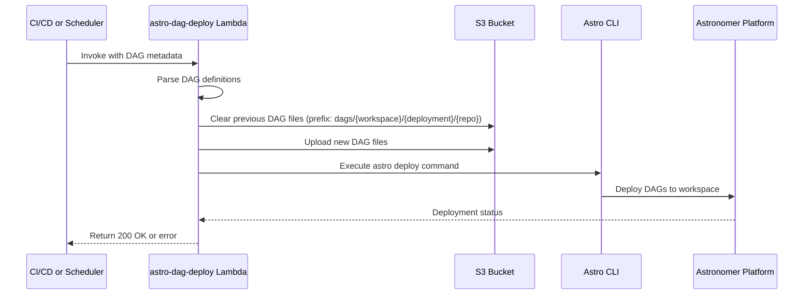

# astro-dag-deploy

## Purpose
AWS Lambda function that automates the deployment of Airflow DAGs to Astronomer (Astro) platform, handling DAG file management and deployment orchestration.

## Repository Location
https://github.com/skyscanner/astro-dag-deploy

## Architecture Components

### Lambda Handler

- **Location**: `astro_dag_deploy/main.py`
- **Function**: `handler(event, context)`
- **Triggers**: HTTP requests via API Gateway or direct Lambda invocation

#### Event Structure

```json
{
  "astroWorkspace": "production",
  "astroDeployment": "data-platform",
  "repo": "my-data-pipeline",
  "body": {
    "dags": [
      {
        "dag_id": "my_etl_pipeline",
        "dag_file": "s3://bucket/dags/my_dag.py",
        ...
      }
    ]
  }
}
```

## Deployment Flow



## Key Modules

### DagUpload
- **Location**: `astro_dag_deploy/model/dag_upload.py`
- **Responsibility**: Download DAG resources from Slingshot and upload to S3
- **Methods**:
  - `download_slingshot_resources()`: Fetch DAG dependencies
  - `upload_dag()`: Upload DAG files to target S3 prefix

### DagDeploy
- **Location**: `astro_dag_deploy/model/dag_deploy.py`
- **Responsibility**: Execute Astro CLI deployment
- **Methods**:
  - `deploy_dags()`: Trigger deployment to Astronomer

### S3 Client
- **Location**: `astro_dag_deploy/utils/s3_client.py`
- **Function**: `clear_prefix(bucket, prefix)`
- **Purpose**: Remove old DAG files before deploying new versions

### Astro CLI Client
- **Location**: `astro_dag_deploy/utils/astro_cli_client.py`
- **Purpose**: Interface with Astronomer CLI for deployments

### Email Client
- **Location**: `astro_dag_deploy/utils/email_client.py`
- **Function**: `email_failure(dag_json, environment)`
- **Purpose**: Send failure notifications

## Metrics and Monitoring

Uses Grappler for metrics:

| Metric | Type | Description |
|--------|------|-------------|
| `parse.success` | Binary | DAG parsing success (1) or failure (0) |
| `parse.time` | Duration | Time taken to parse DAGs |
| `deploy.success` | Binary | Deployment success (1) or failure (0) |
| `deploy.time` | Duration | Time taken to deploy DAGs |

### Metric Tags
- `workspace`: Astro workspace name
- `deployment`: Astro deployment name
- `repo`: Source repository name

## Infrastructure

### Runtime Environment
- **Platform**: AWS Lambda
- **Python Version**: 3.10
- **Deployment**: AWS SAM / Slingshot

### Configuration Files

| File | Purpose |
|------|---------|
| `template.yml` | CloudFormation/SAM template |
| `.slingshot.yml` | Main Slingshot deployment config |
| `.slingshot-lambda.yml` | Lambda-specific configuration |
| `.slingshot-infra.yml` | Infrastructure configuration |
| `swagger.yml` | API Gateway specification |

## Development

### Installing Dependencies
```bash
artifactory-cli-login pip
make install-dev
```

### Running Tests
```bash
make component  # Component tests
make coverage   # Full coverage report
make test       # Lint and component tests
```

### Building Lambda Package
```bash
make dockerised-lambda.zip
```

### Local Testing with SAM

1. Install AWS SAM CLI
2. Create and activate virtual environment
3. Build Lambda package:
   ```bash
   make dockerised-lambda.zip
   ```
4. Start local API:
   ```bash
   sam local start-api
   ```
5. Invoke function:
   ```bash
   curl -X POST http://localhost:3000/latest/invoke \
     -H "Content-Type: application/json" \
     -d '{
       "astroWorkspace": "dev",
       "astroDeployment": "test",
       "repo": "my-repo",
       "body": {
         "dags": []
       }
     }'
   ```

## Deployment Process

### 1. DAG Parsing Phase
- Lambda receives event with DAG metadata
- Parses DAG definitions from request body
- Validates required fields (astroWorkspace, astroDeployment, repo)
- Logs parse metrics

### 2. S3 Management Phase
- Constructs target S3 prefix: `dags/{workspace}/{deployment}/{repo}`
- Clears previous DAG files for the repository
- Downloads resources from Slingshot (if specified)
- Uploads new DAG files to S3

### 3. Deployment Phase
- Executes Astro CLI deployment command
- Deploys to specified workspace and deployment
- Logs deployment metrics
- Returns success/failure status

### 4. Error Handling
- Catches and logs exceptions
- Sends failure notifications via email
- Records failure metrics
- Returns appropriate HTTP status codes

## S3 Bucket Structure

```
s3://bucket-name/
└── dags/
    └── {astroWorkspace}/
        └── {astroDeployment}/
            └── {repo}/
                ├── dag1.py
                ├── dag2.py
                └── dependencies/
                    └── ...
```

## Integration Points

### With Airflow/Astronomer
- Deploys DAG files to Astronomer platform
- Uses Astro CLI for deployment automation
- Syncs DAGs to Airflow scheduler

### With CI/CD
- Triggered by CI/CD pipelines on code changes
- Supports automated DAG deployment
- Integrates with Git workflows

### With S3
- Uses S3 as intermediate storage for DAG files
- Manages DAG file lifecycle
- Cleans up old deployments

## Error Scenarios

### Bad Request (400)
- Missing required parameters (astroWorkspace, astroDeployment, repo)
- Invalid event structure

### Deployment Failure
- Astro CLI errors
- S3 upload failures
- Network connectivity issues

### Parse Failure
- Invalid DAG definitions
- Missing DAG dependencies
- Slingshot resource download failures

## Best Practices

### Lambda Package Size
- Keep package under 50MB limit
- Use `dockerised-lambda.zip` target for correct binaries
- Minimize dependencies

### Deployment Strategy
- Use separate Lambda aliases per Git branch in sandbox
- Production deployments use stable version
- Test locally with SAM before deploying

### Monitoring
- Monitor Grappler metrics for success rates
- Set up alarms for deployment failures
- Review CloudWatch logs for errors

## Related Components

- [astro-dag-cookiecutter](ASTRO_DAG_COOKIECUTTER.md) - Template for generating DAGs deployed by this Lambda
- [alchemy-airflow-operators](ALCHEMY_AIRFLOW_OPERATORS.md) - DAGs deployed by this Lambda use these operators
- [skyspark-cookiecutter](SKYSPARK_COOKIECUTTER.md) - Generated projects create DAGs deployed by this Lambda
- [Deployment Workflows](DEPLOYMENT_WORKFLOWS.md) - Complete deployment patterns
- [Architecture Overview](SKYSCANNER_DATA_PLATFORM_ARCHITECTURE.md) - Complete system architecture
