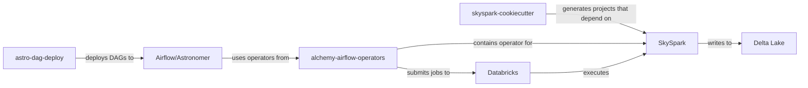
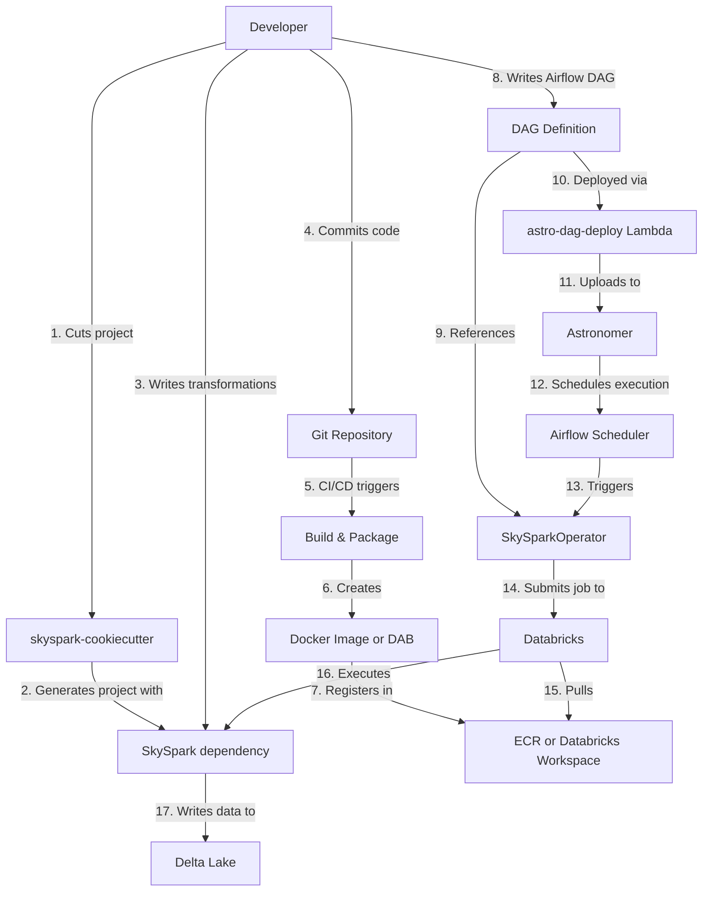
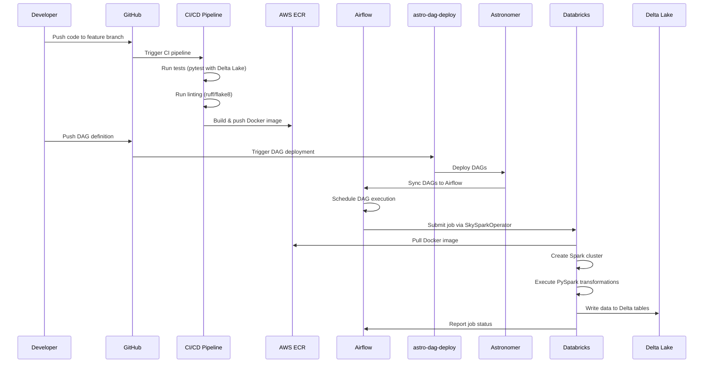
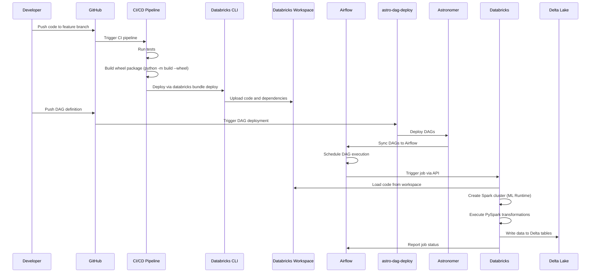

# Component Relationships and Deployment Workflows

## Component Relationships

### Dependency Graph

### Interaction Matrix

| Component | Interacts With | Relationship Type | Purpose |
|-----------|----------------|-------------------|---------|
| skyspark-cookiecutter | SkySpark | Dependency | Generated projects import SkySpark library |
| skyspark-cookiecutter | alchemy-airflow-operators | Indirect | Generated DAGs use SkySparkOperator |
| SkySpark | Databricks | Runtime | Executes on Databricks Spark clusters |
| SkySpark | Delta Lake | Data Layer | Writes/reads data to/from Delta tables |
| alchemy-airflow-operators | Databricks | API | Submits jobs via Databricks API |
| alchemy-airflow-operators | SkySpark | Orchestration | SkySparkOperator submits SkySpark apps |
| astro-dag-deploy | Airflow | Deployment | Deploys DAG files to Astronomer |
| astro-dag-deploy | S3 | Storage | Stores DAG files before deployment |
| Airflow | alchemy-airflow-operators | Dependency | Imports and uses custom operators |

### Data Flow Through Components

## Deployment Workflows

### Docker-based Deployment Workflow

#### Steps Breakdown

##### 1. Development Phase
- Developer runs `mshell-cut cut` and selects `skyspark` template
- Chooses `type_of_task=docker`
- Writes transformations in `src/transformations/`
- Writes Spark apps in `src/apps/`
- Adds dependencies to `requirements.txt`

##### 2. Local Testing
- Run `make test` to execute pytest suite
- Tests use Delta Lake emulation
- Validate transformations with sample data

##### 3. Build Phase
- CI/CD pipeline triggered on push
- `make build-dev` installs dependencies
- `make lint` runs code quality checks
- `make test` runs full test suite
- Dockerfile builds image with dependencies

##### 4. Docker Image Creation
- Base image: Databricks-compatible Python runtime
- Install SkySpark library
- Copy application code from `src/`
- Tag: `{ecr_registry}/databricks-alchemy/{group}/{repo}:{tag}`

##### 5. Image Registration
- Push to AWS ECR
- Image available to Databricks clusters

##### 6. DAG Deployment
- Developer writes Airflow DAG using SkySparkOperator
- Commits DAG to repository
- astro-dag-deploy Lambda triggered
- DAG uploaded to Astronomer

##### 7. Job Execution
- Airflow scheduler triggers DAG
- SkySparkOperator configures Databricks job:
  - Docker image reference
  - Cluster configuration (autoscaling, instance profile)
  - Spark configuration (Delta, S3, Glue)
  - Python files and JARs
- Databricks creates ephemeral cluster
- Cluster pulls Docker image from ECR
- Executes Spark application
- Writes results to Delta Lake
- Cluster terminates on completion

### DABs-based Deployment Workflow

#### Steps Breakdown

##### 1. Development Phase
- Developer runs `mshell-cut cut` and selects `skyspark` template
- Chooses `type_of_task=dab`
- Provides service principal IDs for dev/prod
- Project includes `databricks.yaml` configuration

##### 2. Local Testing
- Same as Docker workflow
- Run `make test` for validation

##### 3. Build Phase
- CI/CD pipeline triggered on push
- Build wheel package: `python -m build --wheel`
- Package dependencies: `pip wheel -r requirements.txt -w ./dependency_wheels`
- Generate requirements manifest: `requirements-dabs.txt`

##### 4. DABs Deployment
- `databricks bundle validate`: Validate configuration
- `databricks bundle deploy`: Deploy to workspace
- Artifacts uploaded:
  - Project wheel file (`dist/*.whl`)
  - Dependency wheels (`dependency_wheels/*.whl`)
  - Workflow definitions (`databricks-workflows/`)
  - Source code (`src/`)

##### 5. Workspace Configuration
- DABs creates Jobs in Databricks workspace
- Jobs reference wheel files in workspace
- No Docker image required
- Uses Databricks ML Runtime

##### 6. DAG Deployment
- Same as Docker workflow
- astro-dag-deploy handles Airflow DAG deployment

##### 7. Job Execution
- Airflow triggers job via Databricks API
- Databricks loads code from workspace
- Creates cluster with ML Runtime
- Installs wheel packages
- Executes Spark application
- Writes to Delta Lake

### Comparison: Docker vs. DABs

| Aspect | Docker Deployment | DABs Deployment |
|--------|-------------------|-----------------|
| **Artifact** | Docker image | Wheel packages |
| **Storage** | AWS ECR | Databricks Workspace |
| **Build Process** | `docker build` | `python -m build --wheel` |
| **Deployment Tool** | Docker CLI + ECR push | Databricks CLI (`bundle deploy`) |
| **Runtime** | Databricks Runtime (standard) | Databricks ML Runtime |
| **Use Case** | Standard ETL pipelines | ML workloads, feature engineering |
| **Dependencies** | Baked into image | Installed from wheels |
| **Update Speed** | Slower (rebuild image) | Faster (upload code) |
| **Reproducibility** | High (immutable image) | Medium (dependency resolution) |
| **CI/CD Complexity** | Medium | Low |

## Related Documentation

- [SkySpark Framework](SKYSPARK_FRAMEWORK.md) - Core PySpark framework
- [skyspark-cookiecutter](SKYSPARK_COOKIECUTTER.md) - Project template generator
- [alchemy-airflow-operators](ALCHEMY_AIRFLOW_OPERATORS.md) - Airflow orchestration operators
- [astro-dag-deploy](ASTRO_DAG_DEPLOY.md) - DAG deployment automation
- [Architecture Overview](SKYSCANNER_DATA_PLATFORM_ARCHITECTURE.md) - Complete system architecture
