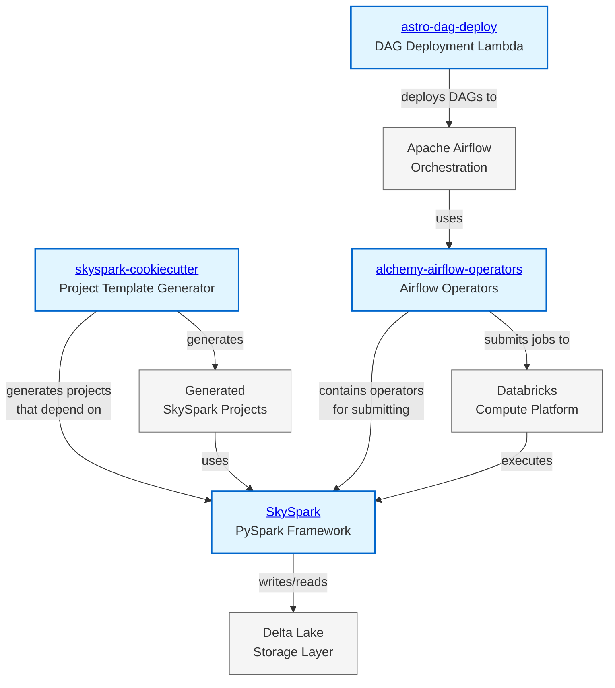
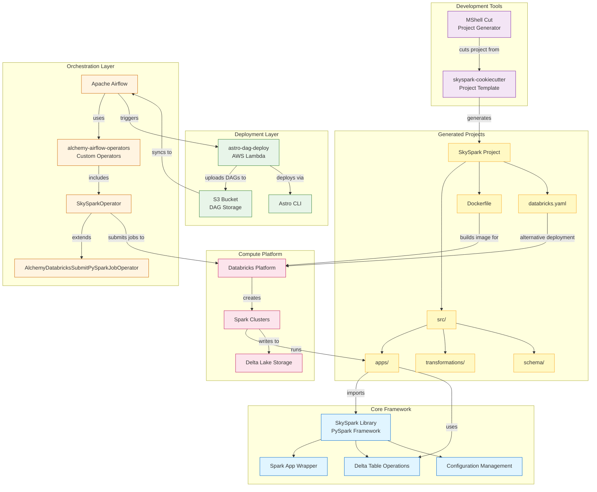
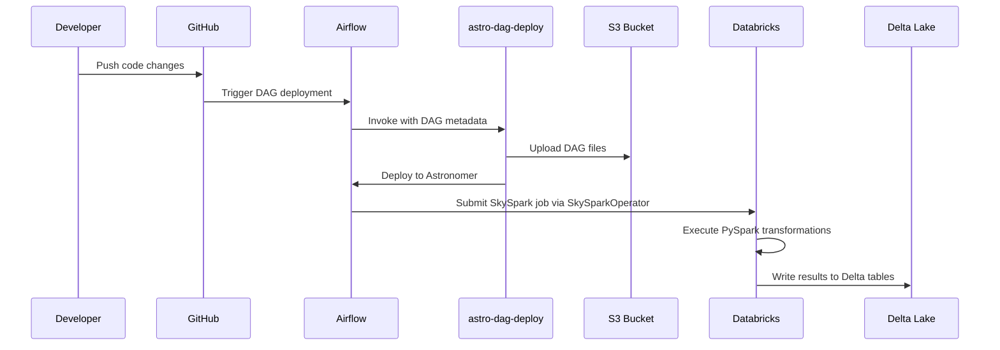

# Skyscanner Data Platform Architecture

## Overview

This document describes the architecture and relationships between the key components of Skyscanner's data platform migration from Alchemy/Airflow to SkySpark/Databricks ecosystem.

## Component Repositories

The platform consists of four main repositories:

| Component | Repository | Description |
|-----------|------------|-------------|
| **SkySpark** | [github.com/skyscanner/skyspark](https://github.com/skyscanner/skyspark) | Core PySpark framework for Spark applications |
| **skyspark-cookiecutter** | [github.com/skyscanner/skyspark-cookiecutter](https://github.com/skyscanner/skyspark-cookiecutter) | Project template generator |
| **alchemy-airflow-operators** | [github.com/skyscanner/alchemy-airflow-operators](https://github.com/skyscanner/alchemy-airflow-operators) | Custom Airflow operators for orchestration |
| **astro-dag-deploy** | [github.com/skyscanner/astro-dag-deploy](https://github.com/skyscanner/astro-dag-deploy) | AWS Lambda for DAG deployment automation |

### Component Relationship Graph

**Repository Interactions:**
- **skyspark-cookiecutter** → **SkySpark**: Generated projects import SkySpark as a dependency
- **alchemy-airflow-operators** → **SkySpark**: Contains SkySparkOperator for job submission
- **alchemy-airflow-operators** → **Databricks**: Submits jobs via Databricks API
- **astro-dag-deploy** → **Airflow**: Automates DAG deployment to Astronomer
- **SkySpark** → **Delta Lake**: Provides APIs for Delta table operations

## Architecture Diagram

## Component Layers

### 1. Development Tools Layer
- **MShell Cut**: Command-line tool for generating new projects
- **skyspark-cookiecutter**: Template repository containing opinionated project structure

### 2. Core Framework Layer
- **SkySpark**: Python library providing PySpark utilities and patterns
- Handles Spark session management, configuration, and Delta Lake operations

### 3. Orchestration Layer
- **Apache Airflow**: Workflow orchestration platform
- **alchemy-airflow-operators**: Custom Airflow operators for data pipelines
- **SkySparkOperator**: Specialized operator for submitting SkySpark jobs to Databricks

### 4. Deployment Layer
- **astro-dag-deploy**: AWS Lambda function for deploying DAGs to Astronomer
- Handles DAG file management and deployment automation

### 5. Compute Platform Layer
- **Databricks**: Unified analytics platform running Spark workloads
- **Delta Lake**: Storage layer providing ACID transactions

### 6. Generated Projects Layer
- Projects created from the cookiecutter template
- Contains apps, transformations, schemas, and deployment configurations

## Deployment Patterns

### Pattern 1: Docker-based Deployment (Default)
1. Developer cuts project using `mshell-cut`
2. Project includes Dockerfile for containerization
3. Docker image pushed to ECR
4. SkySparkOperator references Docker image when submitting jobs
5. Databricks pulls Docker image and runs Spark job

### Pattern 2: Databricks Asset Bundles (DABs)
1. Developer cuts project with `type_of_task=dab`
2. Project includes `databricks.yaml` configuration
3. DABs CLI deploys code directly to Databricks workspace
4. No Docker image required (uses Databricks ML Runtime)

## Data Flow

## Integration Points

### 1. **skyspark-cookiecutter → SkySpark**
- Generated projects have SkySpark as a dependency in `requirements.txt`
- Apps import SkySpark utilities for Spark session and Delta operations

### 2. **alchemy-airflow-operators → Databricks**
- SkySparkOperator configures Databricks cluster and job parameters
- Handles authentication, IAM roles, and Spark configuration

### 3. **astro-dag-deploy → Airflow**
- Lambda function manages DAG lifecycle in Astronomer
- Parses DAG definitions and uploads to S3
- Uses Astro CLI for deployment

### 4. **SkySpark → Delta Lake**
- Provides high-level APIs for Delta table operations
- Handles partitioning, clustering, and metadata management

## Key Technologies

- **Python 3.10+**: Primary programming language
- **PySpark 4.0+**: Distributed data processing
- **Delta Lake**: ACID-compliant storage layer
- **Databricks Runtime**: Managed Spark environment
- **Apache Airflow**: Workflow orchestration
- **AWS Lambda**: Serverless deployment automation
- **Docker**: Containerization for reproducible environments
- **Databricks Asset Bundles**: Alternative deployment mechanism for ML workloads

## Migration Context

This architecture represents Skyscanner's migration from:
- **Alchemy** (legacy data platform) → **SkySpark** (modern PySpark framework)
- **EMR/Glue** (AWS-native compute) → **Databricks** (unified analytics platform)
- **Manual deployment** → **Automated DAG deployment** (via Lambda)

The migration maintains Airflow as the orchestration layer while modernizing the compute and data storage infrastructure.
