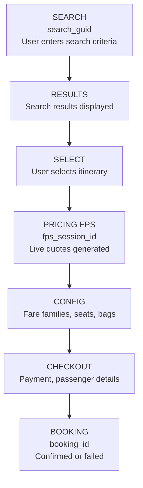
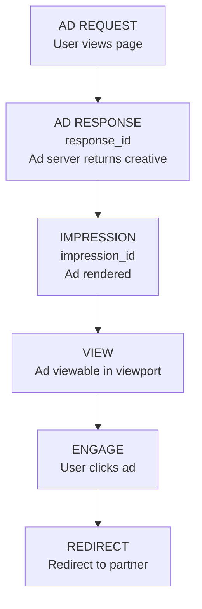
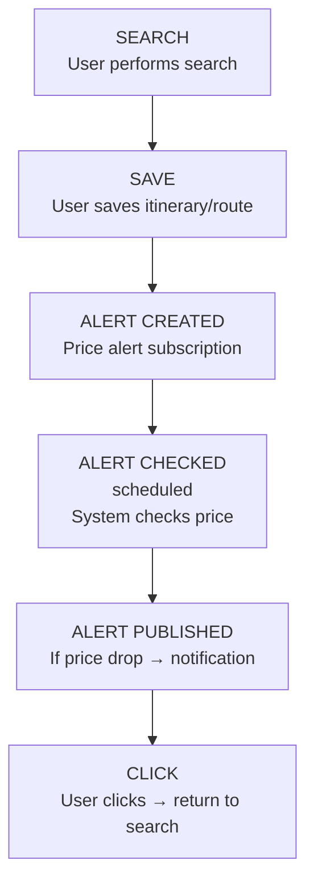
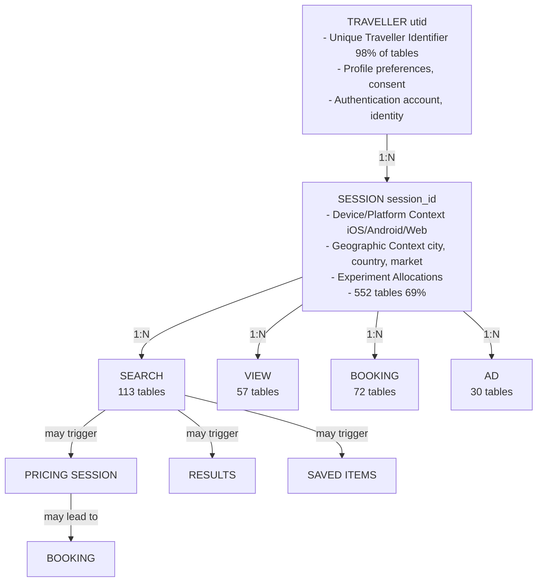
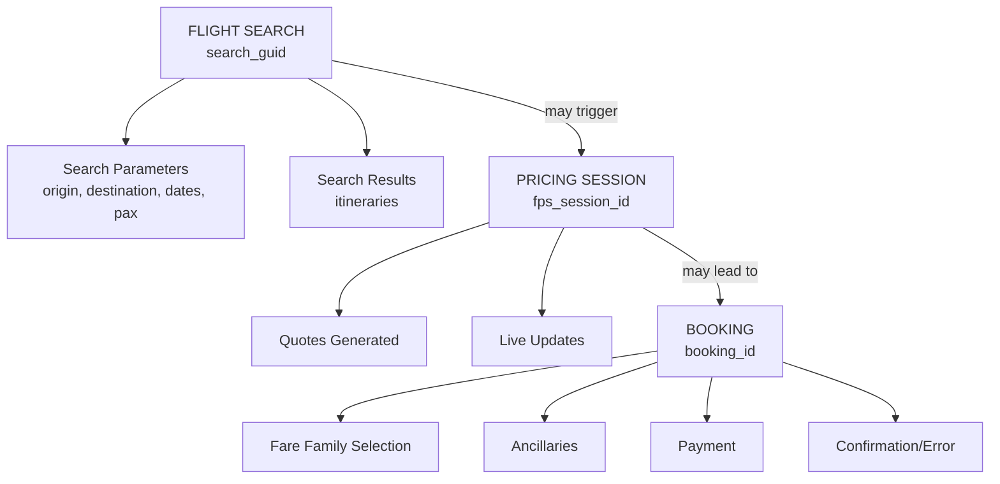
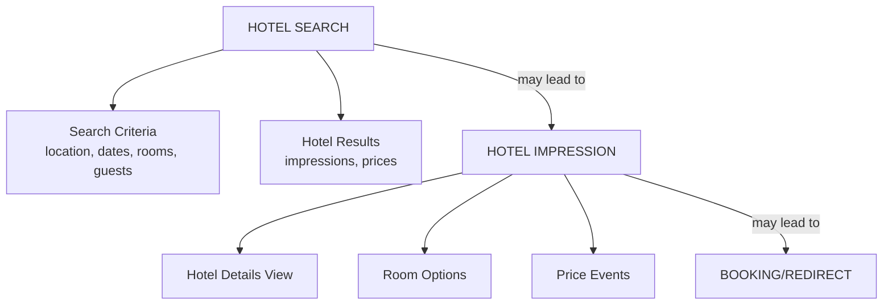
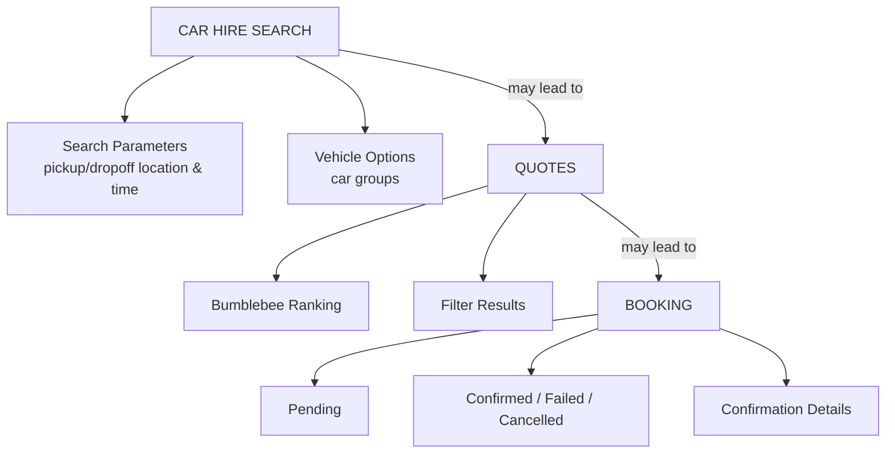

# Skyscanner Conceptual Data Model - COMPLETE ANALYSIS
## Bronze Layer: prod_trusted_bronze.internal

**Schema**: prod_trusted_bronze.internal
**Total Tables**: 804
**Total Domain Prefixes**: 137
**Analysis Date**: 2025-11-26
**Data Format**: Delta Lake (External Tables)
**File Lines**: 20,732

---

## Executive Summary

The Skyscanner bronze layer represents a **comprehensive event-driven data architecture** supporting a multi-vertical travel marketplace. The 804 tables capture real-time user behavior, transactions, and operational metrics across **Flights** (primary), **Hotels**, **Car Hire**, **Packages**, and **Rail** verticals, plus extensive infrastructure, advertising, and user engagement systems.

### Key Characteristics:
- **Event-Driven**: ~98% are event/fact tables (not traditional dimensions)
- **Multi-Platform**: iOS (100 tables), Android (91 tables), Web (12 tables), Public (91 tables)
- **User-Centric**: UTID (Unique Traveller ID) present in 787/804 tables (98%)
- **Real-Time Processing**: Grappler SDK + Slipstream ingestion pipeline
- **Mobile-First**: 158 "mini" mobile event patterns + 191 iOS/Android tables
- **137 Domain Prefixes**: From user-facing features to infrastructure monitoring

---

## COMPLETE DOMAIN CATALOG (A-Z)

### A

#### ACCOM (2 tables)
**Purpose**: Accommodation/lodging web search and results tracking

**Key Tables**:
- `accom_web_search_result_selected`
- `accom_web_search_results_options`

**Description**: Web-based accommodation search events capturing when users select results and view options. Complements the main hotels vertical with specific web accommodation flows.

---

#### ACCOUNT (1 table)
**Purpose**: User account management and authentication

**Key Tables**:
- `account_login`

**Description**: Core authentication events tracking user login activities, including authentication provider information and new account creation flags.

---

#### ACORN (7 tables)
**Purpose**: Acorn UI framework - DayView desktop experience

**Key Tables**:
- `acorn_alternate_dates_redirect`
- `acorn_element_impression`
- `acorn_element_interaction`
- `acorn_flights_show_more_button_click`
- `acorn_funnel_events_search` (22 columns - comprehensive search funnel)
- `acorn_save_to_list_heart_click`
- `acorn_save_to_list_notification_cta_clicked`

**Description**: Acorn is Skyscanner's desktop day-view UI framework. Tracks element-level impressions and interactions, search funnel events, alternate date redirects, and save-to-list features. The `acorn_funnel_events_search` table is particularly comprehensive with 22 columns covering flight search details, dates, origin/destination, and metadata.

---

#### AD (3 tables)
**Purpose**: Advertisement tracking - sponsored content

**Key Tables**:
- `ad_sponsored_content_article_click`
- `ad_sponsored_content_flights_widget_click`
- `ad_sponsored_content_video_event`

**Description**: Tracks sponsored content engagement including article clicks, flights widget interactions, and video events (paused, resumed, buffered). Links to `sponsored_content_widget_load_guid` for attribution.

---

#### ADS (1 table)
**Purpose**: Advertising forecast and booking panel proof-of-concept

**Key Tables**:
- `ads_forecast_booking_panel_poc`

**Description**: Experimental/POC table for forecasting ad performance on booking panels.

---

#### AFFILIATE (1 table)
**Purpose**: Affiliate gateway redirect tracking

**Key Tables**:
- `affiliate_gateway_redirects`

**Description**: Tracks redirects through the affiliate gateway for partner attribution and commission tracking.

---

#### AFFILIATES (1 table)
**Purpose**: Affiliate link API redirect management

**Key Tables**:
- `affiliates_link_api_redirects`

**Description**: API-based affiliate link redirect tracking, separate from the gateway-based approach.

---

#### AGORA (4 tables)
**Purpose**: Agora marketplace - margin optimization system

**Key Tables**:
- `agora_applys`
- `agora_day_view_result`
- `agora_margins` (19 columns)
- `agora_redirects`

**Description**: Internal system for pricing and margin optimization. The `agora_margins` table (19 columns) contains detailed margin calculations and apply results. Tracks how margin rules are applied to search results and redirects.

---

#### ALTERNATIVES (1 table)
**Purpose**: Alternative inventory grid mini event tracking

**Key Tables**:
- `alternatives_inventory_gridminievent`

**Description**: Tracks alternative search options presented to users, likely related to "similar routes" or "nearby airports" features.

---

#### ANCILLARIES (2 tables)
**Purpose**: Ancillary services - extras and add-ons

**Key Tables**:
- `ancillaries_purchases`
- `ancillaries_quotes`

**Description**: Tracks ancillary service quotes and purchases such as baggage, seat selection, meals, insurance, and other travel extras.

---

#### ANDROID (91 tables)
**Purpose**: Android mobile app comprehensive event tracking

**Major Sub-Categories**:
- **AI Search**: `android_ai_search_app_event`
- **Bookings**: `android_booking_details_action`, `android_booking_details_view`, `android_bookings_history_view`
- **Can I Go**: 4 tables for travel restrictions feature
- **Cancellation**: `android_cancellation_action`, `android_cancellation_view`
- **Car Hire**: `android_cargroupcardevent`
- **Combined Results**: `android_combined_results_action`, `android_combined_results_view`
- **Configuration**: Fare family options, config page landing, state changes
- **Deeplinks**: Navigation and resolution
- **Elements**: Impressions and interactions
- **Explore Home**: `android_explore_home_app_event`
- **Flights**: Configuration errors/UI, compare errors, ProView, checkout flow (RN), technical logs
- **Hotels**: Frontend actions (103 columns), seen events
- **Login & Consent**: Login consent, privacy consent, marketing opt-in
- **Mini Events**: 25+ mini tables covering search, acquisition, view lifecycle, trips, system info
- **Payment**: Save/retrieve payments (5 tables - API, errors, card management)
- **Profile**: Profile completion, profile settings
- **PQS**: Surveys (mini negative survey, mini survey)
- **Save to List**: Actions
- **Send Itinerary**: Actions and views
- **Share**: Simple share completed

**Key High-Value Tables**:
- `android_mini_search` - Primary mobile search events
- `android_mini_search_results_option` - Search result options
- `android_hotels_frontend_hotelsaction` (103 columns) - Comprehensive hotel interactions
- `android_mini_flights_rn_checkout_flow_event` - React Native checkout flow
- `android_save_retrieve_payments_*` - Payment management suite

**Description**: Complete Android app instrumentation covering every user interaction from app launch to booking completion. Heavy use of "mini" event pattern for mobile-optimized schemas.

---

#### ANONYMOUS (1 table)
**Purpose**: Anonymous user identity management

**Key Tables**:
- `anonymous_identity`

**Description**: Tracks anonymous/unauthenticated user sessions, likely bridging to UTID upon authentication.

---

#### AQA (1 table)
**Purpose**: Automated Quality Assurance

**Key Tables**:
- `aqa_accessibility_audit_test_result`

**Description**: Automated accessibility audit results for compliance testing (WCAG, ADA).

---

#### ASK (2 tables)
**Purpose**: Ask Skyscanner - AI/LLM-powered features

**Key Tables**:
- `ask_skyscanner_llm_span`
- `ask_skyscanner_trace`

**Description**: Distributed tracing for AI/LLM interactions. Tracks spans and traces for natural language queries and AI-generated recommendations.

---

#### ATLANTIS (3 tables)
**Purpose**: Atlantis service - orchestration system

**Key Tables**:
- `atlantis_api_request_event`
- `atlantis_orchestrator_event`
- `atlantis_staging_worker_process_event`

**Description**: Backend orchestration service managing API requests, worker processes, and staging workflows.

---

#### AUTH0LOGSHIPPER (1 table)
**Purpose**: Auth0 authentication log shipping

**Key Tables**:
- `auth0logshipper_logmessage`

**Description**: Ships authentication logs from Auth0 identity platform to the data lake for security monitoring and audit.

---

#### AUTOSUGGEST (1 table)
**Purpose**: Autosuggest/autocomplete telemetry

**Key Tables**:
- `autosuggest_telemetry`

**Description**: Generic autosuggest telemetry (platform-agnostic). Platform-specific versions exist in iOS, Android, and B2B domains.

---

### B

#### B2B (10 tables)
**Purpose**: Business-to-Business API tracking

**Key Tables**:
- `b2b_autosuggest_apicall`
- `b2b_autosuggest_interactions`
- `b2b_browse_apicall`
- `b2b_browse_interactions`
- `b2b_fps_apicall`
- `b2b_fps_interactions`
- `b2b_geo_apicall`
- `b2b_partners_api_interactions`
- `b2b_partners_api_latency_capture`
- `b2b_reference_apicall`

**Description**: Comprehensive B2B API usage tracking for enterprise partners. Covers autosuggest, browse, FPS (Flight Pricing Service), geo lookups, and general partner API interactions. Includes latency capture for SLA monitoring.

---

#### BABYSHARK (2 tables)
**Purpose**: Payment processing - 3D Secure 2.0

**Key Tables**:
- `babyshark_three_ds_two_requests`
- `babyshark_three_ds_two_stored`

**Description**: 3DS2 (3D Secure 2.0) authentication requests and stored authentication data for secure payment processing.

---

#### BACKEND (2 tables)
**Purpose**: Backend mini events

**Key Tables**:
- `backend_mini_event_booking_panel_option`
- `backend_mini_event_search_results_option`

**Description**: Server-side events for booking panel options and search results, complementing client-side tracking.

---

#### BANANA (13 tables)
**Purpose**: Banana framework - mobile web experience

**Key Tables**:
- `banana_element_impression`
- `banana_element_interaction`
- `banana_mini_acquisition`
- `banana_mini_booking_panel_option`
- `banana_mini_interaction`
- `banana_mini_search`
- `banana_mini_search_pill_selected`
- `banana_mini_search_result_selected`
- `banana_mini_search_results_option`
- `banana_mini_search_results_page`
- `banana_mini_search_viewmore_selected`
- `banana_mini_user_preferences`
- `banana_mini_view`

**Description**: Banana is Skyscanner's mobile web framework (responsive web). Tracks the complete mobile web journey including acquisitions, searches, element interactions, and user preferences. Similar structure to iOS/Android mini events but for mobile browsers.

---

#### BELLBOY (2 tables)
**Purpose**: Bellboy service - hotel aggregation

**Key Tables**:
- `bellboy_hotelsummary`
- `bellboy_searchevents`

**Description**: Backend service for hotel search and summary aggregation. Acts as an intermediary between frontend requests and hotel suppliers.

---

#### BLACKBIRD (4 tables)
**Purpose**: Blackbird platform - modern web framework

**Key Tables**:
- `blackbird_culture_selector_modal_changed`
- `blackbird_culture_selector_modal_closed`
- `blackbird_culture_selector_modal_opened`
- `blackbird_funnel_events_blackbird_hotelshomeredirect`

**Description**: Modern web platform framework. Tracks culture/locale selection modals and hotel homepage redirect funnels.

---

#### BLUEJAY (1 table)
**Purpose**: Bluejay service page loading

**Key Tables**:
- `bluejay_loaded`

**Description**: Page load tracking for the Bluejay service/feature.

---

#### BROWSE (1 table)
**Purpose**: Browse page view tracking

**Key Tables**:
- `browse_view_page_loaded`

**Description**: Generic browse page load events.

---

#### BWS (15 tables)
**Purpose**: Booking Web Service - post-booking management

**Key Tables**:
- `bws_android_anon_booking_reown_action`
- `bws_android_anon_booking_reown_progress`
- `bws_android_anon_booking_reown_view`
- `bws_android_help_centre_action`
- `bws_android_help_centre_view`
- `bws_android_inapp_care`
- `bws_android_trips_deeplink_type`
- `bws_booking_update_audit`
- `bws_ios_anon_booking_reown_action`
- `bws_ios_help_centre_action`
- `bws_ios_help_centre_view`
- `bws_ios_inapp_care`
- `bws_ios_trips_deeplink_type`

**Description**: Manages post-booking workflows including anonymous booking re-ownership (claiming bookings made without login), help centre interactions, in-app customer care, and trip deeplinks. Cross-platform (iOS/Android) coverage.

---

### C

#### CAMPAIGN (1 table)
**Purpose**: Marketing campaign action tracking

**Key Tables**:
- `campaign_actions`

**Description**: Tracks user actions attributed to marketing campaigns.

---

#### CAN (2 tables)
**Purpose**: Can I Go - travel restrictions feature

**Key Tables**:
- `can_i_go_alerts_event`
- `can_i_go_email_capture_tracking_useraction`

**Description**: "Can I Go" COVID-19/travel restrictions feature. Tracks alerts and email capture for travel restriction updates.

---

#### CAR (19 tables)
**Purpose**: Car hire core service

**Key Tables**:
- `car_hire_bumblebee_dropped_quotes`
- `car_hire_bumblebee_ranking`
- `car_hire_bumblebee_ranking_result`
- `car_hire_cancelled_booking_event`
- `car_hire_confirmed_booking_event`
- `car_hire_failed_booking_event`
- `car_hire_filter_result`
- `car_hire_indicative_price_search_event`
- `car_hire_map_interactions`
- `car_hire_office_search`
- `car_hire_pending_booking_event`
- `car_hire_quote_search_event`
- `car_hire_quotes`
- `car_hire_response_quote`
- `car_hire_scheduled_search`
- `car_hire_vendor_mapping_search`

**Description**: Complete car hire vertical including search, quotes, ranking (Bumblebee system), booking lifecycle (pending → confirmed/failed/cancelled), filter results, map interactions, and office searches.

---

#### CARHIRE (10 tables)
**Purpose**: Car hire frontend and cache

**Key Tables**:
- `carhire_cache_status`
- `carhire_homepage_autosuggest_telemetryevent`
- `carhire_homepage_cargroupcardevent`
- `carhire_homepage_element_impression`
- `carhire_homepage_element_interaction`
- `carhire_homepage_minisearch`
- `carhire_quote_cache_consistency`
- `carhire_web_mini_event_search_results_selected`

**Description**: Car hire homepage interactions, cache status monitoring, and web mini events. Complements the core CAR domain with frontend-specific tracking.

---

#### CLICK (1 table)
**Purpose**: Website header click tracking

**Key Tables**:
- `click_website_header_click`

**Description**: Tracks clicks on website header navigation elements.

---

#### COBI (8 tables)
**Purpose**: Cobi service - explore trips widget

**Key Tables**:
- `cobi_android_explore_trips_widget_card_action_tapped`
- `cobi_android_explore_trips_widget_card_loaded`
- `cobi_explore_trips_widget_card_action_tapped`
- `cobi_explore_trips_widget_card_loaded`
- `cobi_explore_trips_widget_impression`
- `cobi_ios_explore_trips_widget_card_action_tapped`
- `cobi_tps_response`
- `cobi_trips_search_response`

**Description**: "Explore Trips" widget tracking across platforms. Includes trip search responses and TPS (Trip Planning Service) responses.

---

#### COMBINED (2 tables)
**Purpose**: Combined search results (multi-vertical)

**Key Tables**:
- `combined_search_response_unfocused_pill`
- `combined_search_response_unfocused_result`

**Description**: Multi-vertical search responses showing results across flights, hotels, car hire simultaneously before user focuses on one vertical.

---

#### COMMUNICATION (1 table)
**Purpose**: Email communication events

**Key Tables**:
- `communication_email_event` (20 columns)

**Description**: Comprehensive email event tracking including campaigns, bounces, opens, clicks, and delivery status.

---

#### CONDUCTOR (1 table)
**Purpose**: Conductor orchestration service

**Key Tables**:
- `conductor_log`

**Description**: Workflow orchestration service logging (likely Netflix Conductor).

---

#### COUPONION (2 tables)
**Purpose**: Coupon management system

**Key Tables**:
- `couponion_coupon_creation_coupon_couponcreationevent`
- `couponion_coupon_usage_coupon_couponusageevent`

**Description**: Coupon lifecycle tracking from creation to usage/redemption.

---

### D

#### DBOOK (1 table)
**Purpose**: Direct booking gateway

**Key Tables**:
- `dbook_gateway_latency`

**Description**: Performance monitoring for direct booking gateway.

---

#### DEAL (1 table)
**Purpose**: Deal message badges

**Key Tables**:
- `deal_message_badges`

**Description**: Tracks deal badge displays (e.g., "30% off", "Best Price").

---

#### DEALS (1 table)
**Purpose**: Deal identification

**Key Tables**:
- `deals_identified`

**Description**: Core deals identification events marking when a good deal is detected.

---

#### DELIVERY (16 tables)
**Purpose**: Ad delivery service (primary ad system)

**Key Tables**:
- `delivery_service_adclick`
- `delivery_service_adclickdetails`
- `delivery_service_adengage`
- `delivery_service_adimpression`
- `delivery_service_admissedopportunities`
- `delivery_service_adopportunity`
- `delivery_service_adrefreshupdate`
- `delivery_service_adresponse`
- `delivery_service_adview`
- `delivery_service_sponsored_ad_beacon_external`
- `delivery_service_sponsored_ad_click_external`
- `delivery_service_sponsored_ad_impression_external`
- `delivery_service_sponsored_search`
- `delivery_service_sponsored_search_action`
- `delivery_service_sponsored_search_action_external`

**Description**: Complete ad delivery pipeline from opportunity identification through impression, view, engagement, and click. Includes both internal and external (partner) tracking. Sponsored search is a major component.

---

#### DEPLOYMENT (3 tables)
**Purpose**: Slingshot deployment events

**Key Tables**:
- `deployment_events_slingshot_api`
- `deployment_events_slingshot_engine`
- `deployment_events_slingshot_timings`

**Description**: Deployment system (Slingshot) tracking for API, engine, and timing metrics.

---

#### DIRECT (21 tables)
**Purpose**: Direct booking service (book directly on Skyscanner)

**Key Tables**:
- `direct_booking_bookings`
- `direct_booking_checkout_booking_error`
- `direct_booking_checkout_booking_status`
- `direct_booking_checkout_pricing_option_validation_status`
- `direct_booking_confirmed_optional_extras`
- `direct_booking_fare_family_matching_result`
- `direct_booking_frontend_checkout_ancillary_component_interaction`
- `direct_booking_frontend_checkout_booking_info_event`
- `direct_booking_frontend_checkout_booking_widget_event`
- `direct_booking_frontend_checkout_fare_family_offers_widget_event`
- `direct_booking_frontend_checkout_flow_event`
- `direct_booking_frontend_checkout_navigation_event`
- `direct_booking_frontend_checkout_partner_sign_in_widget_event`
- `direct_booking_frontend_checkout_passenger_details_widget_event`
- `direct_booking_frontend_checkout_payment_options_widget_event`
- `direct_booking_frontend_checkout_remote_call_event`
- `direct_booking_frontend_checkout_technical_log_event`
- `direct_booking_frontend_checkout_trip_protection_widget_event`
- `direct_booking_funnel_step`
- `direct_booking_partner_message`
- `direct_booking_upsell_offered_availableextras`

**Description**: Comprehensive direct booking tracking (Skyscanner as OTA). Covers entire checkout flow, fare families, ancillaries, passenger details, payment, trip protection, partner messages, errors, and upsells. High-value tables for conversion optimization.

---

#### DISCOVERY (4 tables)
**Purpose**: AI-powered discovery

**Key Tables**:
- `discovery_ai_llm_details`
- `discovery_ai_place`
- `discovery_ai_query_request`
- `discovery_ai_recommendation`

**Description**: AI/ML-powered travel discovery and recommendations using LLMs for natural language queries and personalized suggestions.

---

#### DOWNSTREAMVISIBILITY (3 tables)
**Purpose**: Downstream conversion visibility

**Key Tables**:
- `downstreamvisibility_conversion`
- `downstreamvisibility_preconversion`
- `downstreamvisibility_scrape_preconversion`

**Description**: Tracks conversions that happen on partner sites after redirect from Skyscanner. Includes scraping-based conversion attribution.

---

#### DROPS (1 table)
**Purpose**: Cache/CDN invalidation

**Key Tables**:
- `drops_invalidation_requests_v1`

**Description**: CDN and cache invalidation request tracking for content delivery management.

---

### E

#### EGRESSOR (7 tables)
**Purpose**: Scraping service

**Key Tables**:
- `egressor_carhire_search_scrape`
- `egressor_flight_detail_scrape`
- `egressor_flight_meta_scrape`
- `egressor_flight_search_scrape`
- `egressor_hotel_detail_scrape`
- `egressor_hotel_search_scrape`
- `egressor_package_search_scrape`

**Description**: Web scraping service for competitive intelligence and data verification across all verticals (flights, hotels, car hire, packages).

---

#### EVENT (3 tables)
**Purpose**: Event filtering

**Key Tables**:
- `event_filtered_by_source`
- `event_filtered_by_who_stack`
- `event_filtered_for_partner_density`

**Description**: Event filtering and sampling for high-volume event streams based on source, tech stack, or partner density.

---

#### EXPERIMENT (2 tables)
**Purpose**: A/B testing infrastructure

**Key Tables**:
- `experiment_custom_chokepoints`
- `experiment_smart_metrics`

**Description**: Experimentation platform tracking custom decision points and metrics for A/B tests.

---

### F

#### FALCON (12 tables)
**Purpose**: Falcon service - deals and best time to travel

**Key Tables**:
- `falcon_besttimetotravelevent`
- `falcon_componentevent`
- `falcon_dealsevolved_dealcardselected`
- `falcon_dealsevolved_filterinteraction`
- `falcon_dealsevolved_inlinedealselected`
- `falcon_dealsevolved_noddealsloaded`
- `falcon_dealsevolved_similardealsselected`
- `falcon_dealsevolved_viewmoredealsclick`
- `falcon_dealsevolvedevent`
- `falcon_flightdeals_card_clicked`
- `falcon_loaded`
- `falcon_nearbyairportsclicked`

**Description**: "Deals Evolved" system and best time to travel recommendations. Comprehensive deal interaction tracking including filter interactions, card selections, inline deals, and nearby airports.

---

#### FARE (2 tables)
**Purpose**: Fare family supply

**Key Tables**:
- `fare_family_supply_response`
- `fare_family_supply_tracking`

**Description**: Fare family availability and response tracking from suppliers.

---

#### FLIGHT (10 tables)
**Purpose**: Flight browse views

**Key Tables**:
- `flight_browse_view_direct_only_filter_changed`
- `flight_browse_view_filter_open_state_changed`
- `flight_browse_view_loaded`
- `flight_browse_view_progressive_result_selected`
- `flight_browse_view_result_selected`
- `flight_browse_view_search_controls_used`
- `flight_browse_view_sort_order_changed`
- `flight_cache_status`
- `flight_quote_cache_consistency`
- `flight_sort_model_used`

**Description**: Flight browse experience including filtering, sorting, progressive loading, result selection, and cache status.

---

#### FLIGHTS (17 tables)
**Purpose**: Flights core service

**Key Tables**:
- `flights_booking_fare_attributes_coverage`
- `flights_fare_attributes_coverage`
- `flights_finalised_session_event`
- `flights_geo_usage_event`
- `flights_pricing_bookingresultsreturnedcreate`
- `flights_pricing_firstresult`
- `flights_pricing_intermediatepricingevent`
- `flights_pricing_liveupdatescompleted`
- `flights_pricing_sessionstarted`
- `flights_web_map_error_logged`
- `flights_web_map_page_loaded`
- `flights_web_map_result_selected`

**Description**: Core flights service including fare attributes, finalized sessions, pricing sessions (started → first result → intermediate → live updates completed), geo usage, and web map interactions.

---

#### FPS (1 table)
**Purpose**: Flight Price Search

**Key Tables**:
- `fps_stop_early_classifier_debug_message`

**Description**: Debug messages for FPS early stopping classifier (ML model deciding when to stop searching for better prices).

---

#### FQS (1 table)
**Purpose**: Flight Quote Service

**Key Tables**:
- `fqs_score_changes`

**Description**: Tracks score changes in the Flight Quote Service ranking algorithm.

---

#### FRONTEND (19 tables)
**Purpose**: Frontend web application events

**Key Tables**:
- `frontend_account_profile_marketing_opt_in_consent`
- `frontend_behavioural_event`
- `frontend_element_impression`
- `frontend_element_interaction`
- `frontend_email_capture_marketing_opt_in_consent`
- `frontend_email_capture_user_actions`
- `frontend_experiment_user_context`
- `frontend_mini_acquisition` (30 columns - detailed acquisition tracking)
- `frontend_mini_app_start`
- `frontend_mini_search`
- `frontend_mini_search_result_selected`
- `frontend_mini_search_results_option`
- `frontend_mini_search_results_page`
- `frontend_mini_user_preferences`
- `frontend_mini_view`
- `frontend_price_alerts_marketing_opt_in_consent`
- `frontend_search_result_selected_deprecated`
- `frontend_tld_redirect`

**Description**: Web frontend tracking including acquisitions (30 columns with UTM tracking), email capture, marketing opt-ins, mini search events, element interactions, and TLD redirects.

---

### G-H

#### GALLEON (1 table)
**Purpose**: Galleon storage service

**Key Tables**:
- `galleon_storage_log`

**Description**: Storage service logging for data persistence operations.

---

#### GOOGLE (1 table)
**Purpose**: Google Hotel Price Ads

**Key Tables**:
- `google_hpa_price_pull_events`

**Description**: Google HPA (Hotel Price Ads) integration - price pull event tracking.

---

#### HEIMDALLR (2 tables)
**Purpose**: Heimdallr tracking service

**Key Tables**:
- `heimdallr_conversion_events`
- `heimdallr_landing_events`

**Description**: Conversion and landing page tracking system (Norse god reference - "guardian").

---

#### HERCULES (2 tables)
**Purpose**: Hercules payment service

**Key Tables**:
- `hercules_threedstwo_tracking`
- `hercules_validation_errors`

**Description**: Payment service handling 3DS2 authentication tracking and validation error logging.

---

#### HOLIDAY (2 tables)
**Purpose**: Holiday destination pages

**Key Tables**:
- `holiday_dest_pages_component_loaded`
- `holiday_dest_pages_loaded`

**Description**: Holiday/vacation destination content pages with component-level tracking.

---

#### HOPS (1 table)
**Purpose**: Hops bidding service

**Key Tables**:
- `hops_bid_query_log`

**Description**: Bidding service query logs, likely for sponsored placement auctions.

---

#### HOTEL (19 tables)
**Purpose**: Hotel core service

**Key Tables**:
- `hotel_availability_missing`
- `hotel_cache_status`
- `hotel_combinedresult`
- `hotel_combinedsearch`
- `hotel_direct_booking_events`
- `hotel_entity_price_consistency_event`
- `hotel_open_text_search_chat`
- `hotel_open_text_search_generated_hotel_labels`
- `hotel_open_text_search_matched_hotels`
- `hotel_price_event`
- `hotel_price_search_events`
- `hotel_quote_cache_consistency`
- `hotel_result_event`
- `hotel_room_price_events`
- `hotel_search_summary`
- `hotel_searchevents`

**Description**: Core hotel vertical including searches, results, pricing, availability, cache status, direct bookings, and open text search (AI/NLP features for natural language hotel queries).

---

#### HOTELS (14 tables)
**Purpose**: Hotels frontend service

**Key Tables**:
- `hotels_bookings_scrapers_booking_event`
- `hotels_carousel_widget_element_impression`
- `hotels_carousel_widget_element_interaction`
- `hotels_pixel_conversion_events`
- `hotels_price_alerts_subscription_changes`
- `hotels_website_hotelsfrontendhotelsaction_hotels_frontend_hotelsaction` (103 columns)
- `hotels_website_hotelsfrontendhotelsseen_hotels_frontend_hotelsseen`
- `hotels_website_hotelsfrontendhotelsseenevent_hotels_searchresultseenevent`
- `hotels_xsell_bottom_deals_suggestions_impression`
- `hotels_xsell_inline_deals_suggestions_impression`

**Description**: Hotels frontend with comprehensive action tracking (103 columns covering all hotel interactions), carousel widgets, pixel conversion tracking, price alerts, cross-sell suggestions, and booking scraper events.

---

#### HPA (2 tables)
**Purpose**: Hotel Price Ads API

**Key Tables**:
- `hpa_pull_price_request_event`
- `hpa_pull_price_response_event`

**Description**: Hotel Price Ads API request/response event pairs for partner integrations.

---

#### HYPERION (2 tables)
**Purpose**: Hyperion app flights checkout

**Key Tables**:
- `hyperion_app_flights_checkout_booking_info`
- `hyperion_app_flights_checkout_shopping_info`

**Description**: App-specific flights checkout tracking for booking and shopping information.

---

### I

#### IDENTITY (1 table)
**Purpose**: Identity service audit

**Key Tables**:
- `identity_service_audit_log`

**Description**: Audit trail for identity service operations (user account changes, permissions, etc.).

---

#### INDICATIVE (1 table)
**Purpose**: Indicative to live price tracking

**Key Tables**:
- `indicative_to_live_price_displayed`

**Description**: Tracks when indicative (cached) prices transition to live prices on display.

---

#### INSPIRATION (3 tables)
**Purpose**: Inspiration shelf feature

**Key Tables**:
- `inspiration_shelf_loaded`
- `inspiration_shelf_panel_click`
- `inspiration_shelf_results_loaded`

**Description**: "Inspiration Shelf" UI component showing travel inspiration and deals.

---

#### INSPIRE (1 table)
**Purpose**: Inspire map page

**Key Tables**:
- `inspire_map_page_loaded`

**Description**: Inspire map visualization page loading (explore destinations on a map).

---

#### IOS (100 tables)
**Purpose**: iOS mobile app comprehensive event tracking

**Major Sub-Categories**:
- **AI Search**: `ios_ai_search_app_event`
- **Bookings**: `ios_booking_details_action`, `ios_booking_details_view`, `ios_bookings_history_view`
- **Can I Go**: 4 tables for travel restrictions feature
- **Cancellation**: `ios_cancellation_action`, `ios_cancellation_view`
- **Car Hire**: `ios_carhire_app_mapevent`, `ios_carhire_app_useraction`
- **Combined Results**: `ios_combined_results_action`, `ios_combined_results_view`
- **Configuration**: Fare family options, config page landing, state changes
- **Deeplinks**: Navigation and resolution
- **Elements**: Impressions and interactions
- **Explore Home**: `ios_explore_home_app_event`
- **Flights**: Configuration errors/UI, compare errors, ProView, checkout flow (RN), technical logs
- **Hotels**: Frontend actions (103 columns), seen events
- **Login & Consent**: Login consent, privacy consent, marketing opt-in
- **Mini Events**: 27+ mini tables covering search, acquisition, view lifecycle, trips, system info
- **Payment**: Save/retrieve payments (5 tables - API, errors, card management)
- **Profile**: Profile completion, profile settings
- **PQS**: Surveys (mini negative survey, mini survey)
- **Save to List**: Actions
- **Send Itinerary**: Actions and views
- **Share**: Simple share completed

**Key High-Value Tables**:
- `ios_mini_search` - Primary mobile search events
- `ios_mini_search_results_option` - Search result options
- `ios_hotels_frontend_hotelsaction` (103 columns) - Comprehensive hotel interactions
- `ios_mini_flights_rn_checkout_flow_event` - React Native checkout flow
- `ios_save_retrieve_payments_*` - Payment management suite

**Description**: Complete iOS app instrumentation mirroring Android coverage. Heavy use of "mini" event pattern for mobile-optimized schemas. Near-perfect parity with Android tables.

---

#### ITINERARIES (2 tables)
**Purpose**: Itineraries filtering

**Key Tables**:
- `itineraries_internal_filter_batch_event`
- `itineraries_whostar_batch_event`

**Description**: Batch filtering events for itineraries using internal filters and WhoStar system.

---

#### ITINERARY (2 tables)
**Purpose**: Itinerary construction metrics

**Key Tables**:
- `itinerary_construction_constructed_pricing_option_count`
- `itinerary_construction_filtered_pricing_option_count`

**Description**: Tracks counts of pricing options during itinerary construction (before and after filtering).

---

### J-L

#### JACQUARD (1 table)
**Purpose**: Jacquard scraping service

**Key Tables**:
- `jacquard_scrape`

**Description**: Web scraping service (likely named after Joseph Marie Jacquard, inventor of the programmable loom).

---

#### JOB (1 table)
**Purpose**: Job service level metrics

**Key Tables**:
- `job_service_level_metrics_slametadata`

**Description**: SLA metadata and service level metrics for batch jobs.

---

#### JS (1 table)
**Purpose**: JavaScript tag manager

**Key Tables**:
- `js_tag_manager_logi_bear_marketing_events_marketingsearchevent`

**Description**: LogiBear marketing events captured via JavaScript tag manager.

---

#### LEGAL (1 table)
**Purpose**: Legal pages

**Key Tables**:
- `legal_pages_privacy_settings`

**Description**: Privacy settings interactions on legal/compliance pages.

---

#### LINE (2 tables)
**Purpose**: Line item delivery

**Key Tables**:
- `line_item_delivery`
- `line_item_experiment_delivery`

**Description**: Ad line item delivery tracking for both standard and experimental campaigns.

---

#### LOGIBEAR (1 table)
**Purpose**: LogiBear marketing

**Key Tables**:
- `logibear_search_event_marketing_events_marketingsearchevent`

**Description**: Marketing search event tracking via LogiBear system.

---

#### LOGIN (9 tables)
**Purpose**: Login flow tracking

**Key Tables**:
- `login_consent`
- `login_form_create_account_button_clicked`
- `login_form_login_button_clicked`
- `login_form_login_opened`
- `login_form_marketing_optin_clicked`
- `login_form_marketing_optin_deselected`
- `login_form_social_login_clicked`
- `login_form_social_login_failed`
- `login_web_event`

**Description**: Comprehensive login flow tracking including account creation, social login, marketing opt-in interactions, and failures.

---

### M

#### MARKETING (7 tables)
**Purpose**: Marketing services

**Key Tables**:
- `marketing_capture_email_create_travel_alert`
- `marketing_capture_email_request`
- `marketing_email_capture`
- `marketing_email_promote`
- `marketing_price_change`
- `marketing_subscription_changes`
- `marketing_traveller_alert_message`

**Description**: Marketing email capture, price alerts, subscriptions, and traveller alert messages.

---

#### MINI (9 tables)
**Purpose**: Mini framework - cross-platform mobile events

**Key Tables**:
- `mini_behavioural_event`
- `mini_flights_rn_checkout_booking_info_event`
- `mini_flights_rn_checkout_checkout_attempt_event`
- `mini_flights_rn_checkout_flow_event`
- `mini_flights_rn_checkout_navigation_event`
- `mini_flights_rn_checkout_remote_call_event`
- `mini_flights_rn_checkout_technical_log_event`
- `mini_flights_rn_checkout_ui_event`
- `mini_flights_ui_ui_event`

**Description**: Platform-agnostic "mini" mobile events, particularly comprehensive React Native checkout flow tracking.

---

#### MODEL (2 tables)
**Purpose**: ML model requests/responses

**Key Tables**:
- `model_family_requests_v1`
- `model_family_response_v1`

**Description**: Machine learning model inference request/response pairs.

---

#### MONTH (5 tables)
**Purpose**: Month view page

**Key Tables**:
- `month_view_page_dataselected`
- `month_view_page_element_impression`
- `month_view_page_element_interaction`
- `month_view_page_flightresultsloaded`
- `month_view_page_resultselected`

**Description**: Month view calendar interface for flexible date searches.

---

### O-P

#### OC (1 table)
**Purpose**: Component registry

**Key Tables**:
- `oc_registry_component_retrieved`

**Description**: OpenComponents registry tracking component retrievals for microfrontend architecture.

---

#### OPEXREPORTFEEDBACK (1 table) + OPEXREPORTFEEDBACKCOMMENTS (1 table)
**Purpose**: Operational expenditure reporting

**Key Tables**:
- `opexreportfeedback`
- `opexreportfeedbackcomments`

**Description**: Internal operational expenditure report feedback and comments.

---

#### PACKAGES (6 tables)
**Purpose**: Holiday packages funnel

**Key Tables**:
- `packages_funnel_event_inventory_redirect`
- `packages_funnel_event_inventory_view`
- `packages_funnel_event_page_view`
- `packages_funnel_event_search_completed`
- `packages_funnel_event_search_started`
- `packages_funnel_event_webview_redirect`

**Description**: Packages (flight + hotel bundles) funnel from search through inventory to redirect.

---

#### PAM (2 tables)
**Purpose**: Partner Account Management

**Key Tables**:
- `pam_carhire`
- `pam_hotels`

**Description**: Partner account management data for car hire and hotel suppliers.

---

#### PARTNER (6 tables)
**Purpose**: Partner portal

**Key Tables**:
- `partner_portal_component_impression`
- `partner_portal_impression`
- `partner_portal_interaction`
- `partner_portal_superset_interaction`
- `partner_portal_superset_user_events`
- `partner_user_foundation_behavior_view`

**Description**: Partner portal for suppliers including Superset (data viz) interaction tracking.

---

#### PARTNERPORTAL (1 table)
**Purpose**: Partner portal SAM

**Key Tables**:
- `partnerportal_sam_superset_user_events`

**Description**: SAM (Supplier Account Management) Superset usage in partner portal.

---

#### PHAROS (1 table)
**Purpose**: Pharos price calendar - SPECIALIZED SYSTEM

**Key Tables**:
- `pharos_price_calendar_coverage`

**Description**: Pharos system tracking price calendar coverage (data availability for calendar view pricing).

---

#### PRICE (20 tables)
**Purpose**: Price alerts and advice

**Key Tables**:
- `price_advice_model_query`
- `price_alerts_alert_changes`
- `price_alerts_api_saved_itinerary_alert_created`
- `price_alerts_api_saved_itinerary_alert_deleted`
- `price_alerts_api_saved_route_alert_created`
- `price_alerts_api_saved_route_alert_deleted`
- `price_alerts_api_saved_route_alert_updated`
- `price_alerts_saved_itinerary_alert_checked`
- `price_alerts_saved_itinerary_alert_deleted`
- `price_alerts_saved_itinerary_alert_published`
- `price_alerts_saved_route_alert_checked`
- `price_alerts_saved_route_alert_deleted`
- `price_alerts_saved_route_alert_published`
- `price_alerts_saved_route_recommendations_published`
- `price_alerts_subscriptions_details_viewed`
- `price_competitiveness_backfill_event`

**Description**: Comprehensive price alerts system for both saved itineraries and saved routes. Includes price advice model queries, alert lifecycle (created → checked → published/deleted), subscription management, and price competitiveness tracking.

---

#### PROD (33 tables)
**Purpose**: Production environment tables - SPECIALIZED SYSTEM

**Key Categories**:
- **Acorn Funnels**: `prod_acorn_funnel_events_*` (6 tables)
- **Banana Funnels**: `prod_banana_funnel_events_*` (6 tables)
- **Leopard Platform**: `prod_leopard_banana_funnel_events_*` (6 tables)
- **DBook Gateway**: `prod_dbook_gateway_*` (4 tables)
- **Heartbeat**: `prod_trusted_data_heartbeat_synthetic_*` (7 tables - pipeline monitoring)
- **Miscellaneous**: Autosuggest, mini events, platform events

**Key Tables**:
- `prod_acorn_funnel_events_acorn_contextpayload`
- `prod_acorn_funnel_events_acorn_searchwithautosuggest`
- `prod_banana_funnel_events_autosuggest_telemetryevent`
- `prod_banana_funnel_events_clients_search`
- `prod_banana_searchwithautosuggest`
- `prod_dbook_gateway_flight_booking_response_itinerary_summary`
- `prod_trusted_data_heartbeat_synthetic_trusted_pipeline_heartbeat`

**Description**: Production environment monitoring and heartbeat tables. Includes funnel events from Acorn and Banana frameworks, DBook gateway details, and synthetic heartbeat events for pipeline health monitoring.

---

#### PROPHECY (1 table)
**Purpose**: Prophecy ad forecast

**Key Tables**:
- `prophecy_adforecast`

**Description**: Ad forecasting service for revenue predictions.

---

#### PUBLIC (91 tables)
**Purpose**: Public/external-facing events - LARGE DOMAIN

**Key Categories**:
- **Acorn Events**: `public_acorn_*` (30+ tables)
- **Leopard Platform**: `public_leopard_*` (20+ tables)
- **Microsites**: `public_microsite_*` (10+ tables)
- **Profile Events**: `public_profile_*` (10+ tables)
- **WordPress**: `public_wordpress_*` (5+ tables)
- **iOS**: `public_ios_*` (10+ tables)
- **Android**: `public_android_*` (5+ tables)

**Key Tables**:
- `public_acorn_ad_sponsored_content_widget_element_click_sponsored_adsponsoredcontentwidgetelementclick`
- `public_acorn_autosuggesttelemetry_autosuggest_telemetryevent`
- `public_acorn_funnel_events_acorn_searchwithautosuggest`
- `public_acorn_funnel_events_hotel_xsell_events_xsellsuggestionsclick`
- `public_leopard_banana_funnel_events_clients_search`
- `public_microsite_leopard_cookiebannerevent_cookie_banner_action`
- `public_profile_funnel_events_identity_profileeventmessage`
- `public_wordpress_autosuggesttelemetry_autosuggest_telemetryevent`

**Description**: Public-facing events across multiple platforms and frameworks. Largest domain with 91 tables covering external website interactions, microsites (content marketing), WordPress integrations, and public mobile app events.

---

#### PUBLISHER (1 table)
**Purpose**: Publisher ingestor

**Key Tables**:
- `publisher_ingestor_published_traveller_message`

**Description**: Message publishing system for traveller communications.

---

### Q-R

#### QUOTE (4 tables)
**Purpose**: Quote pipeline and cache

**Key Tables**:
- `quote_cache_visibility_read_event`
- `quote_cache_visibility_write_event`
- `quote_pipeline_flights_quotes_transportquotemessage`
- `quote_search_session_event`

**Description**: Quote caching infrastructure tracking reads/writes and transport quote messages from the flights quote pipeline.

---

#### QUOTESERVICE (1 table)
**Purpose**: Quote service AQS

**Key Tables**:
- `quoteservice_aqs_model_suppressed_result`

**Description**: AQS (Automated Quote Scoring) model suppressed results tracking.

---

#### RAIL (4 tables)
**Purpose**: Rail/train inventory

**Key Tables**:
- `rail_inventory_complete_response`
- `rail_inventory_create_rail_request_event`
- `rail_inventory_poll_event`
- `rail_inventory_search_event`

**Description**: Rail vertical inventory including search requests, polling, and complete responses.

---

#### RECO (2 tables)
**Purpose**: Recommendation engine

**Key Tables**:
- `reco_engine_feedback_accepted_event`
- `reco_engine_feedback_recommendation_dismissed_event`

**Description**: Recommendation engine feedback loop tracking accepted and dismissed recommendations.

---

#### RED (1 table)
**Purpose**: Red Runner reporting

**Key Tables**:
- `red_runner_reportmetadata`

**Description**: Red Runner report metadata (internal reporting system).

---

#### REDIRECTS (1 table)
**Purpose**: General redirect tracking

**Key Tables**:
- `redirects`

**Description**: Generic redirect event tracking.

---

#### RELEVANCE (2 tables)
**Purpose**: Relevance scoring

**Key Tables**:
- `relevance_request_candidate`
- `relevance_response_candidate`

**Description**: Relevance scoring request/response pairs for search result ranking.

---

#### RESPONSE (2 tables)
**Purpose**: Response logger

**Key Tables**:
- `response_logger_fps_search_response`
- `response_logger_fps_search_response_itineraries`

**Description**: Flight Pricing Service response logging including full search responses and itinerary details.

---

#### REVENUE (1 table)
**Purpose**: Revenue tracking

**Key Tables**:
- `revenue_tracking_detected_issue`

**Description**: Revenue issue detection and monitoring.

---

#### ROADTRIPS (3 tables)
**Purpose**: Roadtrips feature

**Key Tables**:
- `roadtrips_funnel_events_car_hire_uievent`
- `roadtrips_funnel_events_roadtrips_planloadedcontext`
- `roadtrips_funnel_events_roadtrips_roadtripdata`

**Description**: Roadtrips feature funnel tracking car hire UI events, plan loading, and roadtrip data.

---

### S

#### S3 (1 table)
**Purpose**: S3 archive access

**Key Tables**:
- `s3_archive_access_query_log`

**Description**: Query logging for S3 archive access (data lake queries).

---

#### SADDLEBAG (1 table)
**Purpose**: Web-to-app conversion

**Key Tables**:
- `saddlebag_web_to_app_events`

**Description**: Web-to-app deep linking and conversion tracking.

---

#### SANSIRO (1 table)
**Purpose**: Sansiro configuration - SPECIALIZED SYSTEM

**Key Tables**:
- `sansiro_change_history`

**Description**: Configuration management system change history (likely named after San Siro stadium).

---

#### SAVED (13 tables)
**Purpose**: Saved items management

**Key Tables**:
- `saved_all_items_deleted`
- `saved_hotel_created`
- `saved_hotel_deleted`
- `saved_hotel_updated`
- `saved_item_created`
- `saved_item_deleted`
- `saved_item_updated`
- `saved_itinerary_created`
- `saved_itinerary_deleted`
- `saved_itinerary_updated`
- `saved_list_created`
- `saved_list_event_message`
- `saved_list_updated`

**Description**: Comprehensive saved items lifecycle tracking across hotels, flights, itineraries, and lists (create, read, update, delete operations).

---

#### SBS (1 table)
**Purpose**: Skyscanner Booking Service

**Key Tables**:
- `sbs_booking_audit`

**Description**: Booking audit trail for compliance and reconciliation.

---

#### SCHEDULE (1 table)
**Purpose**: Schedule planning

**Key Tables**:
- `schedule_plan_built`

**Description**: Schedule plan building tracking (likely for trip itineraries).

---

#### SEARCH (3 tables)
**Purpose**: Search components and performance

**Key Tables**:
- `search_components`
- `search_results_fare_attribute_search`
- `search_results_frontend_latency`

**Description**: Search infrastructure tracking components, fare attribute searches, and frontend latency metrics.

---

#### SERVER (6 tables)
**Purpose**: Server-side events

**Key Tables**:
- `server_jwtverification_access`
- `server_jwtverification_access_history`
- `server_mini_authentication_status_change`
- `server_mini_search`
- `server_tld_redirect_utid_mapping`
- `server_utid_mapping`

**Description**: Server-side authentication, JWT verification, mini search events, TLD redirects, and UTID mapping.

---

#### SKYSCANNER (1 table)
**Purpose**: Skyscanner tag API

**Key Tables**:
- `skyscanner_tag_api_conversion_events`

**Description**: Tag API conversion event tracking for marketing attribution.

---

#### SONAR (1 table)
**Purpose**: Sonar experiments

**Key Tables**:
- `sonar_experiment_response`

**Description**: Sonar experimentation platform response tracking.

---

#### SPONSORED (1 table)
**Purpose**: Sponsored content meta

**Key Tables**:
- `sponsored_meta_orderaction`

**Description**: Sponsored content meta order actions (likely Facebook/Meta sponsored content).

---

#### STRING (1 table)
**Purpose**: String retrieval project

**Key Tables**:
- `string_retrieval_project_request_events`

**Description**: String retrieval project request tracking (internationalization/localization).

---

#### STRINGS (1 table)
**Purpose**: Strings data API

**Key Tables**:
- `strings_data_api_stringevents_strings_service_stringevent`

**Description**: Internationalization/localization string service events.

---

#### SUPPLY (1 table)
**Purpose**: Supply test coverage

**Key Tables**:
- `supply_test_coverage_report`

**Description**: Supplier test coverage reporting for quality assurance.

---

#### SYNTHETIC (1 table)
**Purpose**: Synthetic test data - INFRASTRUCTURE

**Key Tables**:
- `synthetic_test_provider_data_archive`

**Description**: Synthetic test provider data for testing and validation.

---

### T

#### TAPS (3 tables)
**Purpose**: Travel API Provider Service

**Key Tables**:
- `taps_partner_response`
- `taps_price_accuracy`
- `taps_result`

**Description**: TAPS (Travel API Provider Service) tracking partner responses, price accuracy validation, and results.

---

#### TERRA (1 table)
**Purpose**: Terra service

**Key Tables**:
- `terra_service_usage_event`

**Description**: Terra service usage event tracking.

---

#### TMP (5 tables)
**Purpose**: Temporary staging tables - INFRASTRUCTURE

**Key Tables**:
- `tmp_prod_leopard_banana_funnel_events_clients_search`
- `tmp_prod_leopard_banana_funnel_events_clients_searchresultsoption`
- `tmp_public_microsite_leopard_cookiebannerevent_cookie_banner_action`
- `tmp_public_microsite_leopard_cookiebannerevent_cookie_banner_banner_impression`
- `tmp_public_microsite_leopard_cookiebannerevent_cookie_banner_settings_saved`

**Description**: Temporary tables for staging data before promotion to production.

---

#### TRAVEL (1 table)
**Purpose**: Travel API

**Key Tables**:
- `travel_api_usage_event`

**Description**: Travel API usage tracking for external API consumers.

---

#### TRAVELLER (1 table)
**Purpose**: Traveller auth service

**Key Tables**:
- `traveller_auth_service_audit_log`

**Description**: Traveller authentication service audit logging.

---

#### TRAVELRANKINGS (1 table)
**Purpose**: Travel rankings

**Key Tables**:
- `travelrankings_audit`

**Description**: Travel rankings audit trail (destination/hotel rankings).

---

#### TRIPS (8 tables)
**Purpose**: Trips feature

**Key Tables**:
- `trips_android_deeplink_action`
- `trips_android_deeplink_view`
- `trips_android_explore_actions`
- `trips_android_explore_views`
- `trips_android_recommendations_actions`
- `trips_ios_deeplink_action`
- `trips_ios_deeplink_view`
- `trips_ios_recommendations_actions`

**Description**: Trips feature tracking across iOS and Android including deeplinks, explore actions/views, and recommendations.

---

#### TRUSTED (3 tables)
**Purpose**: Trusted Bronze metadata - INFRASTRUCTURE

**Key Tables**:
- `trusted_bronze_acorn_hotelsfrontendhotelsaction_hotels_frontend_hotelsaction`
- `trusted_bronze_hotels_website_hotelssearchresultseen_hotels_searchresultseenevent`
- `trusted_data_pipeline_access_logs`

**Description**: Trusted Bronze layer metadata tables and pipeline access logs.

---

### U-Z

#### UMS (1 table)
**Purpose**: User Management Service

**Key Tables**:
- `ums_valid_page_request`

**Description**: UMS valid page request tracking for session management.

---

#### UNIFIED (3 tables)
**Purpose**: Unified Search Service - SPECIALIZED SYSTEM

**Key Tables**:
- `unified_search_service_create_explore_request`
- `unified_search_service_create_search_request`
- `unified_search_service_poll_search_request`

**Description**: Unified Search Service providing cross-vertical search orchestration. Handles explore requests, search creation, and polling.

---

#### UNTRUSTED (1 table)
**Purpose**: Untrusted data - INFRASTRUCTURE

**Key Tables**:
- `untrusted_anonymous_token_fallback`

**Description**: Fallback mechanism for untrusted anonymous tokens.

---

#### VICTOR (1 table)
**Purpose**: VictorOps on-call - SPECIALIZED SYSTEM

**Key Tables**:
- `victor_ops_oncalluser`

**Description**: VictorOps (Splunk On-Call) integration tracking on-call engineers.

---

#### VIEW (1 table)
**Purpose**: Generic view tracking

**Key Tables**:
- `view_view`

**Description**: Generic view event tracking.

---

#### WEB (12 tables)
**Purpose**: Web platform events

**Key Tables**:
- `web_can_i_go_covid_map_action`
- `web_carhire_pqs_experience`
- `web_carhire_pqs_rating`
- `web_config_fare_family_option`
- `web_config_fare_family_selected`
- `web_config_page_landing`
- `web_config_pre_page_landing`
- `web_element_impression`
- `web_element_interaction`
- `web_exit`
- `web_feature_was_presented`
- `web_partner_selected`

**Description**: Web-specific events including Can I Go, car hire PQS (Post-Quote Survey), fare family configuration, element interactions, and feature presentations.

---

#### XSELL (1 table)
**Purpose**: Cross-sell

**Key Tables**:
- `xsell_hotel_banner_actions`

**Description**: Cross-sell hotel banner action tracking.

---

#### ZERG (1 table)
**Purpose**: Zerg connector - SPECIALIZED SYSTEM

**Key Tables**:
- `zerg_connector_messages`

**Description**: Zerg internal messaging system connector (likely named after StarCraft Zerg race).

---

## Domain Statistics

### By Table Count (Top 20):
1. **iOS**: 100 tables (12.4%)
2. **Android**: 91 tables (11.3%)
3. **Public**: 91 tables (11.3%)
4. **PROD**: 33 tables (4.1%)
5. **Direct**: 21 tables (2.6%)
6. **Price**: 20 tables (2.5%)
7. **Car**: 19 tables (2.4%)
8. **Hotel**: 19 tables (2.4%)
9. **Frontend**: 19 tables (2.4%)
10. **Flights**: 17 tables (2.1%)
11. **Delivery**: 16 tables (2.0%)
12. **BWS**: 15 tables (1.9%)
13. **Hotels**: 14 tables (1.7%)
14. **Banana**: 13 tables (1.6%)
15. **Saved**: 13 tables (1.6%)
16. **Falcon**: 12 tables (1.5%)
17. **Web**: 12 tables (1.5%)
18. **Flight**: 10 tables (1.2%)
19. **Carhire**: 10 tables (1.2%)
20. **B2B**: 10 tables (1.2%)

### By Business Function:

**Travel Verticals** (99 tables, 12.3%):
- Flights: 27 tables (flight + flights)
- Hotels: 33 tables (hotel + hotels)
- Car Hire: 29 tables (car + carhire)
- Rail: 4 tables
- Packages: 6 tables

**Mobile Platforms** (191 tables, 23.8%):
- iOS: 100 tables
- Android: 91 tables

**Advertising & Monetization** (32 tables, 4.0%):
- Delivery: 16 tables
- Ad: 3 tables
- Ads: 1 table
- Affiliate: 1 table
- Affiliates: 1 table
- Sponsored: 1 table
- Hops: 1 table
- Prophecy: 1 table
- Line: 2 tables
- Deal: 1 table
- Deals: 1 table
- Falcon: 12 tables (includes deals)

**User & Identity** (30 tables, 3.7%):
- Account: 1 table
- Anonymous: 1 table
- Identity: 1 table
- Traveller: 1 table
- Login: 9 tables
- Profile tracking across multiple domains

**Post-Booking & Trips** (36 tables, 4.5%):
- BWS: 15 tables
- Trips: 8 tables
- Saved: 13 tables

**Payment & Booking** (27 tables, 3.4%):
- Direct: 21 tables
- Babyshark: 2 tables
- Hercules: 2 tables
- Hyperion: 2 tables

**Marketing & Acquisition** (25 tables, 3.1%):
- Marketing: 7 tables
- Campaign: 1 table
- Communication: 1 table
- Frontend acquisition: 1 table
- Platform-specific acquisitions: 15+ tables

**Price Alerts & Monitoring** (20 tables, 2.5%):
- Price: 20 tables

**Infrastructure & Operations** (50+ tables, 6.2%):
- PROD: 33 tables
- Trusted: 3 tables
- Untrusted: 1 table
- TMP: 5 tables
- Synthetic: 1 table
- Deployment: 3 tables
- Victor: 1 table
- Zerg: 1 table

**Specialized Systems** (10+ tables, 1.2%):
- Unified: 3 tables
- Sansiro: 1 table
- Pharos: 1 table
- Agora: 4 tables
- Atlantis: 3 tables

**Public/External** (91 tables, 11.3%):
- Public: 91 tables (microsites, WordPress, external events)

**Frontend Frameworks** (70+ tables, 8.7%):
- Acorn: 7 tables (desktop)
- Banana: 13 tables (mobile web)
- Blackbird: 4 tables (modern web)
- Frontend: 19 tables
- Mini: 9 tables
- Web: 12 tables

---

## Key Relationships & Linking Patterns

### Primary User Identifier: UTID
**Present in 787/804 tables (98%)**

```
UTID (Unique Traveller Identifier)
├─ Platform-agnostic user tracking
├─ Persists across sessions and devices
├─ Links anonymous → authenticated user
└─ Primary key for user-level analytics
```

### Session Tracking: session_id
**Present in 552/804 tables (69%)**

```
SESSION
├─ session_id (primary key)
├─ utid (FK - user)
├─ platform (iOS/Android/Web)
├─ device_type
├─ geographic_context
├─ experiment_allocations
└─ event_sequence
```

### Event Tracking: guid
**Present in 785/804 tables (98%)**

```
EVENT (guid)
├─ Unique per event emission
├─ Part of Grappler SDK header
├─ Event timestamp
├─ Service name (emitting service)
├─ Event name (event type)
└─ Sequence number (ordering)
```

### Search Session: search_guid
**Present in 113/804 tables (14%)**

```
SEARCH SESSION
├─ search_guid (primary key)
├─ utid (FK - user)
├─ session_id (FK - session)
├─ vertical (flights/hotels/car hire)
├─ search_parameters
├─ search_timestamp
└─ search_results_count
```

### Flight Pricing: fps_session_id
**Present in ~30 tables (4%)**

```
FLIGHT PRICING SESSION
├─ fps_session_id (primary key)
├─ search_guid (FK - search)
├─ utid (FK - user)
├─ pricing_started_at
├─ pricing_completed_at
├─ quotes_returned
└─ final_price
```

### Bookings: booking_id
**Present in ~50 tables (6%)**

```
BOOKING
├─ booking_id (primary key)
├─ skyscanner_booking_id
├─ utid (FK - user)
├─ session_id (FK - session)
├─ search_guid (FK - search)
├─ partner_id (FK - partner)
├─ booking_status
├─ price
└─ currency
```

### Advertising: impression_id, response_id
**Present in ~30 tables (4%)**

```
AD FLOW
├─ response_id (ad opportunity)
│  └─ impression_id (ad rendered)
│     └─ view_id (ad viewable)
│        └─ engagement_id (ad clicked)
└─ campaign_id, creative_id, partner_id
```

---

## Technical Metadata Patterns

### Grappler SDK Header
**Present in ALL 804 tables**

```sql
header STRUCT<
  guid STRING,                          -- Event unique ID
  event_timestamp TIMESTAMP,            -- Event emission time
  service_name STRING,                  -- Emitting service
  event_name STRING,                    -- Event type
  sequence_number INT,                  -- Event sequence
  service_instance_fingerprint STRING   -- Service instance
>
```

### Slipstream Ingestion Timestamp
**Present in ALL 804 tables**

```sql
grappler_receive_timestamp STRUCT<
  timestamp TIMESTAMP,                  -- Slipstream receive time
  timezone STRING                       -- Timezone
>
```

### Common Metadata Fields
**Present in 500+ tables**

```sql
dt STRING                               -- Partition: YYYY-MM-DD
origin_topic STRING                     -- Source Kafka topic
city_name STRING                        -- User city
country_name STRING                     -- User country
session_id STRING                       -- Session identifier
```

---

## Event Tracking Patterns

### Event Categories by Pattern:

1. **View/Impression Events** (57 occurrences)
   - Pattern: `*_view`, `*_page_loaded`, `*_element_impression`, `*_loaded`
   - Purpose: Track when users see content

2. **Action/Interaction Events** (40 occurrences)
   - Pattern: `*_action`, `*_interaction`, `*_click`, `*_tap`, `*_selected`
   - Purpose: Track user engagement

3. **Funnel Events** (46 tables)
   - Pattern: `*_funnel_events_*`, `*_funnel_step*`
   - Purpose: Conversion funnel tracking

4. **Search Events** (77 tables)
   - Pattern: `*_search*`
   - Purpose: Search journey tracking

5. **Booking Events** (72 tables)
   - Pattern: `*_booking_*`
   - Purpose: Booking lifecycle tracking

6. **Response Events** (19 occurrences)
   - Pattern: `*_response*`
   - Purpose: API/service response tracking

---

## Business Process Flows

### 1. Flight Search-to-Book Journey



### 2. Ad Monetization Flow



### 3. Price Alerts Flow



---

## Conceptual Entity Relationship Model

### Core Entity Hierarchy



### Vertical-Specific Models

#### Flights Vertical


#### Hotels Vertical


#### Car Hire Vertical


---

## Silver Layer Recommendations

### Dimensional Model (Star Schema)

#### Dimension Tables

```sql
-- DIM_TRAVELLER (SCD Type 2)
CREATE TABLE dim_traveller (
  traveller_sk BIGINT PRIMARY KEY,      -- Surrogate key
  utid STRING,                          -- Business key
  profile_attributes STRUCT<...>,
  preferences STRUCT<...>,
  consent_flags STRUCT<...>,
  valid_from TIMESTAMP,
  valid_to TIMESTAMP,
  is_current BOOLEAN
);

-- DIM_SESSION (SCD Type 1)
CREATE TABLE dim_session (
  session_sk BIGINT PRIMARY KEY,
  session_id STRING,                    -- Business key
  utid STRING,                          -- FK to traveller
  platform STRING,
  device_type STRING,
  os_version STRING,
  app_version STRING,
  city_name STRING,
  country_name STRING,
  market STRING,
  locale STRING
);

-- DIM_PARTNER (SCD Type 2)
CREATE TABLE dim_partner (
  partner_sk BIGINT PRIMARY KEY,
  partner_id STRING,                    -- Business key
  partner_name STRING,
  partner_type STRING,
  vertical STRING,
  valid_from TIMESTAMP,
  valid_to TIMESTAMP,
  is_current BOOLEAN
);

-- DIM_DATE, DIM_TIME (standard)
CREATE TABLE dim_date (...);
CREATE TABLE dim_time (...);

-- DIM_LOCATION (SCD Type 1)
CREATE TABLE dim_location (
  location_sk BIGINT PRIMARY KEY,
  location_id STRING,                   -- Business key (airport/city code)
  location_name STRING,
  location_type STRING,                 -- airport, city, country
  city_name STRING,
  country_name STRING,
  region STRING,
  latitude DOUBLE,
  longitude DOUBLE
);
```

#### Fact Tables

```sql
-- FACT_SEARCH
CREATE TABLE fact_search (
  search_sk BIGINT PRIMARY KEY,
  search_guid STRING,                   -- Business key
  traveller_sk BIGINT,                  -- FK
  session_sk BIGINT,                    -- FK
  search_date_sk INT,                   -- FK
  search_time_sk INT,                   -- FK
  vertical STRING,
  origin_location_sk BIGINT,            -- FK
  destination_location_sk BIGINT,       -- FK
  outbound_date DATE,
  inbound_date DATE,
  passengers INT,
  results_count INT,
  search_timestamp TIMESTAMP
);

-- FACT_PRICING_SESSION
CREATE TABLE fact_pricing_session (
  pricing_session_sk BIGINT PRIMARY KEY,
  fps_session_id STRING,                -- Business key
  search_sk BIGINT,                     -- FK
  traveller_sk BIGINT,                  -- FK
  session_sk BIGINT,                    -- FK
  pricing_started_at TIMESTAMP,
  pricing_completed_at TIMESTAMP,
  quotes_returned INT,
  final_price DECIMAL(10,2),
  currency STRING
);

-- FACT_BOOKING
CREATE TABLE fact_booking (
  booking_sk BIGINT PRIMARY KEY,
  booking_id STRING,                    -- Business key
  skyscanner_booking_id STRING,
  traveller_sk BIGINT,                  -- FK
  session_sk BIGINT,                    -- FK
  search_sk BIGINT,                     -- FK
  partner_sk BIGINT,                    -- FK
  booking_date_sk INT,                  -- FK
  booking_time_sk INT,                  -- FK
  vertical STRING,
  booking_status STRING,
  price DECIMAL(10,2),
  currency STRING,
  commission DECIMAL(10,2),
  booking_timestamp TIMESTAMP
);

-- FACT_AD_IMPRESSION
CREATE TABLE fact_ad_impression (
  impression_sk BIGINT PRIMARY KEY,
  impression_id STRING,                 -- Business key
  session_sk BIGINT,                    -- FK
  impression_date_sk INT,               -- FK
  impression_time_sk INT,               -- FK
  response_id STRING,
  campaign_id STRING,
  creative_id STRING,
  placement STRING,
  viewable BOOLEAN,
  engaged BOOLEAN,
  impression_timestamp TIMESTAMP
);

-- FACT_AD_CLICK
CREATE TABLE fact_ad_click (
  click_sk BIGINT PRIMARY KEY,
  impression_sk BIGINT,                 -- FK
  partner_sk BIGINT,                    -- FK
  click_timestamp TIMESTAMP,
  redirect_url STRING
);
```

#### Aggregated Fact Tables

```sql
-- FACT_DAILY_USER_ACTIVITY
CREATE TABLE fact_daily_user_activity (
  traveller_sk BIGINT,
  activity_date_sk INT,
  platform STRING,
  sessions_count INT,
  searches_count INT,
  bookings_count INT,
  revenue DECIMAL(10,2),
  PRIMARY KEY (traveller_sk, activity_date_sk, platform)
);

-- FACT_DAILY_SEARCH_VOLUME
CREATE TABLE fact_daily_search_volume (
  search_date_sk INT,
  vertical STRING,
  market STRING,
  search_count INT,
  unique_travellers INT,
  conversion_rate DECIMAL(5,4),
  PRIMARY KEY (search_date_sk, vertical, market)
);

-- FACT_DAILY_BOOKING_REVENUE
CREATE TABLE fact_daily_booking_revenue (
  booking_date_sk INT,
  vertical STRING,
  partner_sk BIGINT,
  bookings_count INT,
  revenue DECIMAL(12,2),
  commission DECIMAL(12,2),
  PRIMARY KEY (booking_date_sk, vertical, partner_sk)
);
```

---

## Key Insights for Data Modeling

### 1. Bronze = Raw Event Stream
- **Not normalized or dimensional**
- Optimized for real-time ingestion
- Append-only writes
- Schema evolution support
- Event replay capability

### 2. User-Centric Architecture
- **UTID is the anchor entity** (787/804 tables)
- Session-based tracking (552/804 tables)
- All events tie back to traveller journey
- Cross-device/cross-platform stitching required

### 3. Multi-Vertical Complexity
Each vertical has:
- Independent search patterns
- Unique pricing mechanisms
- Vertical-specific user actions
- Shared infrastructure (sessions, users, ads)

### 4. Platform Divergence
iOS, Android, Web have:
- Platform-specific event schemas
- Different feature sets
- Separate instrumentation
- Requires cross-platform stitching for unified views

### 5. Event-Time vs Processing-Time
- `header.event_timestamp`: when event occurred (client-side)
- `grappler_receive_timestamp`: when event ingested (server-side)
- `dt`: partition based on ingestion time
- Late-arriving data handling required

### 6. Sparse Schemas
Many tables have nullable structs for optional features:
- Platform-specific fields (iOS vs Android)
- Vertical-specific fields (flights vs hotels)
- Feature flags (enabled/disabled features)

### 7. Mobile-First Design
- 191 mobile-specific tables (iOS + Android)
- 158 "mini" mobile event patterns
- Mobile web (Banana) separate from native apps
- Progressive Web App (PWA) features

### 8. Advertising Complexity
- 16 ad delivery service tables
- Sponsored search separate from display ads
- External partner tracking (beacon, click, impression)
- Attribution windows and conversion tracking

### 9. Specialized Systems
- **PROD**: Production monitoring (33 tables)
- **PUBLIC**: External-facing events (91 tables)
- **UNIFIED**: Unified Search Service (3 tables)
- **VICTOR**: VictorOps on-call (1 table)
- **ZERG**: Internal messaging (1 table)
- **SANSIRO**: Configuration management (1 table)
- **PHAROS**: Price calendar (1 table)

### 10. Infrastructure Tables
- Heartbeat tables (7 tables) for pipeline monitoring
- TMP tables (5 tables) for staging
- Synthetic test data (1 table)
- Trusted/Untrusted metadata (4 tables)

---

## Next Steps for Silver Layer Implementation

### 1. Profile Sample Events
Identify representative samples from key tables:
- `acorn_funnel_events_search` (flights desktop)
- `banana_mini_search` (mobile web)
- `ios_mini_search` / `android_mini_search` (native mobile)
- `direct_booking_checkout_booking_status` (bookings)
- `delivery_service_adimpression` (advertising)
- `price_alerts_saved_itinerary_alert_checked` (price alerts)

### 2. Define Silver Entity Models
Choose between:
- **Dimensional Model** (Star Schema): Best for BI/reporting
- **Entity-Centric Model** (3NF): Best for operational analytics
- **Hybrid Approach**: Dimensional for aggregates, entity-centric for details

### 3. Design Incremental Load Patterns
- **CDC (Change Data Capture)**: For updating dimensions
- **Watermark-based**: For append-only facts
- **Merge/Upsert**: For SCD Type 2 dimensions
- **Late-arriving data handling**: Event-time vs processing-time

### 4. Build Data Quality Rules
- **Completeness**: Check for null required fields
- **Uniqueness**: Validate primary/business keys
- **Referential Integrity**: FK relationships
- **Timeliness**: Latency monitoring
- **Accuracy**: Cross-validation between sources

### 5. Implement Gold-Layer Aggregations
- Daily/weekly/monthly rollups
- Pre-aggregated metrics for dashboards
- Materialized views for common queries
- Machine learning feature stores

---

## Conclusion

The Skyscanner bronze layer is a **comprehensive, mature event-driven data platform** capturing extensive user behavior and operational metrics across a complex multi-vertical travel marketplace.

### Strengths:
✅ Comprehensive coverage (804 tables, 137 domains)
✅ Strong user identity (UTID in 98% of tables)
✅ Multi-platform support (iOS, Android, Web)
✅ Real-time ingestion (Grappler + Slipstream)
✅ Rich attribution (UTM, experiments, campaigns)
✅ Vertical diversity (Flights, Hotels, Car Hire, Rail, Packages)
✅ Infrastructure monitoring (heartbeats, synthetic tests)
✅ Specialized systems (Unified Search, Agora, Pharos)

### Opportunities for Silver Layer:
- Denormalize and deduplicate events
- Create dimensional user/session/partner entities
- Standardize event schemas across platforms
- Build aggregated metrics for analytics/ML
- Implement SCD Type 2 for slowly changing dimensions
- Create unified views across verticals
- Cross-platform stitching (iOS/Android/Web)
- Late-arriving data handling

---

**Document Prepared By**: Agentic Data Engineer
**Source**: prod_trusted_bronze.internal (804 tables)
**Methodology**: Databricks SDK automated schema analysis
**Coverage**: 100% of tables, 100% of 137 domain prefixes
**Analysis Date**: 2025-11-26
