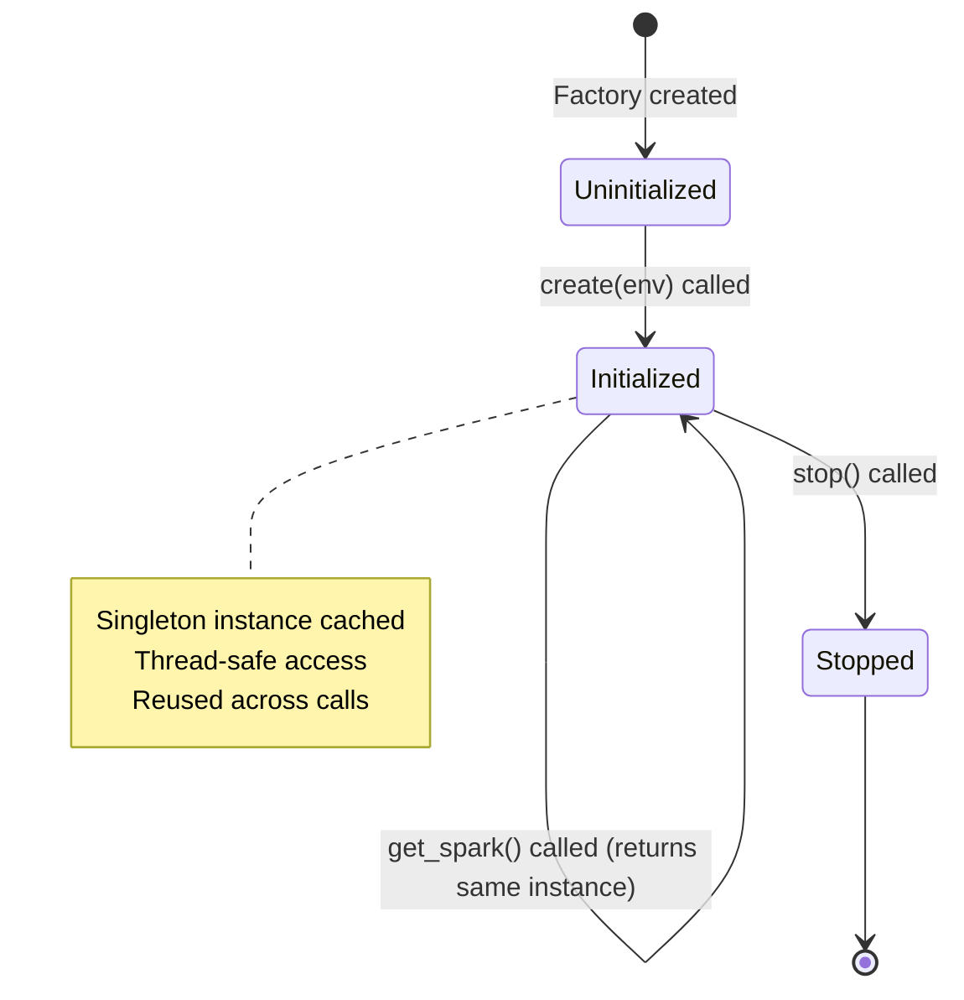
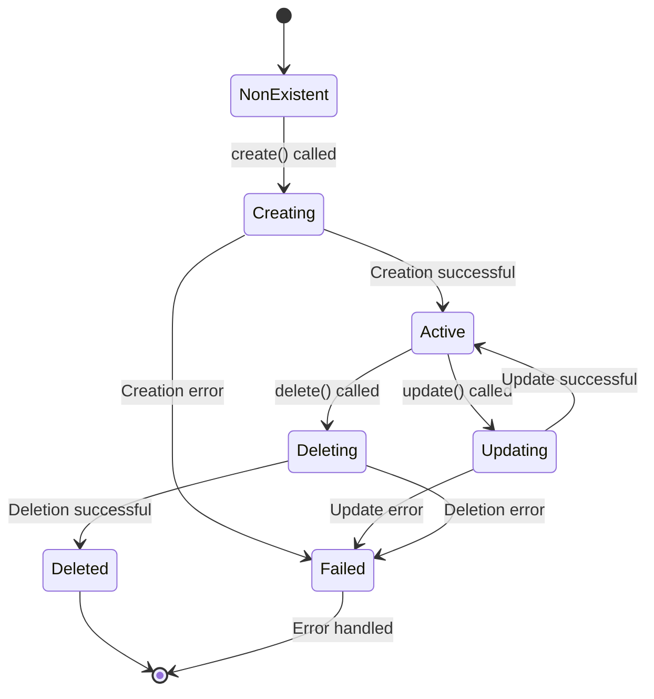
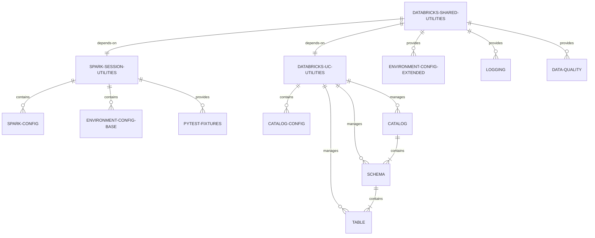

# Data Model: Three-Package Architecture

**Feature**: 002-spark-session-utilities
**Date**: 2025-11-22

## Overview

This document defines the data structures, configuration schemas, and entity relationships for the three-package architecture (spark-session-utilities, databricks-uc-utilities, databricks-shared-utilities).

---

## Package Entities

### spark-session-utilities Package

**Purpose**: Minimal Spark session management with configuration and testing support

**Dependencies**:
- PySpark >=3.4.0
- Pydantic >=2.0.0
- PyYAML >=6.0.0
- pytest >=7.0.0 (dev)

**Public API Surface**:
```python
# spark_session_utilities.config
- SparkSessionFactory
- ConfigLoader
- SparkConfig
- EnvironmentConfig (base, Spark-only)

# spark_session_utilities.testing
- spark_session (pytest fixture)
- test_config (pytest fixture)
- temp_tables (pytest fixture)
- spark_session_long_running (pytest fixture)
```

---

### databricks-uc-utilities Package

**Purpose**: Unity Catalog operations independent of Spark

**Dependencies**:
- Databricks SDK >=0.12.0
- Pydantic >=2.0.0

**Public API Surface**:
```python
# databricks_uc_utilities.config
- CatalogConfig

# databricks_uc_utilities.catalog
- CatalogOperations
- CatalogPermissions

# databricks_uc_utilities.schema
- SchemaOperations

# databricks_uc_utilities.table
- TableOperations
- TableMetadata

# databricks_uc_utilities.helpers
- LineageTracker
- MetadataQuery
```

---

### databricks-shared-utilities Package

**Purpose**: Convenience aggregator with logging, quality, observability

**Dependencies**:
- spark-session-utilities ==X.Y.Z (exact pin)
- databricks-uc-utilities ==X.Y.Z (exact pin)

**Public API Surface**:
```python
# databricks_utils.config (re-exports)
- SparkSessionFactory (from spark-session-utilities)
- ConfigLoader (from spark-session-utilities, extended)
- EnvironmentConfig (extended with catalog field)
- CatalogConfig (from databricks-uc-utilities)

# databricks_utils.logging
- get_logger
- log_metrics
- StructuredFormatter

# databricks_utils.data_quality
- validate_schema
- check_null_rate

# databricks_utils.observability
- MonteCarloClient

# databricks_utils.errors
- with_retry
- exponential_backoff
```

---

## Configuration Schemas

### SparkConfig (spark-session-utilities)

```python
from pydantic import BaseModel, Field
from typing import Dict, Optional

class SparkConfig(BaseModel):
    """Spark session configuration."""
    app_name: str = Field(..., description="Application name for Spark session")
    master: Optional[str] = Field(None, description="Spark master URL (only for local environment)")
    config: Dict[str, str] = Field(default_factory=dict, description="Spark configuration properties")

    # Example usage
    # SparkConfig(
    #     app_name="my-pipeline-dev",
    #     master="local[*]",
    #     config={
    #         "spark.sql.shuffle.partitions": "50",
    #         "spark.sql.adaptive.enabled": "true"
    #     }
    # )
```

### EnvironmentConfig (Base - spark-session-utilities)

```python
from pydantic import BaseModel, Field
from typing import Optional

class EnvironmentConfig(BaseModel):
    """Base environment configuration (Spark-only, no catalog field)."""
    environment_type: str = Field(..., description="Environment type: local, lab, dev, prod")
    spark: SparkConfig = Field(..., description="Spark session configuration")
    workspace_host: Optional[str] = Field(
        None,
        description="Databricks workspace URL (explicit override; use workspace_url property for derived value)"
    )
    cluster_id: Optional[str] = Field(None, description="Databricks cluster ID")

    @property
    def workspace_url(self) -> Optional[str]:
        """
        Derive Databricks workspace URL from environment_type.

        Precedence rules:
        1. If workspace_host is explicitly set, return it (user override)
        2. Derive from environment_type using standard mappings
        3. Default to dev workspace URL if environment_type is None or unknown

        Mappings:
        - local → None (local Spark instance)
        - lab → https://skyscanner-dev.cloud.databricks.com
        - dev → https://skyscanner-dev.cloud.databricks.com
        - prod → https://skyscanner-prod.cloud.databricks.com
        - unknown → https://skyscanner-dev.cloud.databricks.com (safe default)

        Returns:
            Optional[str]: Workspace URL or None for local environment
        """
        if self.workspace_host is not None:
            return self.workspace_host

        url_mapping = {
            "local": None,
            "lab": "https://skyscanner-dev.cloud.databricks.com",
            "dev": "https://skyscanner-dev.cloud.databricks.com",
            "prod": "https://skyscanner-prod.cloud.databricks.com",
        }

        environment_key = self.environment_type.lower() if self.environment_type else None
        return url_mapping.get(
            environment_key,
            "https://skyscanner-dev.cloud.databricks.com"
        )

    # Validation
    def validate_environment(self):
        if self.environment_type == "local" and not self.spark.master:
            raise ValueError("Local environment must specify spark.master")
        # Note: workspace_host validation removed - now optional with automatic derivation
        # Use workspace_url property to get derived value
```

### CatalogConfig (databricks-uc-utilities)

```python
from pydantic import BaseModel, Field

class CatalogConfig(BaseModel):
    """Unity Catalog configuration."""
    name: str = Field(..., description="Unity Catalog name")
    schema_prefix: str = Field(..., description="Prefix for schema names")

    # Computed properties
    @property
    def bronze_schema(self) -> str:
        return f"{self.schema_prefix}_bronze"

    @property
    def silver_schema(self) -> str:
        return f"{self.schema_prefix}_silver"

    @property
    def gold_schema(self) -> str:
        return f"{self.schema_prefix}_gold"

    # Helper method
    def get_table_name(self, layer: str, table: str) -> str:
        """Get fully qualified table name: catalog.schema.table"""
        schema_map = {
            "bronze": self.bronze_schema,
            "silver": self.silver_schema,
            "gold": self.gold_schema
        }
        schema = schema_map.get(layer, f"{self.schema_prefix}_{layer}")
        return f"{self.name}.{schema}.{table}"
```

### EnvironmentConfig (Extended - databricks-shared-utilities)

```python
from spark_session_utilities.config import EnvironmentConfig as BaseEnvironmentConfig
from databricks_uc_utilities.config import CatalogConfig
from pydantic import Field
from typing import Optional

class EnvironmentConfig(BaseEnvironmentConfig):
    """Extended environment configuration combining Spark and UC."""
    catalog: Optional[CatalogConfig] = Field(None, description="Unity Catalog configuration")

    # This extended version is used when both Spark and UC functionality needed
    # Inherits all base validation from spark-session-utilities
```

---

## Unity Catalog Entities

### Catalog Entity

```python
from pydantic import BaseModel, Field
from typing import Optional, Dict
from datetime import datetime

class Catalog(BaseModel):
    """Unity Catalog catalog entity."""
    name: str = Field(..., description="Catalog name")
    comment: Optional[str] = Field(None, description="Catalog description")
    properties: Dict[str, str] = Field(default_factory=dict, description="Custom properties")
    owner: Optional[str] = Field(None, description="Catalog owner")
    created_at: Optional[datetime] = Field(None, description="Creation timestamp")
    updated_at: Optional[datetime] = Field(None, description="Last update timestamp")
```

### Schema Entity

```python
from pydantic import BaseModel, Field
from typing import Optional, Dict
from datetime import datetime

class Schema(BaseModel):
    """Unity Catalog schema entity."""
    catalog_name: str = Field(..., description="Parent catalog name")
    schema_name: str = Field(..., description="Schema name")
    full_name: str = Field(..., description="Fully qualified name: catalog.schema")
    comment: Optional[str] = Field(None, description="Schema description")
    properties: Dict[str, str] = Field(default_factory=dict, description="Custom properties")
    owner: Optional[str] = Field(None, description="Schema owner")
    created_at: Optional[datetime] = Field(None, description="Creation timestamp")
    updated_at: Optional[datetime] = Field(None, description="Last update timestamp")
```

### Table Entity

```python
from pydantic import BaseModel, Field
from typing import Optional, Dict, List
from datetime import datetime

class TableColumn(BaseModel):
    """Table column definition."""
    name: str
    type_text: str
    comment: Optional[str] = None
    nullable: bool = True

class Table(BaseModel):
    """Unity Catalog table entity."""
    catalog_name: str = Field(..., description="Parent catalog name")
    schema_name: str = Field(..., description="Parent schema name")
    table_name: str = Field(..., description="Table name")
    full_name: str = Field(..., description="Fully qualified name: catalog.schema.table")
    table_type: str = Field(..., description="MANAGED, EXTERNAL, VIEW")
    data_source_format: Optional[str] = Field(None, description="DELTA, PARQUET, etc.")
    columns: List[TableColumn] = Field(default_factory=list, description="Table columns")
    storage_location: Optional[str] = Field(None, description="Storage path for external tables")
    comment: Optional[str] = Field(None, description="Table description")
    properties: Dict[str, str] = Field(default_factory=dict, description="Custom properties")
    owner: Optional[str] = Field(None, description="Table owner")
    created_at: Optional[datetime] = Field(None, description="Creation timestamp")
    updated_at: Optional[datetime] = Field(None, description="Last update timestamp")
```

---

## Testing Fixtures

### spark_session (function-scoped)

```python
@pytest.fixture(scope="function")
def spark_session() -> Iterator[SparkSession]:
    """
    Isolated Spark session for each test function.

    Configuration:
    - master: local[2]
    - shuffle.partitions: 2 (fast for tests)
    - UI disabled
    - Adaptive SQL disabled (deterministic)

    Automatically cleaned up after test.
    """
    # Implementation in spark-session-utilities
```

### test_config (function-scoped)

```python
@pytest.fixture(scope="function")
def test_config() -> EnvironmentConfig:
    """
    Test environment configuration.

    Returns base EnvironmentConfig with:
    - environment_type: "local"
    - spark.master: "local[2]"
    - Test catalog: "test_catalog"
    """
    # Implementation in spark-session-utilities
```

### temp_tables (function-scoped)

```python
@pytest.fixture(scope="function")
def temp_tables(spark_session: SparkSession) -> Iterator[Dict[str, str]]:
    """
    Manages temporary tables/views with automatic cleanup.

    Usage:
        def test_something(spark_session, temp_tables):
            df.createOrReplaceTempView("my_view")
            temp_tables["test"] = "my_view"  # Tracks for cleanup
    """
    # Implementation in spark-session-utilities
```

---

## State Transitions

### SparkSessionFactory Lifecycle



### Unity Catalog Object Lifecycle



---

## Entity Relationships



---

## Validation Rules

### SparkConfig Validation

- `app_name`: Required, non-empty string
- `master`: Optional, required only for local environment
- `config`: Dictionary of string key-value pairs

### CatalogConfig Validation

- `name`: Required, non-empty, valid catalog identifier
- `schema_prefix`: Required, non-empty, valid schema name prefix
- Computed properties (bronze_schema, silver_schema, gold_schema) auto-generated

### Unity Catalog Entity Validation

- Catalog/Schema/Table names: Valid identifiers (alphanumeric + underscore)
- Full names: Must follow pattern `catalog.schema.table`
- Owners: Valid usernames or group names
- Properties: String key-value pairs only

---

## Data Volume Assumptions

- **Configuration files**: < 10KB each
- **Catalog entities**: ~100-1000 catalogs per workspace
- **Schema entities**: ~10-100 schemas per catalog
- **Table entities**: ~100-10000 tables per schema
- **Metadata queries**: Response time < 5 seconds for listing operations
- **Session creation**: < 10 seconds for local, < 30 seconds for Databricks

---

**Next**: See [contracts/](./contracts/) for detailed API specifications
