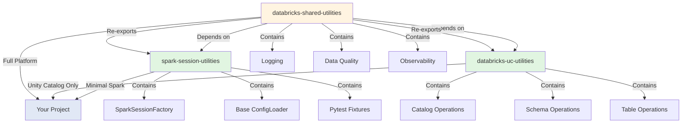
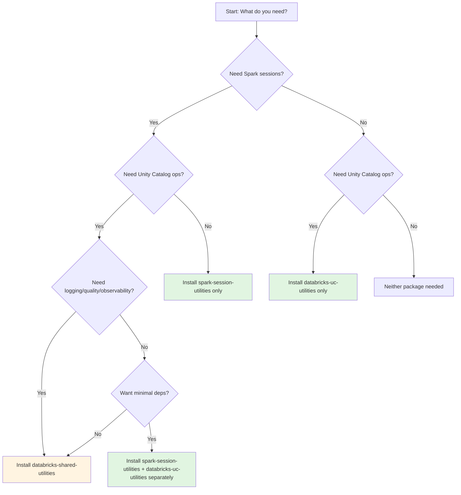

# Quick Start Guide: Three-Package Architecture

**Feature**: 002-spark-session-utilities
**Date**: 2025-11-22

## Overview

This guide helps you understand and use the three-package architecture for Databricks utilities.

---

## Package Architecture



---

## Installation Scenarios

### Scenario 1: Spark Session Only (Minimal)

**Use Case**: You need Spark session management but not Unity Catalog or other utilities.

```bash
pip install spark-session-utilities
```

**What You Get**:
- SparkSessionFactory (singleton pattern)
- Configuration loading (Spark-only)
- Pytest fixtures for testing
- **Dependencies**: PySpark, Pydantic, PyYAML

**Example Usage**:
```python
from spark_session_utilities.config import SparkSessionFactory

# Initialize once at application startup
SparkSessionFactory.create("dev")

# Access anywhere in your code
spark = SparkSessionFactory.get_spark()
df = spark.range(100)
```

---

### Scenario 2: Unity Catalog Only

**Use Case**: You're building governance tools, metadata management, or administrative scripts that don't need Spark.

```bash
pip install databricks-uc-utilities
```

**What You Get**:
- Catalog/Schema/Table operations
- CatalogConfig
- Permissions management
- Lineage tracking
- **Dependencies**: Databricks SDK, Pydantic (NO PySpark)

**Example Usage**:
```python
from databricks_uc_utilities.catalog import CatalogOperations
from databricks_uc_utilities.config import CatalogConfig

config = CatalogConfig(name="my_catalog", schema_prefix="analytics")
catalog_ops = CatalogOperations(workspace_url="https://your-workspace.databricks.com")

# List catalogs
catalogs = catalog_ops.list()

# Create schema
catalog_ops.create_schema(config.bronze_schema)
```

---

### Scenario 3: Full Platform (Convenience)

**Use Case**: You're building complete Databricks pipelines and want all utilities with one install.

```bash
pip install databricks-shared-utilities
```

**What You Get**:
- Everything from spark-session-utilities (automatically installed)
- Everything from databricks-uc-utilities (automatically installed)
- Logging utilities
- Data quality validation
- Observability integration
- Error handling

**Example Usage**:
```python
# All imports work via databricks_utils (backward compatible)
from databricks_utils.config import SparkSessionFactory, CatalogConfig
from databricks_utils.logging import get_logger
from databricks_utils.data_quality import validate_schema

# Initialize Spark
SparkSessionFactory.create("dev")
spark = SparkSessionFactory.get_spark()

# Setup logging
logger = get_logger(__name__)
logger.info("Pipeline started")

# Use data quality checks
validation_result = validate_schema(df, expected_schema)
```

---

## Migration from Combined Package

### Old Code (v0.1.0 - Combined Package)

```python
from databricks_utils.config import SparkSessionFactory, ConfigLoader
from databricks_utils.logging import get_logger

config = ConfigLoader.load("dev")
spark = SparkSessionFactory.create("dev")
logger = get_logger(__name__)
```

### New Code (v0.2.0 - Three Packages)

**Option A: Install shared-utilities (zero changes)**
```bash
pip install databricks-shared-utilities==0.2.0
```

Your code works without any changes! All imports are re-exported.

**Option B: Install minimal packages**
```bash
pip install spark-session-utilities==0.2.0
```

Update imports:
```python
from spark_session_utilities.config import SparkSessionFactory, ConfigLoader
# Logging not available in minimal install
```

---

## Testing with Pytest Fixtures

### Test File Example

```python
# tests/test_my_pipeline.py
from pyspark.sql import SparkSession

def test_my_transformation(spark_session: SparkSession):
    """
    Test uses isolated Spark session fixture.

    spark_session fixture comes from spark-session-utilities.
    Each test gets fresh session, automatically cleaned up.
    """
    # Arrange
    input_data = [(1, "a"), (2, "b"), (3, "c")]
    df = spark_session.createDataFrame(input_data, ["id", "value"])

    # Act
    result = df.filter("id > 1")

    # Assert
    assert result.count() == 2
```

### Fixture Registration

```python
# conftest.py
pytest_plugins = ["spark_session_utilities.testing.conftest"]

# That's it! All fixtures automatically registered:
# - spark_session
# - test_config
# - temp_tables
# - spark_session_long_running
```

---

## Configuration Files

### Spark-Only Config (spark-session-utilities)

```yaml
# config/dev.yaml
environment_type: dev

spark:
  app_name: "my-app-dev"
  config:
    spark.sql.shuffle.partitions: "50"
    spark.sql.adaptive.enabled: "true"

workspace_host: "https://dev.cloud.databricks.com"
cluster_id: "0123-456789-abc123"
```

### Full Config (databricks-shared-utilities)

```yaml
# config/dev.yaml
environment_type: dev

spark:
  app_name: "my-app-dev"
  config:
    spark.sql.shuffle.partitions: "50"
    spark.sql.adaptive.enabled: "true"

catalog:
  name: "dev_analytics"
  schema_prefix: "customer_360"

workspace_host: "https://dev.cloud.databricks.com"
cluster_id: "0123-456789-abc123"
```

---

## Package Dependencies at a Glance

| Package | PySpark | Databricks SDK | Pydantic | PyYAML | spark-session-utils | databricks-uc-utils |
|---------|---------|----------------|----------|--------|---------------------|---------------------|
| **spark-session-utilities** | ✅ | ❌ | ✅ | ✅ | - | - |
| **databricks-uc-utilities** | ❌ | ✅ | ✅ | ❌ | - | - |
| **databricks-shared-utilities** | ❌ (via spark-session) | ❌ (via uc) | ❌ (via both) | ❌ (via spark-session) | ✅ ==X.Y.Z | ✅ ==X.Y.Z |

---

## Decision Tree: Which Package to Install?



---

## Workspace URL Derivation

The `EnvironmentConfig` provides automatic workspace URL derivation based on environment type, available in all three packages.

### Basic Usage

```python
from spark_session_utilities.config import EnvironmentConfig, SparkConfig

# Automatically derive workspace URL from environment type
config = EnvironmentConfig(
    environment_type="dev",
    spark=SparkConfig(app_name="my-app")
)

print(config.workspace_url)
# Output: "https://skyscanner-dev.cloud.databricks.com"
```

### Environment Type Mappings

| Environment Type | Workspace URL | Use Case |
|------------------|---------------|----------|
| `local` | `None` | Local Spark instance (no Databricks workspace) |
| `lab`, `dev` | `https://skyscanner-dev.cloud.databricks.com` | Development workspace |
| `prod` | `https://skyscanner-prod.cloud.databricks.com` | Production workspace |
| Unknown/empty | `https://skyscanner-dev.cloud.databricks.com` | Safe default to dev |

### Explicit Override

You can override the derived URL by setting `workspace_host` explicitly:

```python
config = EnvironmentConfig(
    environment_type="dev",
    workspace_host="https://custom.databricks.com",  # Explicit override
    spark=SparkConfig(app_name="my-app")
)

print(config.workspace_url)
# Output: "https://custom.databricks.com"
```

### Use Cases

**Pattern: Connect to Databricks SDK**

```python
from databricks.sdk import WorkspaceClient
from spark_session_utilities.config import EnvironmentConfig, SparkConfig

config = EnvironmentConfig(
    environment_type="dev",
    spark=SparkConfig(app_name="my-app")
)

# Use derived workspace URL for SDK client
client = WorkspaceClient(host=config.workspace_url)
current_user = client.current_user.me()
print(f"Connected to {config.workspace_url} as {current_user.user_name}")
```

**Pattern: Environment-Specific Configuration**

```python
import os

env_type = os.getenv("ENV", "dev")  # Read from environment variable

config = EnvironmentConfig(
    environment_type=env_type,
    spark=SparkConfig(app_name="customer-360-pipeline")
)

# Workspace URL is automatically correct for the environment
# dev → https://skyscanner-dev.cloud.databricks.com
# prod → https://skyscanner-prod.cloud.databricks.com
logger.info(f"Running in {env_type} environment: {config.workspace_url}")
```

**Pattern: Testing with Local Spark**

```python
def test_pipeline_logic(spark_session):
    """Test with local Spark (no Databricks workspace)."""
    config = EnvironmentConfig(
        environment_type="local",
        spark=SparkConfig(app_name="test", master="local[*]")
    )

    # workspace_url is None for local environment
    assert config.workspace_url is None

    # Use local spark_session fixture for testing
    df = spark_session.createDataFrame([(1, "test")], ["id", "val"])
    result = my_transformation(df)
    assert result.count() == 1
```

### Inheritance in Extended Config

The extended `EnvironmentConfig` in `databricks-shared-utilities` inherits the `workspace_url` property:

```python
from databricks_utils.config import EnvironmentConfig
from spark_session_utilities.config import SparkConfig
from databricks_uc_utilities.config import CatalogConfig

# Extended config with Spark + UC + automatic workspace URL
config = EnvironmentConfig(
    environment_type="dev",
    spark=SparkConfig(app_name="my-app"),
    catalog=CatalogConfig(
        name="dev_trusted_silver",
        schema_prefix="meta_search"
    )
)

# workspace_url property works the same
print(config.workspace_url)
# Output: "https://skyscanner-dev.cloud.databricks.com"

# Use for both Spark and UC operations
client = WorkspaceClient(host=config.workspace_url)
catalog_ops = CatalogOperations(workspace_url=config.workspace_url)
```

---

## Common Patterns

### Pattern 1: Pipeline with Spark + UC

```python
# Install: databricks-shared-utilities

from databricks_utils.config import SparkSessionFactory, ConfigLoader

# Load config with both Spark and UC
config = ConfigLoader.load("dev")

# Initialize Spark
spark = SparkSessionFactory.create("dev")

# Use catalog helpers
table_name = config.catalog.get_table_name("bronze", "customers")
# Returns: "dev_analytics.customer_360_bronze.customers"

df = spark.table(table_name)
```

### Pattern 2: Metadata Tool (UC Only)

```python
# Install: databricks-uc-utilities

from databricks_uc_utilities.catalog import CatalogOperations
from databricks_uc_utilities.schema import SchemaOperations

catalog_ops = CatalogOperations(workspace_url=os.getenv("DATABRICKS_HOST"))

# List all catalogs (no Spark needed)
for catalog in catalog_ops.list():
    print(f"Catalog: {catalog.name}")

    schema_ops = SchemaOperations(workspace_url=os.getenv("DATABRICKS_HOST"))
    for schema in schema_ops.list(catalog.name):
        print(f"  Schema: {schema.schema_name}")
```

### Pattern 3: Testing Spark Transformations

```python
# Install: spark-session-utilities (includes fixtures)

def test_bronze_ingestion(spark_session):
    """Test uses isolated session, no singleton contamination."""
    df = spark_session.createDataFrame(
        [(1, "raw_data")],
        ["id", "data"]
    )

    # Your transformation logic
    result = transform_bronze(df)

    assert result.count() == 1
```

---

## Troubleshooting

### Issue: Import Error After Upgrade

**Symptom**:
```python
ImportError: cannot import name 'SparkSessionFactory' from 'databricks_utils.config'
```

**Solution**: Install databricks-shared-utilities (not just spark-session-utilities)
```bash
pip install databricks-shared-utilities==0.2.0
```

### Issue: PySpark Installed When Not Needed

**Symptom**: Large dependency tree when you only need UC operations

**Solution**: Install databricks-uc-utilities instead of shared-utilities
```bash
pip uninstall databricks-shared-utilities
pip install databricks-uc-utilities==0.2.0
```

### Issue: Fixtures Not Found

**Symptom**:
```python
fixture 'spark_session' not found
```

**Solution**: Register fixtures in conftest.py
```python
# tests/conftest.py
pytest_plugins = ["spark_session_utilities.testing.conftest"]
```

---

## Next Steps

1. **Choose your installation scenario** based on the decision tree
2. **Review** [data-model.md](./data-model.md) for detailed entity definitions
3. **Check** [contracts/](./contracts/) for API specifications
4. **Read** package-specific READMEs for advanced usage:
   - `spark-session-utilities/README.md`
   - `databricks-uc-utilities/README.md`
   - `databricks-shared-utilities/README.md`

---

## Support

- **Documentation**: Package-specific READMEs in each repository
- **Issues**: GitHub issues in respective package repositories
- **Migration Help**: See MIGRATION_GUIDE.md in databricks-shared-utilities
