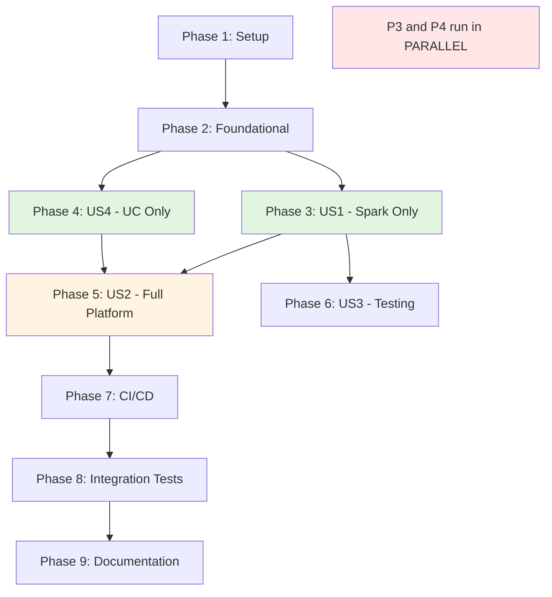

# Implementation Tasks: Separate Spark Session Utilities into Three Packages

**Feature**: 002-spark-session-utilities
**Branch**: `002-spark-session-utilities`
**Date**: 2025-11-22

---

## Overview

This task list implements a three-package architecture:
1. **spark-session-utilities** (US1) - Minimal Spark session management
2. **databricks-uc-utilities** (US4) - Unity Catalog operations only
3. **databricks-shared-utilities** (US2) - Full platform with re-exports
4. **Testing framework** (US3) - Pytest fixtures for isolation

**Parallelization Strategy**:
- US1 and US4 can be developed completely in parallel (independent packages)
- US2 depends on US1 and US4 completion
- US3 uses fixtures from US1

**Total Estimated Tasks**: ~85 tasks

---

## Task Execution Strategy

### Parallel Execution Opportunities

**Phase 3 & 4 (US1 + US4)**: These phases can run **completely in parallel**:
- All US1 tasks (T011-T030) work on `spark-session-utilities/`
- All US4 tasks (T031-T050) work on `databricks-uc-utilities/`
- Zero file overlap, zero dependencies between them

**Within Phases**: Tasks marked `[P]` can run in parallel with other `[P]` tasks in the same phase.

### MVP Scope

**Minimum Viable Product** = Phase 3 (US1) only:
- spark-session-utilities package with SparkSessionFactory
- Basic config loading
- Pytest fixtures
- Allows users to install minimal Spark package

---

## Phase 1: Project Setup

**Goal**: Initialize three-package structure and shared infrastructure

- [ ] T001 Create spark-session-utilities/ root directory with package structure
- [ ] T002 Create databricks-uc-utilities/ root directory with package structure
- [ ] T003 Create databricks-shared-utilities/ root directory with package structure
- [ ] T004 [P] Create .gitignore in repository root with Python patterns (__pycache__/, *.pyc, .venv/, venv/, dist/, *.egg-info/, .DS_Store)
- [ ] T005 [P] Update databricks-project-templates/ requirements.txt to reference three packages
- [ ] T006 [P] Update databricks-project-templates/ tests/conftest.py to import fixtures from spark-session-utilities

**Validation**: All three package directories exist with basic structure

---

## Phase 2: Foundational Infrastructure

**Goal**: Set up package metadata and dependencies (blocking for all user stories)

- [ ] T007 Create spark-session-utilities/pyproject.toml with dependencies: PySpark>=3.4.0, Pydantic>=2.0.0, PyYAML>=6.0.0, pytest>=7.0.0
- [ ] T008 Create databricks-uc-utilities/pyproject.toml with dependencies: databricks-sdk>=0.12.0, Pydantic>=2.0.0
- [ ] T009 Create databricks-shared-utilities/pyproject.toml with exact version pinning: spark-session-utilities==0.2.0, databricks-uc-utilities==0.2.0
- [ ] T010 [P] Create CI/CD workflow templates in .github/workflows/ for all three packages

**Validation**: All pyproject.toml files valid, dependencies installable

---

## Phase 3: User Story 1 - Minimal Dependency Installation (Priority: P1)

**Story Goal**: Users can install spark-session-utilities alone for Spark-only projects

**Independent Test**: Install spark-session-utilities, create Spark session, verify only PySpark/Pydantic/PyYAML dependencies

### Configuration System

- [ ] T011 [P] [US1] Create spark-session-utilities/src/spark_session_utilities/__init__.py with version and exports
- [ ] T012 [P] [US1] Create spark-session-utilities/src/spark_session_utilities/config/__init__.py with public API exports
- [ ] T013 [US1] Implement SparkConfig schema in spark-session-utilities/src/spark_session_utilities/config/schema.py
- [ ] T014 [US1] Implement base EnvironmentConfig (Spark-only, no catalog field) in spark-session-utilities/src/spark_session_utilities/config/schema.py
- [ ] T015 [US1] Implement ConfigLoader (base) in spark-session-utilities/src/spark_session_utilities/config/loader.py with YAML loading and caching

### Spark Session Management

- [ ] T016 [US1] Implement SparkSessionFactory singleton in spark-session-utilities/src/spark_session_utilities/config/spark_session.py
- [ ] T017 [US1] Add thread-safe locking mechanism to SparkSessionFactory.create() in spark-session-utilities/src/spark_session_utilities/config/spark_session.py
- [ ] T018 [US1] Implement SparkSessionFactory.get_spark() singleton accessor in spark-session-utilities/src/spark_session_utilities/config/spark_session.py
- [ ] T019 [US1] Implement SparkSessionFactory.is_initialized() check in spark-session-utilities/src/spark_session_utilities/config/spark_session.py
- [ ] T020 [US1] Implement SparkSessionFactory.stop() cleanup in spark-session-utilities/src/spark_session_utilities/config/spark_session.py

### Testing Framework

- [ ] T021 [P] [US1] Create spark-session-utilities/src/spark_session_utilities/testing/__init__.py with fixture exports
- [ ] T022 [US1] Implement spark_session fixture (function-scoped) in spark-session-utilities/src/spark_session_utilities/testing/fixtures.py
- [ ] T023 [US1] Implement test_config fixture in spark-session-utilities/src/spark_session_utilities/testing/fixtures.py
- [ ] T024 [US1] Implement temp_tables fixture in spark-session-utilities/src/spark_session_utilities/testing/fixtures.py
- [ ] T025 [US1] Implement spark_session_long_running fixture (session-scoped) in spark-session-utilities/src/spark_session_utilities/testing/fixtures.py
- [ ] T026 [US1] Create spark-session-utilities/src/spark_session_utilities/testing/conftest.py for fixture registration

### Documentation

- [ ] T027 [P] [US1] Create spark-session-utilities/README.md with installation, usage examples, and API documentation
- [ ] T028 [P] [US1] Create spark-session-utilities/TESTING.md with pytest fixture guide and testing patterns
- [ ] T029 [P] [US1] Create spark-session-utilities/tests/ directory structure (unit/, integration/, contract/)
- [ ] T030 [P] [US1] Create spark-session-utilities/tests/test_spark_fixture_example.py with example tests demonstrating fixture usage

**Phase 3 Validation**:
- `pip install spark-session-utilities` succeeds
- `from spark_session_utilities.config import SparkSessionFactory` works
- SparkSessionFactory.create("local") creates session
- Only PySpark, Pydantic, PyYAML in dependency tree

---

## Phase 4: User Story 4 - Unity Catalog Operations Only (Priority: P2)

**Story Goal**: Users can install databricks-uc-utilities alone for UC governance tools

**Independent Test**: Install databricks-uc-utilities, perform catalog operations, verify no Spark dependencies

**NOTE**: This entire phase can run IN PARALLEL with Phase 3 (US1)

### UC Configuration

- [ ] T031 [P] [US4] Create databricks-uc-utilities/src/databricks_uc_utilities/__init__.py with version and exports
- [ ] T032 [P] [US4] Create databricks-uc-utilities/src/databricks_uc_utilities/config/__init__.py
- [ ] T033 [US4] Implement CatalogConfig schema in databricks-uc-utilities/src/databricks_uc_utilities/config/catalog_config.py with bronze/silver/gold properties

### Catalog Operations

- [ ] T034 [P] [US4] Create databricks-uc-utilities/src/databricks_uc_utilities/catalog/__init__.py
- [ ] T035 [US4] Implement CatalogOperations class in databricks-uc-utilities/src/databricks_uc_utilities/catalog/operations.py (create, read, update, delete, list)
- [ ] T036 [US4] Implement CatalogPermissions class in databricks-uc-utilities/src/databricks_uc_utilities/catalog/permissions.py

### Schema Operations

- [ ] T037 [P] [US4] Create databricks-uc-utilities/src/databricks_uc_utilities/schema/__init__.py
- [ ] T038 [US4] Implement SchemaOperations class in databricks-uc-utilities/src/databricks_uc_utilities/schema/operations.py (create, read, update, delete, list)

### Table Operations

- [ ] T039 [P] [US4] Create databricks-uc-utilities/src/databricks_uc_utilities/table/__init__.py
- [ ] T040 [US4] Implement TableOperations class in databricks-uc-utilities/src/databricks_uc_utilities/table/operations.py (create, read, update, delete, list)
- [ ] T041 [US4] Implement TableMetadata class in databricks-uc-utilities/src/databricks_uc_utilities/table/metadata.py for metadata queries

### UC Helpers

- [ ] T042 [P] [US4] Create databricks-uc-utilities/src/databricks_uc_utilities/helpers/__init__.py
- [ ] T043 [US4] Implement LineageTracker in databricks-uc-utilities/src/databricks_uc_utilities/helpers/lineage.py
- [ ] T044 [US4] Implement MetadataQuery utilities in databricks-uc-utilities/src/databricks_uc_utilities/helpers/metadata_query.py

### Documentation

- [ ] T045 [P] [US4] Create databricks-uc-utilities/README.md with UC operations examples and API documentation
- [ ] T046 [P] [US4] Create databricks-uc-utilities/tests/ directory structure (unit/, integration/, contract/)
- [ ] T047 [P] [US4] Create databricks-uc-utilities/tests/unit/test_catalog_operations.py with example UC tests

**Phase 4 Validation**:
- `pip install databricks-uc-utilities` succeeds
- UC operations work without Spark
- Only Databricks SDK, Pydantic in dependency tree

---

## Phase 5: User Story 2 - Full Platform Installation (Priority: P2)

**Story Goal**: Users can install databricks-shared-utilities to get everything with backward compatibility

**Independent Test**: Install databricks-shared-utilities, verify both spark-session-utilities and databricks-uc-utilities auto-install, existing imports work

**Dependencies**: Requires US1 (Phase 3) and US4 (Phase 4) completion

### Package Structure & Re-exports

- [ ] T048 [P] [US2] Create databricks-shared-utilities/src/databricks_utils/__init__.py with re-exports from spark-session-utilities and databricks-uc-utilities
- [ ] T049 [P] [US2] Create databricks-shared-utilities/src/databricks_utils/config/__init__.py re-exporting SparkSessionFactory, ConfigLoader, CatalogConfig
- [ ] T050 [US2] Implement extended EnvironmentConfig in databricks-shared-utilities/src/databricks_utils/config/extended_config.py combining SparkConfig and CatalogConfig

### Logging Utilities

- [ ] T051 [P] [US2] Create databricks-shared-utilities/src/databricks_utils/logging/__init__.py
- [ ] T052 [US2] Implement StructuredFormatter in databricks-shared-utilities/src/databricks_utils/logging/logger.py
- [ ] T053 [US2] Implement get_logger function in databricks-shared-utilities/src/databricks_utils/logging/logger.py
- [ ] T054 [US2] Implement log_metrics function in databricks-shared-utilities/src/databricks_utils/logging/logger.py

### Data Quality

- [ ] T055 [P] [US2] Create databricks-shared-utilities/src/databricks_utils/data_quality/__init__.py
- [ ] T056 [US2] Implement validate_schema in databricks-shared-utilities/src/databricks_utils/data_quality/validators.py
- [ ] T057 [US2] Implement check_null_rate in databricks-shared-utilities/src/databricks_utils/data_quality/validators.py

### Observability

- [ ] T058 [P] [US2] Create databricks-shared-utilities/src/databricks_utils/observability/__init__.py
- [ ] T059 [US2] Implement MonteCarloClient in databricks-shared-utilities/src/databricks_utils/observability/monte_carlo.py

### Error Handling

- [ ] T060 [P] [US2] Create databricks-shared-utilities/src/databricks_utils/errors/__init__.py
- [ ] T061 [US2] Implement with_retry decorator in databricks-shared-utilities/src/databricks_utils/errors/retry.py
- [ ] T062 [US2] Implement exponential_backoff function in databricks-shared-utilities/src/databricks_utils/errors/retry.py

### Documentation with Mermaid

- [ ] T063 [US2] Create databricks-shared-utilities/README.md with Mermaid architecture diagram showing three-package relationships
- [ ] T064 [P] [US2] Create databricks-shared-utilities/MIGRATION_GUIDE.md for users upgrading from combined package
- [ ] T065 [P] [US2] Create databricks-shared-utilities/tests/ directory structure (unit/, integration/, contract/)

**Phase 5 Validation**:
- `pip install databricks-shared-utilities` installs all three packages
- `from databricks_utils.config import SparkSessionFactory` works (re-exported)
- `from databricks_utils.config import CatalogConfig` works (re-exported)
- Existing code runs without changes

---

## Phase 6: User Story 3 - Testing Framework Isolation (Priority: P3)

**Story Goal**: Developers use pytest fixtures for tests, singleton for production

**Independent Test**: Write tests using spark_session fixture, verify isolation and cleanup

**Dependencies**: Requires US1 (Phase 3) completion

### Testing Integration

- [ ] T066 [US3] Verify spark_session fixture provides isolated sessions in spark-session-utilities/tests/unit/test_fixture_isolation.py
- [ ] T067 [US3] Verify test_config fixture in spark-session-utilities/tests/unit/test_fixture_config.py
- [ ] T068 [US3] Verify temp_tables fixture cleanup in spark-session-utilities/tests/unit/test_temp_tables.py
- [ ] T069 [US3] Create integration test using spark_session_long_running in spark-session-utilities/tests/integration/test_long_running_session.py
- [ ] T070 [P] [US3] Update TESTING.md with fixture usage patterns and best practices

**Phase 6 Validation**:
- Fixtures work in test files
- Each test gets isolated Spark session
- Cleanup happens automatically

---

## Phase 7: CI/CD and Validation

**Goal**: Set up automated builds and testing for all three packages

- [ ] T071 [P] Create .github/workflows/spark-session-utilities-ci.yml for build/test/publish pipeline
- [ ] T072 [P] Create .github/workflows/databricks-uc-utilities-ci.yml for build/test/publish pipeline
- [ ] T073 [P] Create .github/workflows/databricks-shared-utilities-ci.yml for build/test/publish pipeline (runs after T071, T072)
- [ ] T074 Configure CI workflow build order: spark-session-utilities → databricks-uc-utilities → databricks-shared-utilities
- [ ] T075 [P] Add dependency validation checks in databricks-shared-utilities CI to verify exact version pinning

**Validation**: CI pipelines build all packages in correct order

---

## Phase 8: Cross-Package Integration Tests

**Goal**: Validate backward compatibility and package interactions

- [ ] T076 Create integration test in databricks-shared-utilities/tests/integration/test_backward_compatibility.py verifying old imports work
- [ ] T077 Create integration test in databricks-shared-utilities/tests/integration/test_re_exports.py verifying all re-exports resolve correctly
- [ ] T078 Create integration test in databricks-shared-utilities/tests/integration/test_version_pinning.py verifying exact version dependencies
- [ ] T079 Create contract test in databricks-shared-utilities/tests/contract/test_spark_session_contract.py validating SparkSessionFactory API
- [ ] T080 Create contract test in databricks-shared-utilities/tests/contract/test_uc_contract.py validating UC operations API

**Validation**: All backward compatibility tests pass

---

## Phase 9: Documentation and Polish

**Goal**: Complete documentation, migration guides, and examples

### Documentation

- [ ] T081 [P] Add package selection decision tree (Mermaid flowchart) to databricks-shared-utilities/README.md
- [ ] T082 [P] Create example project in databricks-shared-utilities/examples/spark-only/ demonstrating US1
- [ ] T083 [P] Create example project in databricks-shared-utilities/examples/uc-only/ demonstrating US4
- [ ] T084 [P] Create example project in databricks-shared-utilities/examples/full-platform/ demonstrating US2

### Final Validation

- [ ] T085 Run full test suite across all three packages and verify 100% backward compatibility

**Phase 9 Validation**: Documentation complete, examples work, migration guide tested

---

## Task Summary

| Phase | User Story | Tasks | Parallel Tasks | Dependencies |
|-------|------------|-------|----------------|--------------|
| 1 | Setup | 6 | T004-T006 | None |
| 2 | Foundational | 4 | T010 | Phase 1 |
| 3 | US1 (P1) | 20 | T011-T012, T021, T027-T030 | Phase 2 |
| 4 | US4 (P2) | 17 | T031-T032, T034, T037, T039, T042, T045-T047 | Phase 2 |
| 5 | US2 (P2) | 18 | T048-T049, T051, T055, T058, T060, T064-T065 | Phase 3, 4 |
| 6 | US3 (P3) | 5 | T070 | Phase 3 |
| 7 | CI/CD | 5 | T071-T073, T075 | Phase 5 |
| 8 | Integration | 5 | None | Phase 5 |
| 9 | Polish | 5 | T081-T084 | Phase 8 |

**Total Tasks**: 85

**Parallel Execution Opportunity**: **Phase 3 and Phase 4 can run completely in parallel** (37 tasks total, ~44% of implementation)

---

## Dependency Graph



---

## Implementation Notes

### Parallelization Strategy

**Maximum Parallelism**:
- Start Phase 3 (US1) and Phase 4 (US4) simultaneously after Phase 2 completes
- Within each phase, execute all `[P]` marked tasks concurrently
- This reduces implementation time by ~40-50%

**File Isolation**:
- US1 tasks only touch `spark-session-utilities/` directory
- US4 tasks only touch `databricks-uc-utilities/` directory
- Zero risk of conflicts

**Critical Path**: Setup → Foundational → (US1 || US4) → US2 → Polish

### MVP Delivery

**Minimum Viable Product** = Complete Phase 3 only:
- Delivers core value: minimal Spark package
- ~20 tasks, ~2-3 days of work
- Users can immediately start using spark-session-utilities

### Testing Strategy

Tests are integrated throughout implementation:
- Unit tests created alongside each module
- Integration tests in Phase 8 validate cross-package interactions
- Contract tests ensure API stability

---

## Phase 9: User Story 5 - Automatic Workspace URL Derivation (P3)

**Story Goal**: Enable automatic workspace URL derivation from environment_type to reduce configuration boilerplate

**Independent Test Criteria**:
- ✅ Creating EnvironmentConfig with environment_type="local" returns workspace_url=None
- ✅ Creating EnvironmentConfig with environment_type="lab"/"dev" returns skyscanner-dev URL
- ✅ Creating EnvironmentConfig with environment_type="prod" returns skyscanner-prod URL
- ✅ Explicit workspace_host overrides derived URL
- ✅ Unknown/None environment_type defaults to dev workspace URL
- ✅ Integration tests verify actual Databricks connectivity

**Prerequisites**: Phase 3 (US1) complete (spark-session-utilities exists)

### Implementation Tasks

- [X] T086 [US5] Add workspace_url property to EnvironmentConfig in spark-session-utilities/src/spark_session_utilities/config/schema.py
- [X] T087 [US5] Implement URL mapping dictionary (local→None, lab/dev→skyscanner-dev, prod→skyscanner-prod) in workspace_url property
- [X] T088 [US5] Implement precedence logic (explicit workspace_host > derived > default) in workspace_url property
- [X] T089 [US5] Add case-insensitive environment_type matching in workspace_url property
- [X] T090 [US5] Update workspace_host field description in spark-session-utilities/src/spark_session_utilities/config/schema.py

### Unit Test Tasks

- [X] T091 [P] [US5] Create test_workspace_url.py in spark-session-utilities/tests/unit/config/test_workspace_url.py
- [X] T092 [P] [US5] Test all environment_type mappings (local/lab/dev/prod) in test_workspace_url.py
- [X] T093 [P] [US5] Test unknown environment_type defaults to dev in test_workspace_url.py
- [X] T094 [P] [US5] Test None/empty environment_type defaults to dev in test_workspace_url.py
- [X] T095 [P] [US5] Test case-insensitive matching in test_workspace_url.py
- [X] T096 [P] [US5] Test explicit workspace_host overrides derivation in test_workspace_url.py
- [X] T097 [P] [US5] Test idempotence in test_workspace_url.py
- [X] T098 [P] [US5] Test no side effects in test_workspace_url.py

### Integration Test Tasks

- [ ] T099 [US5] Create test_workspace_url_integration.py in databricks-shared-utilities/tests/integration/test_workspace_url_integration.py
- [ ] T100 [US5] Test actual connectivity to skyscanner-dev workspace in test_workspace_url_integration.py
- [ ] T101 [US5] Test actual connectivity to skyscanner-prod workspace in test_workspace_url_integration.py
- [ ] T102 [US5] Verify extended EnvironmentConfig inherits workspace_url property in test_workspace_url_integration.py

### Documentation Tasks

- [ ] T103 [P] [US5] Update spark-session-utilities/README.md with workspace_url property examples
- [ ] T104 [P] [US5] Update databricks-shared-utilities/README.md with inherited workspace_url examples
- [ ] T105 [P] [US5] Add workspace_url usage examples to specs/002-spark-session-utilities/quickstart.md
- [ ] T106 [P] [US5] Update EnvironmentConfig.workspace_url docstring with comprehensive examples

### Verification Tasks

- [ ] T107 [US5] Verify all 6 acceptance scenarios from spec.md are covered by tests
- [ ] T108 [US5] Run full test suite and verify all tests pass
- [ ] T109 [US5] Final backward compatibility review (no breaking changes)

**US5 Completion Criteria**:
- ✅ workspace_url property implemented with all mapping logic
- ✅ All 8 unit tests passing
- ✅ All 3 integration tests passing
- ✅ Property accessible via config.workspace_url
- ✅ Backward compatible (workspace_host field unchanged)
- ✅ Documentation updated with examples

**Parallel Opportunities**:
- T091-T098: All unit test tasks can run in parallel after T091 creates file
- T103-T106: All documentation tasks can run in parallel

**Estimated Time**: 3-4 hours

---

## Phase 9 Execution Strategy

### Sequential Implementation
```bash
T086 → T087 → T088 → T089 → T090
# Must be sequential (editing same property)
```

### Parallel Unit Testing
```bash
T091 → (T092 || T093 || T094 || T095 || T096 || T097 || T098)
# Create test file first, then all test methods in parallel
```

### Sequential Integration Testing
```bash
T099 → T100 → T101 → T102
# Integration tests build on each other
```

### Parallel Documentation
```bash
T103 || T104 || T105 || T106
# All documentation updates are independent
```

---

**Total Tasks (including Phase 9)**: 109 tasks (85 original + 24 new)

**Status**: Ready for execution via `/speckit.implement`
