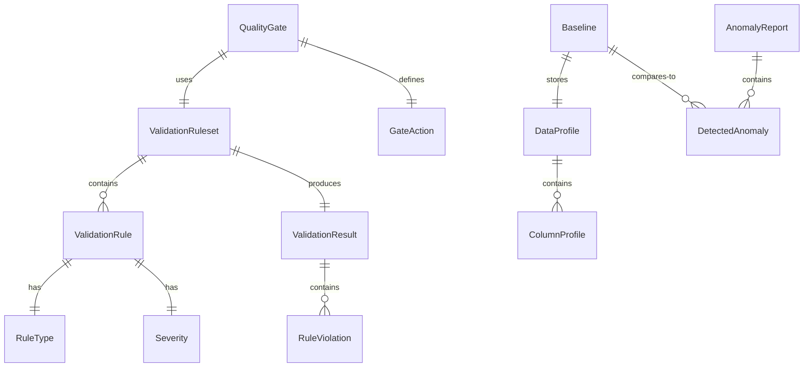

# Data Model: DQX Data Quality Framework

**Feature**: `004-dqx-utilities`
**Date**: 2025-11-22
**Purpose**: Define core entities, their relationships, and state transitions for DQX data quality validation system

---

## Entity Relationship Diagram



---

## Core Entities

### 1. ValidationRule

Represents a single data quality rule applied to a DataFrame column or set of columns.

**Attributes**:
- `rule_id`: Unique identifier (UUID)
- `rule_type`: RuleType enum (COMPLETENESS, UNIQUENESS, FRESHNESS, SCHEMA, PATTERN, RANGE, CUSTOM)
- `name`: Human-readable rule name
- `description`: Detailed rule description
- `target_column`: Column name being validated (optional for multi-column rules)
- `parameters`: Dict of rule-specific parameters (e.g., `{"allow_null": False, "min_value": 0}`)
- `severity`: Severity enum (CRITICAL, WARNING, INFO)
- `enabled`: Boolean flag to disable rules without removing them

**Validation Rules**:
- `rule_id` must be unique within a ruleset
- `target_column` must exist in DataFrame schema (checked at validation time)
- `parameters` must match expected schema for `rule_type`

**State Transitions**:
- Created → Enabled (default state)
- Enabled ↔ Disabled (via enable/disable methods)
- Immutable once added to ValidationResult

**Example**:
```python
CompletessRule(
    rule_id="user_id_complete",
    target_column="user_id",
    parameters={"allow_null": False},
    severity=Severity.CRITICAL
)
```

---

### 2. ValidationRuleset

Collection of validation rules applied together to a DataFrame.

**Attributes**:
- `ruleset_id`: Unique identifier (UUID)
- `name`: Descriptive ruleset name
- `description`: Ruleset purpose
- `rules`: List[ValidationRule]
- `created_at`: Timestamp of creation
- `updated_at`: Timestamp of last modification
- `metadata`: Dict for additional context (e.g., `{"pipeline": "bronze_ingestion", "owner": "data_team"}`)

**Operations**:
- `add_rule(rule)`: Add rule to ruleset
- `remove_rule(rule_id)`: Remove rule by ID
- `validate(dataframe)`: Execute all enabled rules against DataFrame
- `to_json()`: Serialize ruleset for storage
- `from_json(json)`: Deserialize ruleset from JSON

**Validation Rules**:
- Rule IDs within ruleset must be unique
- At least one rule must be enabled

**State Transitions**:
- Empty → Contains rules (via add_rule)
- Contains rules → Validated (via validate)
- Immutable during validation execution

---

### 3. ValidationResult

Output of executing a ValidationRuleset against a DataFrame.

**Attributes**:
- `validation_id`: Unique execution identifier (UUID)
- `ruleset_id`: Reference to ValidationRuleset used
- `table_name`: Fully qualified table name (e.g., `"bronze.users"`)
- `timestamp`: Validation execution timestamp
- `overall_status`: Status enum (PASSED, FAILED, WARNING, ERROR)
- `total_rules`: Total number of rules evaluated
- `passed_rules`: Number of rules that passed
- `failed_rules`: Number of rules that failed
- `violations`: List[RuleViolation]
- `execution_time_seconds`: Total validation runtime
- `dataframe_row_count`: Total rows in validated DataFrame
- `metadata`: Additional execution context

**Derived Properties**:
- `pass_rate`: passed_rules / total_rules
- `has_critical_failures`: Any violation with severity=CRITICAL
- `has_warnings`: Any violation with severity=WARNING

**State Transitions**:
- Created (during validation)
- Completed (after all rules evaluated)
- Persisted (written to storage)

**Example**:
```python
ValidationResult(
    validation_id="abc123",
    overall_status=Status.FAILED,
    total_rules=10,
    passed_rules=8,
    failed_rules=2,
    violations=[...]
)
```

---

### 4. RuleViolation

Represents a single rule failure with details about the violation.

**Attributes**:
- `rule_id`: Reference to violated rule
- `rule_name`: Human-readable rule name
- `severity`: Severity enum
- `violation_count`: Number of rows violating rule
- `violation_percentage`: Percentage of total rows (0-100)
- `sample_violations`: List of example violating values (first 10 by default)
- `affected_columns`: List of columns involved in violation
- `message`: Human-readable violation description
- `remediation_suggestion`: Actionable guidance to fix violation

**Example**:
```python
RuleViolation(
    rule_id="user_id_complete",
    rule_name="User ID Completeness",
    severity=Severity.CRITICAL,
    violation_count=1523,
    violation_percentage=0.15,
    sample_violations=[None, None, None],  # Sample null values
    message="1,523 rows (0.15%) have null user_id values",
    remediation_suggestion="Check upstream data source for null user_ids"
)
```

---

### 5. DataProfile

Statistical summary and quality metrics for a DataFrame.

**Attributes**:
- `profile_id`: Unique identifier (UUID)
- `table_name`: Fully qualified table name
- `timestamp`: Profile generation timestamp
- `row_count`: Total rows in DataFrame
- `column_count`: Total columns in DataFrame
- `column_profiles`: Dict[column_name, ColumnProfile]
- `schema_digest`: Hash of DataFrame schema for drift detection
- `sampling_method`: Sampling method used (if applicable)
- `sample_size`: Actual sample size used
- `profile_metadata`: Additional profile context

**Operations**:
- `get_column_profile(column)`: Retrieve profile for specific column
- `compare(other_profile)`: Compare with another profile (drift detection)
- `to_json()`: Serialize for storage
- `from_json(json)`: Deserialize from JSON

**Example**:
```python
DataProfile(
    table_name="bronze.users",
    row_count=10000000,
    column_count=15,
    column_profiles={
        "user_id": NumericColumnProfile(...),
        "email": StringColumnProfile(...),
        "created_at": TimestampColumnProfile(...)
    }
)
```

---

### 6. ColumnProfile

Statistical profile for a single DataFrame column (abstract base, with type-specific subclasses).

**Base Attributes** (all column types):
- `column_name`: Column name
- `data_type`: Spark data type
- `null_count`: Number of null values
- `null_percentage`: Percentage null (0-100)
- `distinct_count`: Number of distinct values
- `distinct_percentage`: Percentage distinct (0-100)

**NumericColumnProfile** (numeric columns):
- `min_value`: Minimum value
- `max_value`: Maximum value
- `mean`: Arithmetic mean
- `median`: 50th percentile
- `stddev`: Standard deviation
- `quartiles`: [Q1, Q2, Q3]
- `histogram`: Value distribution histogram

**StringColumnProfile** (string columns):
- `min_length`: Shortest string length
- `max_length`: Longest string length
- `avg_length`: Average string length
- `most_common_values`: Top 10 values with counts
- `unique_values_sample`: Sample of unique values

**TimestampColumnProfile** (timestamp columns):
- `min_date`: Earliest timestamp
- `max_date`: Latest timestamp
- `date_range_days`: Days between min and max
- `freshness_hours`: Hours since max_date (data age)

---

### 7. QualityGate

Decision point in pipeline that evaluates validation results and determines execution flow.

**Attributes**:
- `gate_id`: Unique identifier (UUID)
- `name`: Descriptive gate name
- `ruleset`: ValidationRuleset to evaluate
- `actions`: Dict[Severity, GateAction] - defines behavior per severity
- `enabled`: Boolean flag to disable gate
- `metadata`: Gate context (stage, pipeline name, etc.)

**GateAction Enum**:
- `RAISE`: Raise QualityGateException (stop pipeline)
- `COLLECT_THEN_RAISE`: Collect all violations, then raise exception
- `LOG`: Log violations but continue execution
- `IGNORE`: Skip rule evaluation

**Operations**:
- `check(dataframe)`: Execute gate validation
- `get_violations()`: Retrieve violations from last check
- `reset()`: Clear cached validation results

**State Transitions**:
- Created → Ready
- Ready → Executing (during check)
- Executing → Passed | Failed
- Passed/Failed → Ready (for next check)

**Example**:
```python
QualityGate(
    name="bronze_ingestion_gate",
    ruleset=my_ruleset,
    actions={
        Severity.CRITICAL: GateAction.RAISE,
        Severity.WARNING: GateAction.LOG,
        Severity.INFO: GateAction.IGNORE
    }
)
```

---

### 8. Baseline

Historical data profile used for anomaly detection and drift monitoring.

**Attributes**:
- `baseline_id`: Unique identifier (UUID)
- `table_name`: Fully qualified table name
- `profile`: DataProfile captured at baseline time
- `created_at`: Baseline creation timestamp
- `version`: Baseline version (semantic versioning: major.minor.patch)
- `is_active`: Boolean flag for currently active baseline
- `metadata`: Baseline context (pipeline run ID, data date range, etc.)

**Operations**:
- `save()`: Persist baseline to Delta Lake
- `load(table_name)`: Load latest active baseline
- `compare(current_profile)`: Detect drift between baseline and current profile
- `deactivate()`: Mark baseline as inactive (for rotation)

**State Transitions**:
- Created → Persisted (via save)
- Persisted → Active (when set as active baseline)
- Active → Inactive (when new baseline replaces it)

---

### 9. AnomalyReport

Collection of detected anomalies from comparing current data against baseline.

**Attributes**:
- `report_id`: Unique identifier (UUID)
- `table_name`: Fully qualified table name
- `baseline_id`: Reference to baseline used for comparison
- `current_profile_id`: Reference to current data profile
- `timestamp`: Anomaly detection timestamp
- `anomalies`: List[DetectedAnomaly]
- `overall_severity`: Highest severity among all anomalies
- `metadata`: Additional report context

**Operations**:
- `get_critical_anomalies()`: Filter anomalies by severity=CRITICAL
- `to_json()`: Serialize report
- `from_json(json)`: Deserialize report

---

### 10. DetectedAnomaly

Individual anomaly detected during drift monitoring.

**Attributes**:
- `anomaly_id`: Unique identifier (UUID)
- `anomaly_type`: AnomalyType enum (VOLUME, DISTRIBUTION, SCHEMA, STATISTICAL)
- `severity`: Severity enum
- `affected_columns`: List of columns involved
- `baseline_value`: Expected value from baseline
- `current_value`: Observed value in current data
- `deviation`: Magnitude of change (percentage or statistical measure)
- `statistical_significance`: P-value (for distribution drift)
- `message`: Human-readable anomaly description
- `remediation_suggestion`: Recommended actions

**AnomalyType Enum**:
- `VOLUME`: Row count change exceeds threshold
- `DISTRIBUTION`: Statistical distribution shift detected
- `SCHEMA`: Column addition, removal, or type change
- `STATISTICAL`: Mean/median/stddev shift beyond threshold

**Example**:
```python
DetectedAnomaly(
    anomaly_type=AnomalyType.VOLUME,
    severity=Severity.CRITICAL,
    baseline_value=10000000,
    current_value=5000000,
    deviation=-0.50,  # 50% decrease
    message="Row count decreased by 50% (10M → 5M rows)",
    remediation_suggestion="Check for upstream data pipeline failures"
)
```

---

## Entity Relationships

### One-to-Many Relationships
- **ValidationRuleset → ValidationRule**: One ruleset contains many rules
- **ValidationResult → RuleViolation**: One result contains many violations
- **DataProfile → ColumnProfile**: One profile contains many column profiles
- **AnomalyReport → DetectedAnomaly**: One report contains many anomalies

### One-to-One Relationships
- **ValidationRule → RuleType**: Each rule has one type
- **ValidationRule → Severity**: Each rule has one severity
- **Baseline → DataProfile**: Each baseline stores one profile snapshot

### Many-to-One Relationships
- **ValidationResult ← ValidationRuleset**: Many results from one ruleset (over time)
- **QualityGate ← ValidationRuleset**: Many gates can use same ruleset

---

## State Diagrams

### ValidationResult Lifecycle
```
[Created] → [Executing Rules] → [Completed] → [Persisted]
                ↓                    ↓
          [Rule Failure]      [Archived]
```

### QualityGate Lifecycle
```
[Created] → [Ready] ⇄ [Executing] → [Passed/Failed] → [Ready]
                                         ↓
                                  [Exception Raised]
```

### Baseline Lifecycle
```
[Created] → [Persisted] → [Active] → [Inactive] → [Archived]
                                ↑
                         [Reactivated]
```

---

## Validation Rules and Constraints

### Cross-Entity Constraints
1. **ValidationResult.ruleset_id** must reference valid ValidationRuleset
2. **RuleViolation.rule_id** must reference rule in parent ValidationResult's ruleset
3. **Baseline.is_active**: Only one active baseline per table_name at a time
4. **QualityGate.actions**: Must define action for all Severity levels used in ruleset

### Temporal Constraints
1. **ValidationResult.timestamp** must be ≥ ValidationRuleset.created_at
2. **Baseline.created_at** should be after DataProfile.timestamp (capture lag allowed)
3. **AnomalyReport.timestamp** must be ≥ Baseline.created_at

### Data Integrity
1. **Percentages**: All percentage fields must be in range [0, 100]
2. **Counts**: All count fields must be ≥ 0
3. **Sample sizes**: sample_size ≤ row_count (unless full scan)

---

## Serialization Formats

All entities support serialization to JSON for:
- Configuration files (ValidationRuleset)
- Persistence (ValidationResult, DataProfile, Baseline, AnomalyReport)
- API responses (all entities)

### Example Serialized ValidationRuleset
```json
{
    "ruleset_id": "a1b2c3d4-e5f6-7890-abcd-ef1234567890",
    "name": "bronze_users_validation",
    "rules": [
        {
            "rule_id": "rule1",
            "rule_type": "COMPLETENESS",
            "target_column": "user_id",
            "parameters": {"allow_null": false},
            "severity": "CRITICAL"
        },
        {
            "rule_id": "rule2",
            "rule_type": "UNIQUENESS",
            "target_column": "email",
            "parameters": {},
            "severity": "CRITICAL"
        }
    ]
}
```

---

## Storage Strategy

### ValidationResult Storage
- **Format**: Delta Lake table
- **Partition**: `date`, `table_name`
- **Retention**: 90 days (configurable)
- **Schema**: Flattened JSON (violations as array column)

### Baseline Storage
- **Format**: Delta Lake table
- **Partition**: `table_name`, `version`
- **Retention**: Keep last 30 baselines per table
- **Schema**: Nested JSON (profile as struct column)

### AnomalyReport Storage
- **Format**: Delta Lake table
- **Partition**: `date`, `table_name`
- **Retention**: 90 days (configurable)
- **Schema**: Flattened JSON (anomalies as array column)
