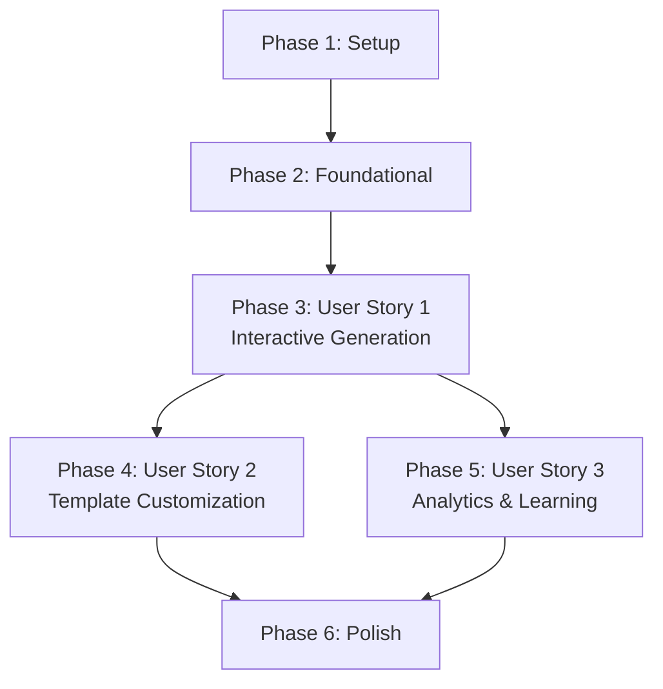

# Implementation Tasks: Claude Agent Template System

**Feature**: 006-claude-agent-templates
**Branch**: `006-claude-agent-templates`
**Date**: 2025-11-23
**Total Tasks**: 97

## Task Summary

| Phase | User Story | Task Count | Parallelizable | Story Label |
|-------|------------|------------|----------------|-------------|
| Phase 1 | Setup | 8 | 5 | - |
| Phase 2 | Foundational | 15 | 8 | - |
| Phase 3 | User Story 1 (P1) | 32 | 18 | [US1] |
| Phase 4 | User Story 2 (P2) | 24 | 14 | [US2] |
| Phase 5 | User Story 3 (P3) | 12 | 7 | [US3] |
| Phase 6 | Polish & Cross-Cutting | 6 | 3 | - |
| **Total** | **6 Phases** | **97** | **55** | - |

## Implementation Strategy

### MVP Scope (Minimum Viable Product)
**Recommended MVP**: Complete Phase 1-3 only (User Story 1)
- Delivers core value: conversational project generation
- 55 tasks total
- All foundational infrastructure in place
- Independently testable and deployable

### Incremental Delivery
1. **Sprint 1** (MVP): Phase 1-3 → User Story 1 working end-to-end
2. **Sprint 2**: Phase 4 → Add template customization (User Story 2)
3. **Sprint 3**: Phase 5 → Add analytics and learning (User Story 3)
4. **Sprint 4**: Phase 6 → Polish and production readiness

---

## Dependencies & Execution Order

### User Story Dependencies

**Critical Path**: Setup → Foundational → User Story 1
**Parallel After US1**: User Story 2 and User Story 3 can be implemented in parallel (no interdependencies)

### Blocking Tasks (Must Complete Before User Stories)
- T001-T008: Project setup and infrastructure
- T009-T023: Core Pydantic models and templates (all user stories depend on these)

---

## Phase 1: Setup (8 tasks, ~2 hours)

**Goal**: Initialize project structure, dependencies, and development environment

**Tasks**:

- [ ] T001 Create project root directory `databricks-project-templates/` with initial structure
- [ ] T002 Create `pyproject.toml` with project metadata and dependencies per research.md
- [ ] T003 [P] Create `requirements.txt` with pinned dependencies (anthropic>=0.40.0, jinja2>=3.1.0, pyyaml>=6.0.0, pydantic>=2.0.0, click>=8.1.0)
- [ ] T004 [P] Create `.gitignore` with Python, Databricks, secrets, IDE exclusions per security requirements
- [ ] T005 [P] Create `README.md` at project root with quickstart instructions
- [ ] T006 [P] Create source directory structure: `src/agent/`, `src/generators/`, `src/features/`, `src/validation/`, `src/analytics/`, `src/models/`, `src/cli/`
- [ ] T007 [P] Create templates directory structure: `templates/project_structure/`, `templates/configs/`, `templates/bundle/`, `templates/readme/`, `templates/cicd/`
- [ ] T008 Create `knowledge/` directory with placeholder YAML files: `databricks_best_practices.yaml`, `compatibility_matrix.yaml`, `default_packages.yaml`

**Parallel Execution**: T003-T007 can run in parallel (independent files)

---

## Phase 2: Foundational (15 tasks, ~4 hours)

**Goal**: Implement core data models and shared infrastructure that all user stories depend on

**Tasks**:

### Core Data Models (Pydantic)

- [ ] T009 [P] Create `src/models/__init__.py` and export all models
- [ ] T010 [P] Implement `src/models/project_requirements.py` with ProjectRequirements and FeatureType enum per data-model.md
- [ ] T011 [P] Implement `src/models/configuration_profile.py` with ConfigurationProfile model per data-model.md
- [ ] T012 [P] Implement `src/models/feature_module.py` with FeatureModule model per data-model.md
- [ ] T013 [P] Implement `src/models/project_template.py` with ProjectTemplate model and BASE_DIRECTORIES constant
- [ ] T014 [P] Implement `src/models/generation_session.py` with GenerationSession model and anonymization method
- [ ] T015 [P] Implement `src/models/template_improvement_suggestion.py` with TemplateImprovementSuggestion model per data-model.md

### Template Knowledge Base

- [ ] T016 [P] Populate `knowledge/databricks_best_practices.yaml` with Databricks best practices from clarifications
- [ ] T017 [P] Populate `knowledge/compatibility_matrix.yaml` with Python/DBR version compatibility rules
- [ ] T018 Create `knowledge/default_packages.yaml` with feature-specific dependency mappings per research.md

### Jinja2 Templates (Base)

- [ ] T019 [P] Create `templates/configs/environment_config.yaml.j2` template for environment configurations
- [ ] T020 [P] Create `templates/configs/project.yaml.j2` template for project metadata
- [ ] T021 [P] Create `templates/bundle/bundle.yml.j2` template for Databricks Asset Bundle per generated_project_structure.md
- [ ] T022 Create `.env.example` template file with required environment variables
- [ ] T023 Create `tests/` directory structure: `tests/unit/`, `tests/integration/`, `tests/contract/`, `tests/fixtures/`

**Parallel Execution**: T009-T015 (models), T016-T018 (knowledge base), T019-T022 (templates) can all run in parallel

**Blocking Completion**: ALL Phase 2 tasks must complete before starting any user story

---

## Phase 3: User Story 1 - Interactive Project Generation (32 tasks, ~12 hours)

**User Story**: As a data engineer starting a new Databricks project, I want to interactively generate a project structure through a conversational Claude agent interface, so that I can provide requirements in natural language and receive a fully configured project without memorizing cookiecutter variable names.

**Independent Test Criteria**:
- User can describe project in natural language ("I need a bronze/silver/gold pipeline for customer data")
- Agent asks <5 clarifying questions
- Agent generates complete project with 9-directory layout
- All configuration files populated with conversation-derived values
- Generated project passes validation checks

**Tasks**:

### Agent Infrastructure

- [ ] T024 [P] [US1] Implement `src/agent/__init__.py` and export ConversationManager, RequirementsParser, QuestionBuilder
- [ ] T025 [US1] Implement `src/agent/conversation.py` with ConversationManager class (session-scoped state, Claude client wrapper)
- [ ] T026 [P] [US1] Implement `src/agent/requirements_parser.py` with RequirementsParser.parse_natural_language() method per quickstart.md
- [ ] T027 [P] [US1] Implement `src/agent/question_builder.py` with QuestionBuilder.identify_ambiguities() and generate_clarifying_questions() methods

### Generators Infrastructure

- [ ] T028 [P] [US1] Implement `src/generators/__init__.py` and export all generator classes
- [ ] T029 [US1] Implement `src/generators/directory_builder.py` with DirectoryBuilder.create_standard_layout() per quickstart.md
- [ ] T030 [P] [US1] Implement `src/generators/config_generator.py` with ConfigGenerator.generate_environment_config() method
- [ ] T031 [P] [US1] Implement `src/generators/bundle_generator.py` with BundleGenerator.generate_asset_bundle() method
- [ ] T032 [P] [US1] Implement `src/generators/readme_generator.py` with ReadmeGenerator.generate() method (8 required sections per contracts)
- [ ] T033 [P] [US1] Implement `src/generators/project_generator.py` as main orchestrator connecting all generators

### Validation Infrastructure

- [ ] T034 [P] [US1] Implement `src/validation/__init__.py` and export all validators
- [ ] T035 [US1] Implement `src/validation/structure_validator.py` with StructureValidator.validate() checking 9-directory layout
- [ ] T036 [P] [US1] Implement `src/validation/config_validator.py` with ConfigValidator.validate() checking YAML syntax and schema
- [ ] T037 [P] [US1] Implement `src/validation/bundle_validator.py` with BundleValidator.validate() checking Databricks Asset Bundle spec
- [ ] T038 [P] [US1] Implement `src/validation/compatibility_checker.py` with CompatibilityChecker.check_python_dbr_compatibility()

### README Generator Templates

- [ ] T039 [P] [US1] Create `templates/readme/overview.md.j2` template for README overview section
- [ ] T040 [P] [US1] Create `templates/readme/features.md.j2` template for features list section
- [ ] T041 [P] [US1] Create `templates/readme/setup.md.j2` template for setup instructions section
- [ ] T042 [P] [US1] Create `templates/readme/architecture.md.j2` template with Mermaid diagram placeholder
- [ ] T043 [P] [US1] Create `templates/readme/deployment.md.j2` template for deployment instructions
- [ ] T044 [P] [US1] Create `templates/readme/security.md.j2` template for security reminders

### Unit Tests (US1 Core)

- [ ] T045 [P] [US1] Create `tests/fixtures/claude_responses.py` with fixture responses for testing per research.md
- [ ] T046 [P] [US1] Create `tests/unit/test_project_requirements.py` testing ProjectRequirements validation per quickstart.md
- [ ] T047 [P] [US1] Create `tests/unit/test_requirements_parser.py` testing RequirementsParser with mock Claude client
- [ ] T048 [P] [US1] Create `tests/unit/test_question_builder.py` testing question generation logic
- [ ] T049 [P] [US1] Create `tests/unit/test_directory_builder.py` testing 9-directory creation
- [ ] T050 [P] [US1] Create `tests/unit/test_config_generator.py` testing YAML config generation
- [ ] T051 [P] [US1] Create `tests/unit/test_structure_validator.py` testing directory layout validation

### Contract Tests (US1 Core)

- [ ] T052 [P] [US1] Create `tests/contract/test_generated_structure.py` validating 9-directory layout per contracts/generated_project_structure.md
- [ ] T053 [P] [US1] Create `tests/contract/test_config_schema.py` validating YAML schema compliance
- [ ] T054 [P] [US1] Create `tests/contract/test_bundle_compatibility.py` validating Asset Bundle format

### Integration Tests (US1 End-to-End)

- [ ] T055 [US1] Create `tests/integration/test_end_to_end_generation.py` testing full generation workflow with fixtures per quickstart.md

**Parallel Execution Examples**:
- **Wave 1** (agent layer): T024-T027 in parallel
- **Wave 2** (generators): T028-T033 in parallel
- **Wave 3** (validators): T034-T038 in parallel
- **Wave 4** (templates): T039-T044 in parallel
- **Wave 5** (tests): T045-T054 in parallel

**Story Completion Criteria**: T055 (integration test) passes successfully

---

## Phase 4: User Story 2 - Template Customization Through Conversation (24 tasks, ~8 hours)

**User Story**: As a data engineer with specific requirements, I want to customize the generated project by describing my needs conversationally (e.g., "add streaming support", "configure for Unity Catalog"), so that I can get exactly the project structure I need without manually editing template files.

**Independent Test Criteria**:
- User can request features conversationally ("enable Monte Carlo monitoring")
- Agent includes feature-specific files and configurations
- requirements.txt includes feature-specific dependencies with pinned versions
- Conflicting requirements trigger warnings with alternatives

**Tasks**:

### Feature Module System

- [ ] T056 [P] [US2] Implement `src/features/__init__.py` and export FeatureModule base class
- [ ] T057 [US2] Implement `src/features/base.py` with FeatureModule abstract base class (applies_to, generate_files, update_dependencies)
- [ ] T058 [P] [US2] Implement `src/features/streaming.py` with StreamingFeature class per data-model.md feature metadata
- [ ] T059 [P] [US2] Implement `src/features/monte_carlo.py` with MonteCarloFeature class per data-model.md
- [ ] T060 [P] [US2] Implement `src/features/data_validation.py` with DataValidationFeature class per data-model.md
- [ ] T061 [P] [US2] Implement `src/features/testing.py` with TestingFrameworkFeature class per data-model.md

### Feature Templates

- [ ] T062 [P] [US2] Create `templates/project_structure/streaming/` with streaming pipeline templates
- [ ] T063 [P] [US2] Create `templates/project_structure/monte_carlo/` with Monte Carlo monitor templates
- [ ] T064 [P] [US2] Create `templates/project_structure/data_validation/` with validation rule templates
- [ ] T065 [P] [US2] Create `templates/project_structure/testing/` with pytest configuration and test templates

### Conflict Detection

- [ ] T066 [US2] Implement conflict detection logic in `src/validation/compatibility_checker.py` method check_feature_compatibility()
- [ ] T067 [US2] Add warning generation to QuestionBuilder for conflicting requirements per agent_interface.md conflict format

### CI/CD Generation

- [ ] T068 [P] [US2] Implement `src/generators/cicd_generator.py` with CICDGenerator.generate_workflow() method
- [ ] T069 [P] [US2] Create `templates/cicd/github_actions/ci.yml.j2` template per generated_project_structure.md
- [ ] T070 [P] [US2] Create `templates/cicd/gitlab_ci/.gitlab-ci.yml.j2` template per generated_project_structure.md
- [ ] T071 [P] [US2] Create `templates/cicd/azure_devops/azure-pipelines.yml.j2` template per generated_project_structure.md

### Unit Tests (US2 Features)

- [ ] T072 [P] [US2] Create `tests/unit/test_feature_modules.py` testing all feature module implementations
- [ ] T073 [P] [US2] Create `tests/unit/test_conflict_detection.py` testing compatibility checker warnings
- [ ] T074 [P] [US2] Create `tests/unit/test_cicd_generator.py` testing CI/CD workflow generation

### Integration Tests (US2 Customization)

- [ ] T075 [P] [US2] Create `tests/integration/test_feature_combinations.py` testing multiple feature enablement
- [ ] T076 [P] [US2] Create `tests/integration/test_conflict_detection.py` testing end-to-end conflict warnings
- [ ] T077 [US2] Create `tests/integration/test_streaming_generation.py` testing streaming pipeline generation end-to-end
- [ ] T078 [US2] Create `tests/integration/test_monte_carlo_generation.py` testing Monte Carlo feature generation
- [ ] T079 [US2] Create `tests/integration/test_validation_generation.py` testing data validation feature generation

**Parallel Execution Examples**:
- **Wave 1** (features): T056-T061 in parallel
- **Wave 2** (templates): T062-T065 in parallel
- **Wave 3** (CI/CD): T068-T071 in parallel
- **Wave 4** (tests): T072-T079 in parallel

**Dependency on US1**: Requires T024-T055 complete (core generation working)

**Story Completion Criteria**: T077-T079 (feature-specific integration tests) pass successfully

---

## Phase 5: User Story 3 - Template Evolution and Learning (12 tasks, ~6 hours)

**User Story**: As a platform engineer, I want the Claude agent to learn from generated projects and improve templates over time, so that future projects benefit from best practices discovered in production usage.

**Independent Test Criteria**:
- After 10+ project generations, analytics identifies patterns
- Pattern analyzer suggests actionable improvements
- Suggestions include frequency data and supporting session counts
- Generated metrics show most/least used features

**Tasks**:

### Analytics Infrastructure

- [ ] T080 [P] [US3] Implement `src/analytics/__init__.py` and export SessionRecorder, PatternAnalyzer, Anonymizer
- [ ] T081 [US3] Implement `src/analytics/session_recorder.py` with SessionRecorder.record_session() method per data-model.md
- [ ] T082 [P] [US3] Implement `src/analytics/anonymizer.py` with Anonymizer.anonymize_project_requirements() method per security requirements
- [ ] T083 [US3] Implement `src/analytics/pattern_analyzer.py` with PatternAnalyzer.analyze_sessions() method (requires 10+ sessions per SC-005)

### Analytics Storage

- [ ] T084 [P] [US3] Create `.generation_analytics/` directory structure: `sessions/`, `analysis_cache.json`
- [ ] T085 [US3] Implement JSON file storage in SessionRecorder for generation session records per research.md storage decision

### Analytics Integration

- [ ] T086 [US3] Integrate SessionRecorder into ProjectGenerator.generate() to record metadata after successful generation
- [ ] T087 [US3] Implement PatternAnalyzer.suggest_improvements() method returning TemplateImprovementSuggestion instances

### Unit Tests (US3 Analytics)

- [ ] T088 [P] [US3] Create `tests/unit/test_session_recorder.py` testing session recording and anonymization
- [ ] T089 [P] [US3] Create `tests/unit/test_pattern_analyzer.py` testing pattern detection with 10+ mock sessions

### Integration Tests (US3 Analytics)

- [ ] T090 [US3] Create `tests/integration/test_analytics_workflow.py` testing end-to-end analytics: generate 12 projects, analyze patterns, verify suggestions
- [ ] T091 [US3] Create `tests/integration/test_anonymization.py` verifying no sensitive data persisted per security contract

**Parallel Execution Examples**:
- **Wave 1** (analytics core): T080-T083 can start in parallel after T080 defines interfaces
- **Wave 2** (integration): T086-T087 sequential (depend on T081-T083)
- **Wave 3** (tests): T088-T089 in parallel

**Dependency on US1**: Requires T024-T055 complete (core generation working)

**Independence from US2**: US3 can be implemented in parallel with US2 (no shared code beyond foundational models)

**Story Completion Criteria**: T090 (analytics workflow test) passes with valid suggestions after 10+ generations

---

## Phase 6: Polish & Cross-Cutting Concerns (6 tasks, ~3 hours)

**Goal**: Production readiness, documentation, error handling, and final integration

**Tasks**:

### Error Handling & Recovery

- [ ] T092 [P] Implement error handling for existing directory conflicts per clarification (prompt user: overwrite/merge/backup/cancel)
- [ ] T093 [P] Implement exponential backoff for Claude API rate limits per quickstart.md common issues
- [ ] T094 Implement graceful fallback to cookiecutter suggestion when agent fails per FR-013

### Documentation & CLI

- [ ] T095 [P] Update project README.md with complete usage instructions, examples, and architecture overview
- [ ] T096 Implement `src/cli/main.py` as CLI entry point if agent is invoked via command line (optional per research.md)

### Final Validation

- [ ] T097 Run full test suite and verify all acceptance criteria met: pytest --cov=src --cov-report=html; verify SC-001 through SC-008

**Parallel Execution**: T092-T093, T095 can run in parallel

---

## Validation Checklist

Before marking implementation complete, verify:

### User Story 1 (P1) Validation
- [ ] Agent responds to natural language project descriptions
- [ ] <5 clarifying questions asked for typical projects (SC-003)
- [ ] Generated projects have exactly 9 directories (FR-003)
- [ ] All config files use environment variables, no hardcoded credentials
- [ ] README includes all 8 required sections with Mermaid diagram
- [ ] Structure validation passes (T052 contract test)
- [ ] End-to-end test passes (T055)

### User Story 2 (P2) Validation
- [ ] Streaming feature adds correct files and dependencies
- [ ] Monte Carlo feature generates monitors.py
- [ ] Data validation feature includes expectations/
- [ ] CI/CD workflow generated based on user selection
- [ ] Conflicting requirements trigger warnings (T076 test)
- [ ] Feature combination tests pass (T075)

### User Story 3 (P3) Validation
- [ ] Session metadata recorded after each generation
- [ ] Conversation logs NOT persisted (security requirement)
- [ ] Pattern analyzer requires minimum 10 sessions (SC-005)
- [ ] Suggestions include frequency and supporting session count
- [ ] Anonymization test passes (T091)

### Success Criteria from Spec
- [ ] SC-001: Generation completes in <5 minutes
- [ ] SC-002: 100% accuracy for requested features
- [ ] SC-003: <5 clarifying questions
- [ ] SC-004: 90% require zero manual changes (measure post-launch)
- [ ] SC-005: Analytics after 10+ projects
- [ ] SC-006: 4:1 preference (measure post-launch)
- [ ] SC-007: All validation checks pass
- [ ] SC-008: 95% success rate for ambiguous requirements (measure post-launch)

---

## Parallel Execution Strategy

### Maximum Parallelization by Phase

**Phase 1 (Setup)**: 5 parallel tasks
- T003, T004, T005, T006, T007 (all independent file creation)

**Phase 2 (Foundational)**: 8 parallel tasks
- T009-T015 (models), T016-T018 (knowledge), T019-T022 (templates)

**Phase 3 (User Story 1)**: 18 parallel tasks per wave
- Wave 1: T024-T027 (agent)
- Wave 2: T028-T033 (generators)
- Wave 3: T034-T038 (validators)
- Wave 4: T039-T044 (README templates)
- Wave 5: T045-T054 (tests)

**Phase 4 (User Story 2)**: 14 parallel tasks per wave
- Wave 1: T056-T061 (features)
- Wave 2: T062-T065 (feature templates)
- Wave 3: T068-T071 (CI/CD)
- Wave 4: T072-T079 (tests)

**Phase 5 (User Story 3)**: 7 parallel tasks per wave
- Wave 1: T080-T083 (analytics)
- Wave 3: T088-T089 (tests)

**Phase 6 (Polish)**: 3 parallel tasks
- T092, T093, T095

### Estimated Timeline

| Approach | Duration | Notes |
|----------|----------|-------|
| Sequential (1 developer) | ~35 hours | One task at a time |
| Parallel Optimal (1 developer, max parallelization) | ~15 hours | Batching independent tasks |
| Team of 3 | ~8-10 hours | MVP (US1) in 1-2 days |
| Team of 5 | ~5-7 hours | MVP (US1) in 1 day |

---

## Task Format Legend

- `[ ]` - Checkbox for task completion tracking
- `T###` - Task ID (sequential execution order)
- `[P]` - Parallelizable (can run concurrently with other [P] tasks in same phase)
- `[US#]` - User Story label (US1, US2, US3)
- File paths included in task descriptions for clarity

---

**Tasks Generated**: 2025-11-23
**Ready for Implementation**: ✅ Yes
**Next Step**: Begin Phase 1 (Setup) or review/customize task breakdown with team
