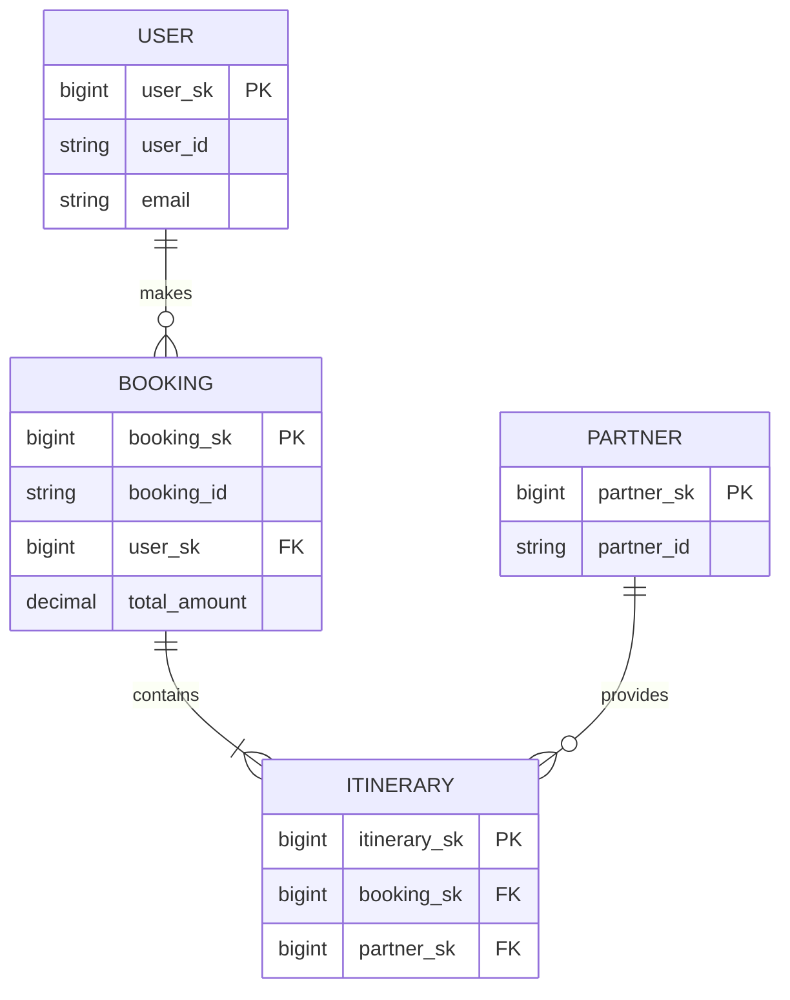
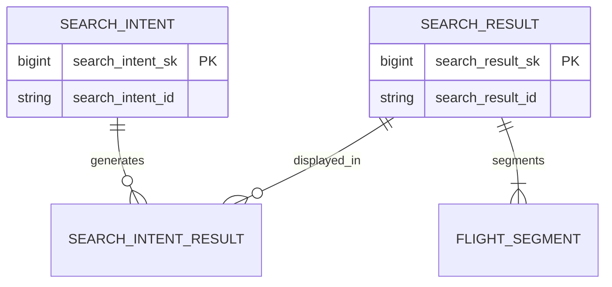

## Capabilities

## 1. ECM Overview
Entity-Centric Modeling (ECM) focuses on building data models around **real-world business entities** rather than source systems or analytical dimensions. Entities represent stable concepts such as User, Booking, Partner, SearchIntent, and Itinerary.

### Why ECM?
- Reduces fragmentation across systems
- Ensures consistent business meaning
- Improves lineage, observability, and governance
- Provides a durable Silver layer for analytical consumption

---
## 2. ECM Principles (Full Version)
### 2.1. Entity-First Design
Build models around **business concepts**, independent of source schemas.

### 2.2. Normalization for Stability
Use **3NF** to avoid redundancy:
- Each attribute depends on the key
- The whole key
- And nothing but the key

### 2.3. Keys and Identity Resolution
- Business keys reflect natural identity (e.g., email, partner_id)
- Surrogate keys ensure system performance
- Maintain BK→SK mapping tables where needed

### 2.4. Entity History (SCD Types)
- **SCD1**: Overwrite
- **SCD2**: Full historical tracking
- **SCD3**: Limited historical attributes

### 2.5. Entity Relationships
Represent real-world relationships:
- 1:1 (User → UserProfile)
- 1:N (Booking → Itinerary)
- M:N via bridge entities (SearchIntent ↔ SearchResult)

### 2.6. Entity Quality Rules
- NOT NULL constraints
- CHECK constraints
- Referential integrity

### 2.7. Temporal Modeling
Use temporal validity for SCD2 entities:
- valid_from
- valid_to
- is_current
- version

---
## 3. Reference Entities (ECM Pattern Library)
Reference entities are small, stable lookup entities reused broadly.
Look up existing Silver entity patterns in `dev_data_modelling_silver.reference`
- Use geography for entity_id relationship
- sample data to look up which reference schema to use wherever applicable

### Examples:
#### 3.1. Country Reference Entity
```sql
CREATE TABLE silver.ref_country (
    country_code STRING PRIMARY KEY,
    country_name STRING NOT NULL,
    region STRING,
    iso3 STRING
) USING DELTA;
```

#### 3.2. Currency Reference Entity
```sql
CREATE TABLE silver.ref_currency (
    currency_code STRING PRIMARY KEY,
    currency_name STRING,
    symbol STRING
) USING DELTA;
```

#### 3.3. Date Entity (Role-Playing Reference)
```sql
CREATE TABLE silver.ref_date (
    date_key DATE PRIMARY KEY,
    year INT,
    month INT,
    day INT,
    week INT,
    quarter INT
) USING DELTA;
```

Role-playing examples:
- booking_date_key
- departure_date_key
- return_date_key

---
## 4. Full ECM SQL Examples
Below are rewritten examples for core Silver entities.

### 4.1. User Entity (ECM + SCD2)
```sql
CREATE TABLE silver.user (
    user_sk BIGINT GENERATED ALWAYS AS IDENTITY PRIMARY KEY,
    user_id STRING NOT NULL,
    email STRING NOT NULL,
    first_name STRING,
    last_name STRING,
    country_code STRING,
    preferred_language STRING,
    loyalty_tier STRING,
    is_verified BOOLEAN DEFAULT FALSE,

    -- Entity temporal validity (SCD2)
    valid_from TIMESTAMP NOT NULL,
    valid_to TIMESTAMP,
    is_current BOOLEAN NOT NULL,
    version INT NOT NULL,

    -- Audit
    source_system STRING NOT NULL,
    created_at TIMESTAMP NOT NULL,
    updated_at TIMESTAMP NOT NULL,

    CONSTRAINT uk_user UNIQUE(user_id, valid_from),
    CONSTRAINT fk_country FOREIGN KEY(country_code) REFERENCES silver.ref_country(country_code)
) USING DELTA
PARTITIONED BY (date_trunc('MONTH', valid_from));
```

### 4.2. Partner Entity (ECM + Lifecycle)
```sql
CREATE TABLE silver.partner (
    partner_sk BIGINT GENERATED ALWAYS AS IDENTITY PRIMARY KEY,
    partner_id STRING NOT NULL UNIQUE,
    partner_name STRING NOT NULL,
    partner_type STRING NOT NULL,
    country_code STRING,
    api_endpoint STRING,
    commission_rate DECIMAL(5,2),
    is_active BOOLEAN DEFAULT TRUE,

    source_system STRING NOT NULL,
    created_at TIMESTAMP NOT NULL,
    updated_at TIMESTAMP NOT NULL,

    CONSTRAINT fk_partner_country FOREIGN KEY(country_code) REFERENCES silver.ref_country(country_code)
) USING DELTA;
```

### 4.3. Booking + Itinerary (ECM Relationship Modeling)
```sql
CREATE TABLE silver.booking (
    booking_sk BIGINT GENERATED ALWAYS AS IDENTITY PRIMARY KEY,
    booking_id STRING NOT NULL UNIQUE,
    user_sk BIGINT NOT NULL,
    booking_date TIMESTAMP NOT NULL,
    booking_status STRING NOT NULL,
    total_amount DECIMAL(12,2) NOT NULL,
    currency_code STRING NOT NULL,

    source_system STRING NOT NULL,
    created_at TIMESTAMP NOT NULL,
    updated_at TIMESTAMP NOT NULL,

    CONSTRAINT fk_booking_user FOREIGN KEY(user_sk) REFERENCES silver.user(user_sk),
    CONSTRAINT fk_currency FOREIGN KEY(currency_code) REFERENCES silver.ref_currency(currency_code)
) USING DELTA;
```

```sql
CREATE TABLE silver.itinerary (
    itinerary_sk BIGINT GENERATED ALWAYS AS IDENTITY PRIMARY KEY,
    booking_sk BIGINT NOT NULL,
    partner_sk BIGINT NOT NULL,
    itinerary_type STRING NOT NULL,
    origin_code STRING,
    destination_code STRING,
    departure_time TIMESTAMP,
    return_time TIMESTAMP,
    traveler_count INT NOT NULL,
    base_price DECIMAL(10,2),
    taxes DECIMAL(10,2),
    total_price DECIMAL(12,2) NOT NULL,

    created_at TIMESTAMP NOT NULL,
    updated_at TIMESTAMP NOT NULL,

    CONSTRAINT fk_itinerary_booking FOREIGN KEY(booking_sk) REFERENCES silver.booking(booking_sk),
    CONSTRAINT fk_itinerary_partner FOREIGN KEY(partner_sk) REFERENCES silver.partner(partner_sk)
) USING DELTA;
```

---
## 5. ER Diagrams (ECM Versions)

### 5.1 Core Travel Entities


### 5.2 Search Entities


---
## 6. Expanded ECM Patterns
### 6.1 Entity Composition
Use parent-child structures to model hierarchical entities (e.g., Booking → Itinerary → Segments).

### 6.2 Master + Detail Entities
Stable master entities (User, Partner) feed detail entities.

### 6.3 Identity Resolution Entities
Use BK/SK lookup tables to unify identifiers from multiple sources.

### 6.4 Federated Reference Entities
Shared entities (Currency, Country, Airport) standardized across teams.

---
## 7. Testing ECM Models
- Ensure no duplicate business keys
- Ensure no orphan records
- Validate temporal ranges (no overlaps)
- Validate CHECK constraints

---
## 8. Tools and Techniques

### 8.1 Entity Discovery
- Use the `bronze-table-finder-agent` agent to locate source tables
- Apply the `data-profiler-agent` agent to understand Bronze data
- Collaborate with business stakeholders to define entities

### 8.2 Schema Design
- Use PySpark DataFrame schemas with constraints
- Leverage Delta Lake features (MERGE, CHECK constraints, GENERATED columns)
- Document schemas in data catalog or metadata repository

### 8.3 Quality Validation
- Implement data quality checks in transformation pipelines
- Monitor entity quality metrics over time